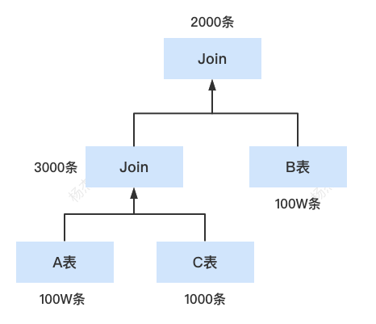

[toc]

随着技术的不断发展，大数据领域出现了越来越多的技术和框架。如果细心的话，我们会发现，越来越多的大数据技术和应用开始支持SQL进行数据查询。SQL作为一个学习成本很低的语言，支持SQL进行数据查询可以降低用户使用大数据的门槛，让更多的用户能够使用大数据。

首先，什么是SQL引擎呢？我们给SQL引擎下个简单的定义：**SQL引擎让我们可以直接通过写SQL的方式查询指定的数据文件（所以Mysql、Oracle也算一种单机版的SQL引擎）**。

本篇博客带大家一个标准的大数据SQL引擎是如何构建起来的。

# 一、SQL引擎实现:从简单到复杂,从单机到分布式

假设现在有个需求，用户期望可以直接写SQL语句来查询一份数据（这份数据可能是各种类型的文件，比如CSV、json格式文件等等）。一开始的需求很简单，只要能识别类似这样的SQL select id,name from test 。

简单的思考后，我们的实现很可能会分三步走：


- SQL语法解析：我们需要将用户传进来的SQL进行解析，得出要读取的表和字段
- 表、字段映射：我们需要知道读取的表对应哪个文件，文件路径在哪，什么格式？字段在文件中的位置
- 执行：知道了元数据的相关信息后，就可以直接读取相关文件了

## 最简单的实现—使用正则解析SQL

为了快速完成需求，同时SQL也比较简单，我们可能很自然的想到使用正则来提取一些关键信息。通过正则，我们可以提取出要查询的表和字段。

然后对于表、字段的映射关系，我们可以建立一个数据库，提前存储好表的相关元数据信息。之后根据表名来查询即可找到我们要的相关信息。

这样，一个简单版本的SQL引擎就实现了：


显然，这样的实现方案简单快速，但是不够灵活。假设我们后面想支持更丰富的SQL语法，比如where、join、group by、distinct等等，那么我们很难依靠正则来实现可以解析所有SQL语法的代码。

## 标准实现—支持更复杂的SQL语法

为了支持更复杂的SQL语法，我们需要引入专门的语法解析器，来做SQL语法的解析工作。这时候我们有两个选择：

1. 自研一个SQL语法解析器
2. 使用现有的开源语法解析工具

语法解析器涉及到语句的语法、词法分析，需要掌握很深的编译原理相关知识，我们很少接触，因此要自研一个SQL语法解析器难度高、成本大。所以使用现有的语法解析器是最好的选择。目前常见的开源语法解析器有两种

1. Antrl
2. Javacc
3. JFlex

因为Antrl在SQL引擎中使用更广泛，比如Hive、SparkSQL、presto都是使用Antrl4来进行SQL语法解析。所以我们这里使用开源的Antrl4来进行语法解析。

使用Antrl4我们需要先定义好对应的SQL语法规则文件，然后根据定义的这些规则解析SQL，就可以得到一个语法树。

关于Antrl4解析出来的语法树，我们可以简单看一下下图：


我们通过Antrl解析完SQL拿到语法树后，里面包含了所有SQL的关键信息。我们通过遍历这个语法树，就可以知道需要进行的对应操作，比如说查询、过滤、聚合、join等等。通过遍历语法树，我们能构建一个执行计划（描述执行的相关环节），最后将这个执行计划转换为具体的代码即可完成SQL的执行。


关于执行计划，我们可以看一下下面这个例子：

```sql
select id from yjbtest.test where id > 5
```

它在SparkSQL中的执行计划是这样的：

```bash
== Physical Plan ==
*(1) Filter (isnotnull(id#5519) AND (id#5519 > 5))
+- Scan hive yjbtest.test [id#5519], HiveTableRelation `yjbtest`.`test`, org.apache.hadoop.hive.serde2.lazy.LazySimpleSerDe, [id#5519, name#5520], [date_p#5521], Statistics(sizeInBytes=8.0 EiB)
```

从下往上读，很好理解，就是先Scan yjbtest这张表，然后再做Filter。

在引入Antrl4后，我们基本可以cover住大部分SQL场景了，甚至可以自定义一些独特的语法。但是如果仔细思考，我们会发现还有两点需要进一步优化：

- 性能提升：目前我们只是简单粗暴的将语法树翻译成执行计划，这个执行计划的性能并不一定是最优的（一条SQL可以有好几种的执行计划）

- 支持大数据量：因为我们目前的实现还只是单机版，如果要查询的数据量非常大，那么很难高效的进行数据查询。

## 性能优化—执行计划优化

针对性能，我们可以在生成执行计划时进行干预，因为每个SQL对应的执行计划都是可能有多种的，我们需要做的工作就是在这些执行计划中找出性能最好的那个执行计划。

举个简单的例子：

```sql
select id from test where id < 50 group by id
```

上面这条SQL它对应的执行计划可能有两种：

1、先聚合后再过滤id


2、先过滤id后再进行聚合


上面两个执行计划最终得到的结果都是一样的，不同的地方在于过滤和聚合的顺序不一样。而我们知道，聚合操作的代价是远远高于数据过滤的，执行计划2在进行聚合前过滤了大部分的数据，这样聚合数据所需要的时间就会大大减少。**因此，执行计划2的性能肯定是优于执行计划1的**。

既然如此简单的SQL都有2种执行计划，那么我们可以想象，对于那些复杂的SQL，它对应的执行计划会更多，关于执行计划的优化策略也很复杂。目前业内总的优化方向有两个，一个是RBO（基于规则优化），一个是CBO（基于代价优化），我们在下面的章节再详细介绍。这时我们的SQL引擎架构大概是这样的：


> 如果了解Mysql架构的同学，这时的SQL引擎架构基本和Mysql一样了。也就是单机版的SQL引擎

## 大数据SQL引擎架构

下面我们来看一下如何将SQL引擎应用在大数据领域。

处理大数据的核心在于需要将生成的执行计划转为批处理任务，比如mapreduce、tez、spark等。我们来看一下Hive和SparkSQL引擎是如何处理一条SQL的：


和单机版的相比，我们发现原先的执行计划分成了逻辑计划和物理计划。那么它们的区别是什么呢？

这是由于在大数据领域中，有着许多计算引擎，比如Mapreduce、Spark、Tez，**单机版的执行计划本身仅是描述SQL执行的相关逻辑的**，要翻译成Mapreduce job、Spark job都要进行一定量的转换工作。

因此大数据SQL引擎中引入了逻辑计划和物理计划两种概念，**逻辑计划专注于对执行计划的抽象描述，而物理计划更贴合底层的计算引擎。**

拿Hive来说，Hive本身是支持多种计算引擎的，无论底层的计算引擎是什么，一条SQL在Hive中的逻辑计划都是一样的，而根据不同的计算引擎，它生成的物理计划就会有所差别。比如Hive On Mr生成的物理计划更多描述的是Mapreduce的相关操作，Hive On Spark生成的物理计划更多描述Spark RDD的相关操作。

我们可以通过下面这个SQL来更直观的了解一下各个阶段的执行计划：

```sql
select
  a.id,
  b.name
from
  yjbtest.test a
  join yjbtest.test2 b on a.id = b.id
where
  a.id > 5
  and b.name = 'test'
```

下面是通过SparkSQL输出的各阶段计划：


1、Parsed Logical Plan：我们可以理解成这是通过Antrl4解析出来的语法树，可以看出，Parsed Logical Plan的计划和我们写的SQL执行顺序基本是一致的，也就是先查下两张表的数据，然后做join，最后再过滤对应的数据。

2、Analyzed Logical Plan：这个是经过元数据解析后的逻辑计划，可以看出，这里Spark将表和字段的各维度数据都展示了出来。

3、Optimized Logical Plan：优化后的逻辑计划，这里可以看出最明显的一个优化就是将Filter算子下推到了各个子查询中，这样就减少了后面做join时的数据量。

4、Physical Plan：真正要执行的物理计划，后面用于转成RDD

> 逻辑计划和物理计划的区别：这两个计划都可以理解为对执行计划的描述。逻辑计划更抽象一些，比如Join操作，逻辑计划就说明这里要做Join，但是物理计划会描述具体做Join的手段，比如如两张表分别进行hashpartitioning、sort，然后最终进行SortMergeJoin。我们发现，这些操作都是可以很直观的翻译成RDD代码的。因此，逻辑计划更偏向宏观的描述，而物理计划则是描述具体的操作过程。

# 二、执行计划的一些常见优化手段

关于执行计划的优化方案主要可以分为两类，RBO（基于规则的优化）和CBO（基于代价的优化）

## RBO（基于规则优化）

很好理解，就是我们提前制定好一些规则去优化执行计划，这些规则都是我们通过规律总结出来的经验。常见的优化手段有这些：

- **PushDownPredicates**：谓词下推，在join或聚合前提前进行数据过滤，减少参与join的数据量


- **ConstantFolding** ：常量折叠 ——> 100+80 直接转换成180，避免重复无效的计算

比如有sql: select id+100+80 from test 会被优化成 select id + 180 from test

- **ColumnPruning** ： 列裁剪，去掉不需要的列，只查询指定的列，减少IO的数据读取量

## CBO（基于代价优化）

RBO虽然可以进行一些特定的优化，但是它有两个缺点：

- 规则是基于经验的，但是经验并不是万能的，总有些问题经验解决不了
- 不太可能列出所有经验，事实上这些规则也确实是逐渐充实的

既然有些场景经验无法有效解决问题，那么我们可以引入代价模型，通过评估执行计划的代价来选择最优的执行计划。

举个例子，假设现在有个场景 A join B join C。A和B都是大表，C是小表。

它对应的执行计划有很多个，我们来看一下比较典型的两种执行计划：

计划1:先对A表和B表进行Join，然后再将结果和C表进行join


计划2：先对A表和C表进行join，然后再将结果和B表进行join



这两个的执行计划的区别就在于join的顺序不同。

那么上面这种场景可以通过RBO来优化吗？显然是不行的，因为这没有经验可循，我们无法通过经验得出A、B、C表的数据量各是多少，因此也无法进行特定的优化。所以这里CBO，也就是基于代价的优化就派上用场了。

**总体来说，CBO是通过评估各个执行计划的代价来选择一个最优的执行计划的。**

一般一个执行计划都对应一个树，评估这个执行计划的代价也就是累加整棵树各个节点的代价的过程。一个节点通常对应这一个算子，评估一个算子的代价需要一般需要两个指标

1、代价计算规则，每种算子的代价计算规则都不一样，比如Merge-Sort Join、Shuffle Hash Join、GroupBy都有自己的一套代价计算算法

2、算子进行操作的数据相关信息（大小、总记录条数）

代价计算规则比较好办，它其实就算一种算法，代入各种数据就可以的出来。但是算子进行操作的数据相关信息应该如何获取呢？这里主要有两类：

1、原始表的数据集信息 —— 通过提前扫描全表可以统计出各个维度的相关信息存储到数据库

2、中间表的数据集信息（原始表经过filter、group by、join等操作后得到的中间数据） —— 需要基于原始表加上一些推导规则进行**估算**

那什么是推导规则呢？规则推导意思是说在当前子节点统计信息的基础上，计算父节点相关统计信息的一套推导规则。

举个例子`select id from A where id > 5`，我们现在已经知道了A表的相关统计信息了，比如行数、id最大值、id最小值、直方图等等。那么我们如何评估经过`id>5`的过滤后得到的中间表的数据集信息呢？


上面这张直方图横坐标表示id的数值，纵坐标表示id在该区间出现的频率。通过这个数据，我们就可以大概估算出id>5的数据信息。

当然，真正的推导规则会更加复杂，考虑的因素更多。

下面我们使用CBO来为上面A join B join C的执行计划选择一个最优的执行计划。假设现在关于join算子代价的计算公式为 = 表1数据条数*表2数据条数 （和join的行为比较一致）

那么我们可以计算出两个执行计划的代价各是多少：

执行计划1：第一个Join的代价是 100w * 100w = 100000000w(1万亿)，第二个join的代价是 10w * 1000 = 10000w。总体代价就是两个相加（1万亿）

执行计划2：第一个Join的代价是 100w * 1000 = 100000w，第二个Join的代价是 100w * 3000 = 300000w。总体代价就是两个相加(40亿)

很显然，执行计划1的代价是远高于执行计划2的，因此这里通过CBO，我们就可以得到执行计划2优于执行计划1的结论，然后选择执行计划2作为我们最终的执行计划。

最后，CBO也有两点不足的地方：

- 需要提前采集好各个原始表的统计信息，比如Hive在insert table后会开启一个任务专门统计这些信息，这就意味着SQL执行性能的降低
- 对于那些中间表数据信息的推导只是一个估算，并不一定准确，所以仍然有些场景CBO也无法优化到，只能人为介入

# 三、总结

上面我们从零开始，逐渐为大家介绍了一个SQL引擎的架构是如何慢慢演变完善起来的。

首先，单机版SQL引擎的架构大概如下图：


引申到我们常使用的各类关系数据库，其实它们的架构大多也是这样。当然，我们这里的SQL引擎只是简单的查询一些指定的数据文件，而mysql、oracle这些数据库底层的数据存储结构要复杂很多，这又是另外一个课题了。

然后，我们又了解了大数据领域的常见SQL引擎架构：


**和单机版相比，它的执行计划分裂成了逻辑计划和物理计划**，这和大数据计算引擎有关。在单机的情况下，执行计划可以较简单的翻译成可执行代码，但是在分布式领域中，因为计算引擎多种多样，因此，还需要一个更贴近具体计算引擎的描述，也就是物理计划。换言之，逻辑计划只是抽象的一层描述，而物理计划则和具体的计算引擎直接挂钩。

最后，我们还了解了SQL引擎常用两种优化手段。一种是RBO，它是基于规则的优化，根据一些提前设定好的经验去优化执行计划。一种是CBO，它是基于代价优化，通过评估各个执行计划的代价来选择一个最优的计划。

> 关于执行计划的优化，Spark 在3.0后发布了Adaptive Execution特性，支持在运行的过程中实时的调整执行计划。感兴趣的可以了解下：https://blog.csdn.net/u013332124/article/details/90677676