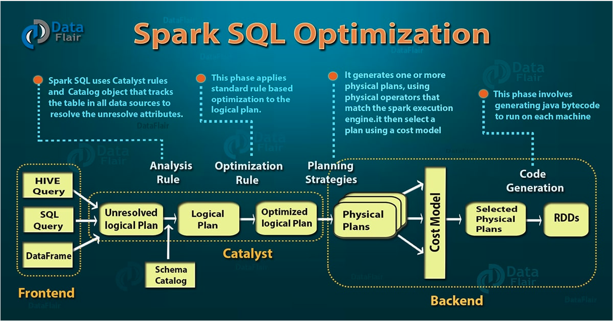
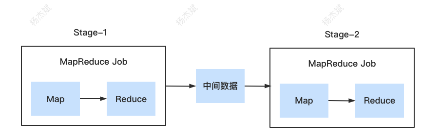

[toc]

这次我的分享主题是大数据SQL引擎的那些事，主要是介绍大数据SQL引擎的大概实现和一些优化手段。我整体分成了5个部分，第一个部分我会介绍一个SQL引擎架构是如何从无到有一步步构建起来的。第二个部分场景的SQL引擎如如何自动去优化执行计划的，第三个部分SQL大概是如何翻译成MR和Spark的，第四个部分则是关于大数据SQL的一些优化手段。最后一个部分我会带大家简单了解下Spark3.0推出的自适应执行。

# 一、SQL引擎实现:从简单到复杂,从单机到分布式

假设现在有个需求，用户期望可以直接写SQL语句来查询一份数据（这份数据可能是各种类型的文件，比如CSV、json格式文件等等）。

## 最简单的实现—使用正则解析SQL

我们先来个最简单的SQL：`select id,name from test`。

关于SQL的语法解析，我们可以很自然的想到使用正则来提取一些关键信息，通过正则，我们可以提取出要查询的表和字段。找到查询的表后，还需要知道这些表对应那些数据文件，字段又对应文件中的哪一列内容，这个过程叫做元数据解析。最后，这些信息都对应上后，我们就可以直接从数据文件中获取到对应的数据。

显然，这样的实现方案简单快速，但是不够灵活。我们都知道，标准SQL的语法非常丰富，比如where、join、group by、distinct等等。因此我们很难依靠正则来实现可以解析所有SQL语法的代码。

所以我们需要一个更强大的语法分析器，来处理复杂的SQL语法。

## 标准实现—使用Antrl4解析SQL

这时我们就要引入专门的语法解析器，来做SQL语法的解析工作。我们可以使用开源的Antrl4来进行语法解析，使用Antrl4解析SQL后，我们会得到一个语法树，这个语法树中会有SQL的各类关键信息。我们通过遍历这个语法树，就可以需要进行的对应操作，比如说查询、过滤、聚合、join等等。大概流程应该是：

`Antrl4语法解析——> 表、字段解析(元数据查询) ——> 遍历语法树生成执行计划 `

> Antrl4不仅可以解析SQL，还解析各类语法。我们只要定义好语法规则文件，即可解析得到对应的语法树。

引入Antrl4后，我们基本可以cover住大部分SQL场景了，甚至可以自定义一些独特的语法。但是如果仔细思考，我们会发现还有两点需要进一步优化：

1. 性能提升：目前我们只是简单粗暴的将语法树翻译成执行计划，这个执行计划的性能并不一定是最优的（一条SQL可以有好几种的执行计划）
2. 支持大数据量：因为我们目前的实现还只是单机版，如果要查询的数据量非常大，那么很难高效的进行数据查询。

## 性能优化—执行计划优化

针对性能，我们可以在生成执行计划时进行干预，因为每个SQL对应的执行计划都是可能有多种的，我们需要做的工作就是在这些执行计划中找出性能最好的那个执行计划。

举个简单的例子：

`select id from test where id < 50 group by id`

上面这条SQL它对应的执行计划可能有两种：

1、先聚合后再过滤id


2、先过滤id后再进行聚合


上面两个执行计划最终得到的结果都是一样的，不同的地方在于过滤和聚合的顺序不一样。而我们知道，聚合操作的代价是远远高于数据过滤的，执行计划2在进行聚合前过滤了大部分的数据，这样聚合数据所需要的时间就会大大减少。**因此，执行计划2的性能肯定是优于执行计划1的**。

既然如此简单的SQL都有2种执行计划，那么我们可以想象，对于那些复杂的SQL，它对应的执行计划会更多，目前业内总的优化方向有两个，一个是RBO（基于规则优化），一个是CBO（基于代价优化），我们在下面的章节介绍。

在做完执行计划的优化后，其实我们这里的整体架构已经和传统的关系型数据库差不多了。下面我们来看一下Mysql的SQL处理过程

## Mysql的执行过程


在Mysql中，一条SQL从客户端提交上来后，会经过连接器、分析器、优化器、执行器处理后最终返回数据给客户端。

### 1.1 连接器

主要负责接收请求，同时进行一些权限校验的工作。比如用户账号密码是否正确等。

### 1.2 分析器

分析器主要对SQL进行语法解析，然后构建语法树，这里如果SQL有语法错误，就会抛出异常。同时还会进行具体表和字段的解析工作， 比如说用户如果查询的表和字段不存在，也会报错。

另外，这里生成语法树后还会尝试从缓存中直接查询该SQL的结果，如果缓存中有该SQL的执行结果，就可以直接返回。——这个缓存层比较鸡肋，在mysql5.6后缓存默认是关闭的，8.0后已经去掉缓存层了。

### 1.3 优化器

将上一步生成的语法树进一步生成执行计划，一条SQL可以有很多种执行计划，最后都返回相同的结果。优化器的作用就是找到这其中最好的执行计划，因此这里还会进行许多的优化手段，包括RBO（基于规则优化）和CBO（基于代价优化），目的是为了更高效的执行。

### 1.4 执行器

执行器的作用就是根据执行计划调用存储引擎的API来完成数据的查询。其中比较出名的Mysql存储引擎就是InnoDB和MyIsam了。

总体来说SQL在Mysql中的执行过程也是解析—>优化—>执行。当然，mysql底层肯定会复杂很多，比如存储格式、索引、事务、并发等等。我们今天的主题也不是单机版SQL引擎，而是大数据的SQL引擎，因此这里就不详细展开。

下面我们来看一下SQL是如何应用在大数据领域的

## SQL在分布式的应用—SparkSQL处理架构

处理大数据的核心在于需要将生成的执行计划转为批处理任务，比如mapreduce、tez、spark等。我们来看一下SparkSQL引擎是如何处理一条SQL的：



**Unresolved logical Plan**：SQL经过语法解析后的逻辑执行计划，Unresolved表示未经过元数据解析，这时语法树各个节点的表、字段都只是一个简单的字符串，也就是未映射到具体哪张表。

**Logical Plan**：即逻辑计划。经过Schema Catalog的解析后，也就是去查询各个表、字段的具体元数据信息，这样后面任务在具体执行时，才知道要去查询哪些数据文件还有对应的字段数据。

**Optimized logical Plan**：优化后的逻辑计划。生成逻辑计划后，Spark会使用一系列的规则对逻辑计划进行优化，最终生成一个优化后的逻辑计划。

Physical Plans：物理计划，可以理解为我们通常说的执行计划。从图中也可以看出，这里的物理计划可以有多种

**Cost Model**：基于代价的优化模型，经过这一层优化后，会选择出一个最优的物理计划出来

Selected Physical Plans：最终选择出的最优的物理计划

**RDDs**：将物理计划真正的翻译成可执行的RDD代码

上面的几个过程我们可以通过explain extended更直观的感受下。比如下面这个SQL：

```sql
select
  a.id,
  b.name
from
  yjbtest.test a
  join yjbtest.test2 b on a.id = b.id
where
  a.id > 5
  and b.name = 'test'
```

它具体的各阶段计划如下：


>  上面的Parsed Logical Plan对应Unresolved logical Plan，Analyzed Logical Plan对应Logical Plan。

1、Parsed Logical Plan：可以看出，Parsed Logical Plan的计划和我们写的SQL执行顺序基本是一致的，也就是先查下两张表的数据，然后做join，最后再过滤对应的数据。

2、Analyzed Logical Plan：这个是经过元数据解析后的逻辑计划，可以看出，这里Spark将表和字段的各维度数据都展示了出来。

3、Optimized Logical Plan：优化后的逻辑计划，这里可以看出最明显的一个优化就是将Filter算子下推到了各个子查询中，这样就减少了后面做join时的数据量。

4、Physical Plan：真正要执行的物理计划，后面用于转成RDD

> 逻辑计划和物理计划的区别：这两个计划都可以理解为对执行计划的描述。逻辑计划更抽象一些，比如Join操作，逻辑计划就说明这里要做Join，但是物理计划会描述具体做Join的手段，比如如两张表分别进行hashpartitioning、sort，然后最终进行SortMergeJoin。我们发现，这些操作都是可以很直观的翻译成RDD代码的。因此，逻辑计划更偏向宏观的描述，而物理计划则是描述具体的操作过程。

# 二、执行计划的一些常见优化手段

关于执行计划的优化方案主要可以分为两类，RBO（基于规则的优化）和CBO（基于代价的优化）

## RBO（基于规则优化）

很好理解，就是我们提前制定好一些规则去优化执行计划，这些规则都是我们通过规律总结出来的经验。常见的优化手段有这些：

- **PushDownPredicates**：谓词下推，在join或聚合前提前进行数据过滤，减少参与join的数据量
- ***ConstantFolding\*** ：常量折叠 ——> 100+80 直接转换成180，避免重复无效的计算
- ***ColumnPruning\*** ： 列裁剪，去掉不需要的列，只查询指定的列，减少IO的数据读取量

## CBO（基于代价优化）

RBO虽然可以进行一些特定的优化，但是它有两个缺点：

- 规则是基于经验的，但是经验并不是万能的，总有些问题经验解决不了
- 不太可能列出所有经验，事实上这些规则也确实是逐渐充实的

既然有些场景经验无法有效解决问题，那么我们可以引入代价模型，通过评估代价来进行执行计划的优化。

举个例子，假设现在有个场景 A join B join C。A和B都是大表，C是小表。

它对应的执行计划有很多个，我们来看一下比较典型的两种执行计划：

1、先对A表和B表进行join：


2、先对A表和C表进行join：


很显然，因为A表和B表的数据量到高达100G，如果对这两张表进行join，比如需要消耗大量的资源，而如果先对A表和C表进行join，因为C表的量很小，所以做join可以很快的得出结果。因此方案2的性能明显优于方案1的。

那么上面这种场景可以通过RBO来优化吗？显然是不行的，因为这没有经验可循，我们无法通过经验得出A、B、C表的数据量各是多少，因此也无法进行特定的优化。所以这里CBO，也就是基于代价的优化就派上用场了。

**总体来说，CBO是通过评估各个执行计划的代价来选择一个最优的执行计划的。**

一般一个执行计划都对应一个树，评估这个执行计划的代价也就是累加整棵树各个节点的代价的过程。一个节点通常对应这一个算子，评估一个算子的代价需要一般需要两个指标

1、代价计算规则，每种算子的代价计算规则都不一样，比如Merge-Sort Join、Shuffle Hash Join、GroupBy都有自己的一套代价计算算法

2、算子进行操作的数据集基本信息（大小、总记录条数）

代价计算规则比较好办，它其实就算一种算法，代入各种数据就可以的出来。但是算子进行操作的数据集基本信息应该如何获取呢？这里主要有两类，一类是原始表的数据集信息，一类是中间表的数据集信息（原始表经过filter、group by、join等操作后得到的中间数据）。原始表的数据信息我们可以通过提前扫描全表今天统计。而中间表的数据集信息则相对比较复杂，需要定义好对应的推导规则。

那么什么是推导规则呢？规则推导意思是说在当前子节点统计信息的基础上，计算父节点相关统计信息的一套推导规则（这里也需要提前采集原始表的相关统计信息）。举个例子`select id from A where id > 5`，我们现在已经知道了A表的相关统计信息了，比如行数、id最大值、id最小值、直方图等等。那么我们如何评估经过`id>5`的过滤后得到的中间表的数据集信息呢？

1、现在我们已经知道了A表min_id=0，max_id=100，同时这区间有300条数据。如果数据的id是均匀分布的，那么我们可以大概估算出id>5的数据条数大概是 (100-5)/100 * 300 = 285条。对应公式 =  ` (max_id – N) / (max_id – min_id) * 原先条数`

2、上面这种推导规则是基于数据均匀分布的前提下完成的，但是在实际场景中，我们都知道数据很少是真正均匀的。因此这时候就需要引入直方图了，也就是A表id字段在各个区间的频率。


上面这张直方图横坐标表示id的数值，纵坐标表示id在该区间出现的频率。通过这个数据，我们就可以更加准确的算出id>5的数据信息。

当然，真正的推导规则会更加复杂，考虑的因素更多。

总体来说，CBO需要提前采集好各个原始表的统计信息，然后根据一系列推导规则计算各个算子的代价，最终才能评估出整个执行计划的代价。

## SparkSQL 的自适应执行（AOE）

上面的RBO和CBO都是比较通用的执行计划优化方案。这里的介绍的AOE是Spark基于自身的RDD特性实现的一套执行计划优化方案。它在3.0后开始支持。

下面来看一下Spark的自适应执行都解决了哪些问题：

### 1、shuffle partition 数量没有达到最优——动态调整Shuffle Partition数量

在SparkSQL中，shuffle中Reduce Task的数量可以通过spark.sql.shuffle.partition参数来设置，但是这个参数只能全局配置，会有以下问题：

- spark.sql.shuffle.partition参数设置过大会导致额外的资源调度开销以及导致大量的小文件
- spark.sql.shuffle.partition参数设置过小会导致部分task处理的数据量比较大，甚至出现OOM
- 对于复杂的执行计划，Stage数量比较多，无法精确的为各个Stage设置一个合理的partition数量
- 对于复杂的执行计划，无法有效的评估各个Reduce Stage需要分配的partition数量（比如下图中的Stage-3和Stage-5）


解决方案：

对于这种情况，自适应执行可以动态的调整shuffle partition数量，那么它是如何做到的呢？可以看下面这张图：


在没有使用自适应执行之前，Stage-2会有5个分区，需要处理的数据量分别是64M、1M、2M、20M、40M，而Stage-2的执行时间基本等同于处理64M task的执行时间。

引入自适应执行后，它会统计Stage-1 shuffle write出来的数据，发现有4个分区的可以进行合并，因此在Stage-2就值需要2个分区，一个处理64M的数据，一个处理1+2+20+40=63M的数据，使分区数量达到最合理。

### 2、执行计划并未达到最优

虽然CBO可以有效的针对执行计划进行优化，但是它依赖于原始表的各个维度的统计信息，在实际场景中，有一些表可能没有完全采集到这些统计信息。同时它的代价模型也是只是基于估算，因此并不一定是准确的。

在SparkSQL中，提供了一个参数spark.sql.autoBroadcastJoinThreshold参数，如果做join时，表的数据量低于这个参数，Spark会开启BroadcastHashJoin，也就是基于内存做join，不用经过Shuffle，性能会有很大的提升。因为是否要转为BroadcastHashJoin也是基于CBO，因此也经常会有估算不准确的问题，本来可以转成BroadcastHashJoin的，却使用了SortMergeJoin。如下图的执行计划：


解决方案：

做Join的两个Stage执行完后，获取他们的shuffle write的数据量，如果数据量低于spark.sql.autoBroadcastJoinThreshold的值，则进行BroadcastHashJoin。比如Stage-1和Stage-2进行join，发现Stage-1的Shuffle write的数据量仅10M，则可以将Stage-1的Shuffle write的数据直接加载成broadcast，之后下游的Stage直接读取Stage-2的数据同时从内存中读取Stage-1的数据进行Join。


### 3、数据倾斜场景

不管是mapreduce还是spark，都可能存在数据倾斜问题。数据倾斜意味着某一些partition要处理的数据量远大于其他的partition。在实际场景中，我们需要根据实际SQL进行一些针对性的调整来避免数据倾斜。


上图中，Stage-1和Stage-2进行join，Stage-3有3个ReduceTask，但是因为Stage-1的数据倾斜，导致Reduce task 1需要处理3G+10M的数据，远多于其他两个task的20M数据。那么整个Stage的处理瓶颈就会落到Reduce task 1上面。

解决方案：

引入自适应执行后，执行计划就会变成这样：


再引入自适应执行后，Spark发现Stage 1输出的partition 1的数据总量比其他partition大很多，会导致数据倾斜。因此，SPark将1个task分割成了3个task，分别读取Stage 1中的各个map task落地的parttion 1数据，每个task只处理1G+10M的数据，理论上性能提升了3倍。

这样的执行计划变动需要对shuffle read的接口也做了改变，允许它只读取部分mapper中某一个partition的数据

# 三、SQL在大数据场景下的实现

## SQL在Mapreduce中的执行计划

举个例子：

```sql
    select
      id,
      count(1) as cnt
    from
      yjbtest.test a
    group by
      id
```

这个SQL比较简单，我们看一下在Hive on MR中，它的执行计划是什么样的：


这里的Stage-1可以理解成一个MapReduce Job。可以看出，上面的SQL比较简单，它的执行计划最终被翻译成一个MapReduce Job。那么如果SQL复杂一些呢？比如基于这个SQL在外面在嵌套一层：

```sql
select
  cnt
from
  (
    select
      id,
      count(1) as cnt
    from
      yjbtest.test a
    group by
      id
  ) b
group by
  cnt
```

查看其执行计划：


我们发现，这个SQL生成了两个Stage（**注意，这里的Stage并非Spark中的Stage，是Hive对Mapreduce Job的一个统称**），也就是两个MapReduce Job，并且这两个Job之间有依赖关系，是串行执行的，Stage-1输出的数据并不是最终数据，而是SQL执行过程中的中间数据，提供给Stage-2计算使用。大概架构图如下：



因此，这个SQL执行时，如果我们根据appName去Yarn上查找记录，会发现有两个Job，也就是对应这两个MapReduce Job。所以对于一些很复杂的SQL，Hive On MR会生成很多个Job

## SQL在Spark中的执行计划

和MR不同，Spark的执行体系本身就是支持DAG图的，所以它可以很自然的表达SQL的执行计划。还是用上面那个SQL：

```sql
select
  cnt
from
  (
    select
      id,
      count(1) as cnt
    from
      yjbtest.test a
    group by
      id
  ) b
group by
  cnt
```

对应在Hive On Spark中的执行计划为：


我们发现，Hive On Spark仅用一个Job就解决了（对应Stage-1）。这是因为Spark的RDD本身就提供了大量的算子，可以很方便的将SQL的执行计划转换为RDD的执行代码。真正执行的RDD DAG图大概如下：


因此，对于Hive On Spark任务，基于一个SQL对应Yarn上的一个Job。

## 一些算子在Mapreduce中的实现

刚才说过，Spark RDD自身就提供了大量的算子，比如join、groupBy、count等，因此我们将SQL的执行计划翻译成RDD代码并不是很难。那么对于Mapreduce这种语义仅仅只支持Map->Reduce的批处理框架，要如何实现SQL中的一些算子呢？

### join 算子

实现原理是在map的输出value中打上标记，比如表A和表B进行join，表A的输出value中加上A表的tag，表B的输出value中加上B表的tag。最后在reduce阶段中区分表A和表B的数据然后进行join。


### group by 算子

group by算子的实现比较简单，利用mapreduce自身的排序，将要group by的字段作为map输出的key，然后reduce阶段做对应的操作即可。

### count distinct

当只有一个字段做distinct时：

```sql
select id,count(distinct name) from yjbtest.test group by id
```

我们只需要将group by的字段和distinct的字段组合作为shuffle的key，然后在reduce阶段再将key进行拆分，因为key本身就是排序好的，所以我们直接按顺序遍历这些key就可以很简单的统计出各个id对应的key的数量。比如说id=1的key有3个，也就是count(distinct name)=3，id=2的key有2个，也就是count(distinct name)=2。


当有多个字段同时做distinct：

```sql
select id,count(distinct name),count(distinct age) from yjbtest.test group by id
```

一种方式是和上面的做法一下，将group by的字段和distinct的所有字段都作为key，但是因为distinct的字段较多，所以在reduce阶段需要在内存中进行去重，如果数据量大的话可能会导致OOM。

另一种方法是在map阶段将一条记录分成N条记录：


比如有一条记录<1,jack,12>，我们将name字段编号0，age字段编号1。然后在做shuffle时会分裂出两条记录，key为<1,0,jack>和<1,1,12>。其他记录也同理。最后，在reduce段，这些key都会自然排好序。

这样，我们就可以通过拆分key然后记录LastKey的方式很快的算出各个count，比如<1,0>为首的key表示id=1的count(distinct name)的值，最后算出来=2，其他的也是同理。

这种方法很好的利用上了mapreduce的排序，节省了reduce阶段去重的内存消耗，但是缺点是增加了shuffle的数据量。

需要注意的是，在生成reduce value时，除第一个distinct字段所在行需要保留value值，其余distinct数据行value字段均可为空。

# 四、一些SQL优化实践

## 数据倾斜处理

数据倾斜是大数据场景中最常见的。

还是举个例子：

```sql
select
  a.id,
  count(1)
from
  yjbtest.test a
group by
  a.id
```

这个SQL对应的执行计划很简单，大概这样：


假设Stage-1在shuffle write时出现的数据倾斜：


我们看到，partition 1的数据量远大于其他partition，因此到时Reduce task 1的处理时长将会远大于其他的task。那么遇到这种情况我们应该怎么处理呢？

### 1、提高shuffle操作的并行度

我们可以提高shuffle的并行度，比如上面的SQL原先是生成3个partition，我们提高并行度后，partition数量就会变多，每个parttiion分到的数据量可能就会变化，数据可能会更加均匀。这样也就解决了数据倾斜的问题。

在Hive中，我们可以通过参数xxxx来修改shuffle的并行度

在SparkSQL中，我们可以通过参数xxx来修改shuffle的并行度

### 2、两阶段聚合（中间加个随机数（仅适用于group by）

在一些场景，提高shuffle操作的并行度可以解决数据倾斜的问题，但是对于一些场景是无法适用的。比如导致数据倾斜的key就一个或者2个，那么即使partition的数量再多，也无法解决数据倾斜的问题，总会有一个partition会出现倾斜。

遇到这种情况我们可以采用两阶段聚合，上面的SQL可以修改成下面这样：

```sql
select
  split(random_id, '-') [0] as id,
  sum(cnt)
from
  (
    select
      CONCAT(a.id, "-", rand(100)) as random_id,
      count(1) as cnt
    from
      yjbtest.test a
    group by
      CONCAT(a.id, "-", rand(100))
  ) b
group by
  split(random_id, '-') [0]
```

主要思路是这样的，我们可以一开始做一下预聚合，给id加上一个随机数作为group by的key，然后计算count，这样得到一个中间结果再拆分原先的key得到真正的id，再做sum就可以得到我们想要的值。这样做的好处是在第一阶段大大的减少了数据量，这样在第二阶段做聚合时，只要很快的时间就可以计算出来。大概示意图如下：


### 3、尝试转为mapjoin

上面我们讨论的是group by场景下的数据倾斜。下面我们来看一个join场景下的数据倾斜：

```sql
select
  a.id,
  count(1)
from
  yjbtest.test a,
  yjbtest.test2 b
where
  a.id = b.id
group by
  a.id
```

上面这个SQL的执行计划大概这样：


假设Stage-1的输出partition出现了倾斜：


很明显，partition 1出现了倾斜。这个同样可以用提高shuffle的并行度来尝试解决，如果不行，我们发现Stage-2的Shuffle输出比较小，那么可以将Stage-2的加载到内存，之后就可以将join转成mapJoin，也就是基于内存做join，就省去了shuffle的流程，可以很大程度的提升任务性能。

### 4、从业务上调整

如果技术层面无法有效的优化，那么我们也可以尝试在业务层面做一些调整。比如我们发现某几个Key导致的倾斜，那么如果我们的业务认为这些key对计算结果影响不大，可以接受，我们就可以直接过滤掉这些倾斜的Key，自然就解决了数据倾斜的问题。

## mapjoin优化

除了数据倾斜外，如果有一些join本身比较慢，且是大表join小表的情况，我们都可以尝试将其转为mapJoin。

在Hive中，可以尝试通过调整参数xxx来设置mapJoin的阀值（依赖于Hive的CBO，不一定能生效）

在SparkSQL中，可以通过SparkSQL的hint机制，也就是xxx来让执行计划强制使用mapJoin（SparkSQL中叫BroadcastHashJoin）

## 例行任务查询大范围数据改成提前聚合

对于一些例行任务，经常会查询比较大的时间范围，比如下面这个SQL：

```sql
select
  name,
  count(1) as occurCount
from
  test
where
  date_p > 20200901
  and date_p < 20200930
  and province = '福建'
group by
  name
```

这个sql每天都会查询近一个月的数据，10月01日查询20200901~20200930的数据，10月02日查询20200902~20201001的数据。我们会发现，10月2日计算的20200902~20200930这些数据其实在1号的时候都已经算过了，这时候又做了重复的计算。**为了避免这些重复的计算，我们可以提前每天的数据写入到一张中简表，之后再从这些中简表读取数据进行合并（此时每天的数据合并过一次了，读取数据量会少很多）:**


优化步骤：

1、建立表 test_intermediate (name,occurCount) 

2、创建每日任务 【清洗数据到中间表 test_intermediate】：

```sql
insert overwrite table test_intermediate partiton(date_p=${date_p})
select
  name,
  count(1) as occurCount
from
  test_intermediate
where
  date_p = ${date_p}
  and province = '福建'
group by
  name
```

3、优化之前的sql(从中间表读取数据)：

```sql
select
  name,
  sum(occurCount) as occurCount
from
  test_intermediate
where
  date_p > 20200901
  and date_p < 20200930
group by
  name
```
# 参考资料

SparkSQL编译过程

 https://data-flair.training/blogs/spark-sql-optimization/

https://www.itdiandi.net/view/2603

http://www.jasongj.com/spark/rbo/

HiveSQL 编译执行过程 https://tech.meituan.com/2014/02/12/hive-sql-to-mapreduce.html

数据倾斜场景处理：https://tech.meituan.com/2016/05/12/spark-tuning-pro.html

Hive的CBO  https://support.huaweicloud.com/productdesc-mrs/mrs_08_001102.html

SQL的逻辑优化和代价优化：https://www.cnblogs.com/JasonCeng/p/14199298.html

Calcite 介绍：https://www.cnblogs.com/listenfwind/p/13192259.html

https://blog.csdn.net/xyilu/article/details/8996204

各个主流引擎的性能对比：https://zhuanlan.zhihu.com/p/54907288

