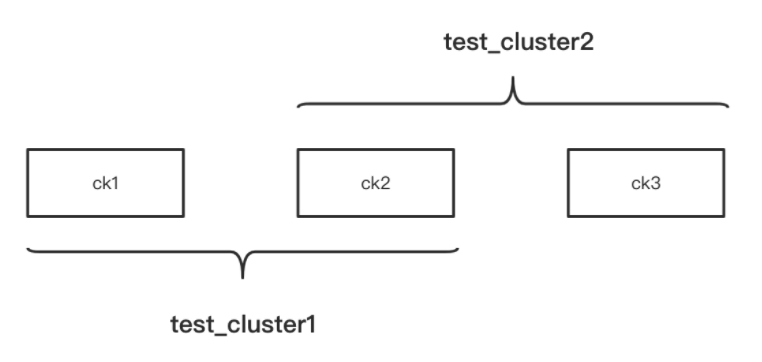
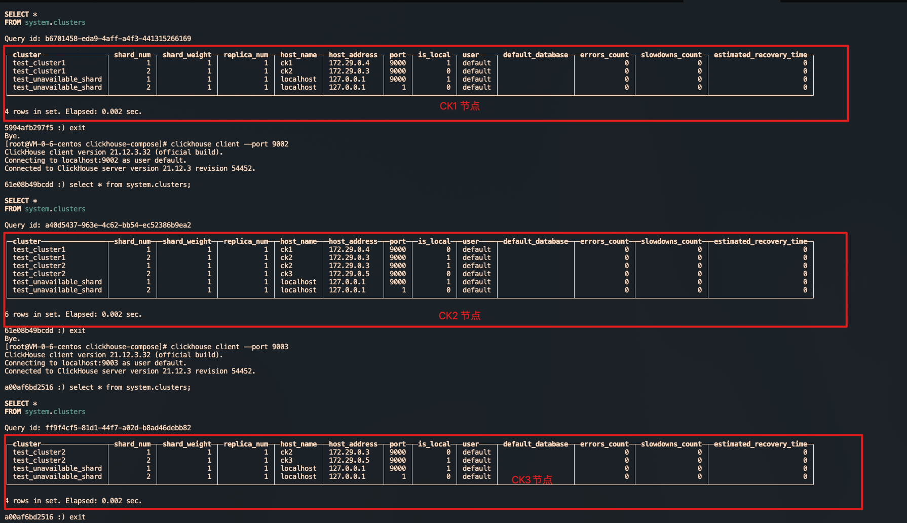
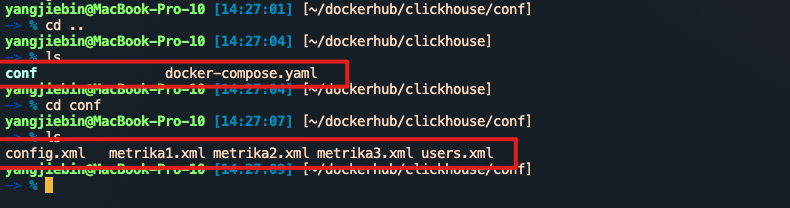
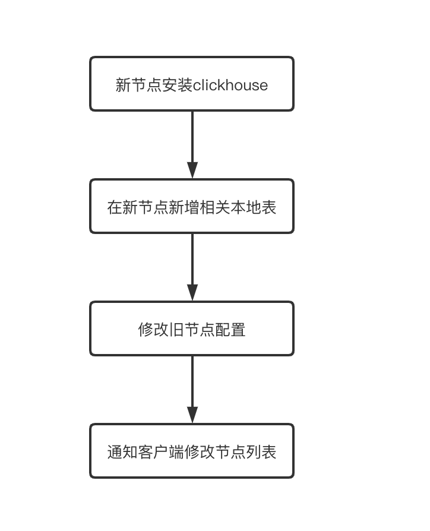
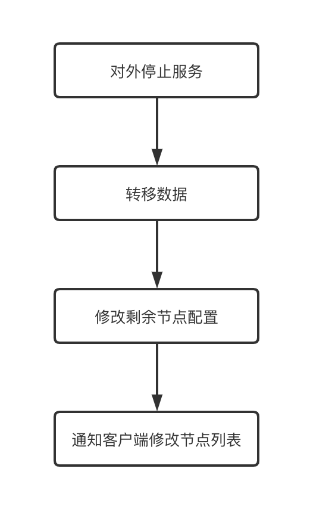

[toc]

# 一、单机版安装和启停

单机版的安装相对简单，官网介绍了好几种办法：

https://clickhouse.com/docs/zh/getting-started/install/

> 这里提一下tgz安装包的方式，目前官网的文档有点问题(不知道将来会不会更新)。从21.2.xx之后的版本的相关tgz包已经移到 https://repo.clickhouse.com/tgz/stable/ 下面了，官方文档的curl拉的路径全部都是https://repo.clickhouse.com/tgz。另外，如果通过官网的命令获取最新版本，甚至在 https://repo.clickhouse.com/tgz/stable/ 下可能都找不到对应的tgz包，遇到这种情况，我们可以自行找一个合适的版本下载

```shell
#获取最新版本的clickhouse
export LATEST_VERSION=`curl https://api.github.com/repos/ClickHouse/ClickHouse/tags 2>/dev/null | grep -Eo '[0-9]+\.[0-9]+\.[0-9]+\.[0-9]+' | head -n 1`
#如果最新版本下载不到，可以获取指定版本的clickhouse
export LATEST_VERSION=21.12.3.32
#21.2.xx 之后的tgz包路径变成https://repo.clickhouse.com/tgz/stable下
#21.2.xx 之前的还在https://repo.clickhouse.com/tgz下
curl -O https://repo.clickhouse.com/tgz/stable/clickhouse-common-static-$LATEST_VERSION.tgz
curl -O https://repo.clickhouse.com/tgz/stable/clickhouse-common-static-dbg-$LATEST_VERSION.tgz
curl -O https://repo.clickhouse.com/tgz/stable/clickhouse-server-$LATEST_VERSION.tgz
curl -O https://repo.clickhouse.com/tgz/stable/clickhouse-client-$LATEST_VERSION.tgz
 
tar -xzvf clickhouse-common-static-$LATEST_VERSION.tgz
sudo clickhouse-common-static-$LATEST_VERSION/install/doinst.sh
 
tar -xzvf clickhouse-common-static-dbg-$LATEST_VERSION.tgz
sudo clickhouse-common-static-dbg-$LATEST_VERSION/install/doinst.sh
 
tar -xzvf clickhouse-server-$LATEST_VERSION.tgz
sudo clickhouse-server-$LATEST_VERSION/install/doinst.sh
sudo /etc/init.d/clickhouse-server start
 
tar -xzvf clickhouse-client-$LATEST_VERSION.tgz
sudo clickhouse-client-$LATEST_VERSION/install/doinst.sh
```

启动/关闭clickhouse服务：

```shell
clickhouse start
clickhouse stop
```

clickhouse安装完之后会注册linux服务，因此也可以通过linux系统服务来启停clickhouse：

```shell
#注意！如果使用linux系统服务启动clickhouse，后面不能用clickhouse stop来关闭，不然系统会重新拉起clickhouse
/etc/init.d/clickhouse-server start
/etc/init.d/clickhouse-server stop
```

安装完测试连通性：

```shell
clickhouse client --port 9000
```

# 二、集群部署搭建

## 1、手动搭建clickhouse集群

clickhouse 集群是非主从结构，各个节点是相互独立的。因此，和hdfs、yarn的集群不同，我们可以根据配置，灵活的配置集群，甚至可以将一个节点同时分配给多个集群。

> clickhouse集群的概念主要就是用于分布式表和表的副本



上面这张图有3个节点，这3个节点组成了2个集群。

想要配置集群，需要在 /etc/clickhouse-server/config.xml的 <remote_servers> 标签下添加相关集群信息。或者在/etc/metrika.xml中进行配置。

> 如果要在 /etc/metrika.xml 中配置，需要确保metrika.xml已经被config.xml包含进去了：
>
> <remote_servers incl="clickhouse_remote_servers">   remote_servers记得加incl属性
>
>  <include_from>/etc/metrika.xml</include_from>  config.xml 将metrika.xml包含进来

要实现上图的集群架构，ck1、ck2、ck3的/etc/metrika.xml配置分别如下：

ck1配置：

```xml
<yandex>
    <clickhouse_remote_servers>
        <!--自定义集群名称-->
        <test_cluster1>
            <!--定义集群的分片数量，2个shard标签说明有2个节点-->
            <shard>
                <!--定义分片的副本数量，这里副本只有1个-->
                <replica>
                    <host>ck1</host>
                    <port>9000</port>
                </replica>
            </shard>
            <shard>
                <replica>
                    <host>ck2</host>
                    <port>9000</port>
                </replica>
            </shard>
        </test_cluster1>
    </clickhouse_remote_servers>
 
    <zookeeper-servers>
        <node index="1">
            <host>zk1</host>
            <port>2181</port>
        </node>
    </zookeeper-servers>
</yandex>
```

ck2配置：

```xml
<yandex>
  <clickhouse_remote_servers>
    <test_cluster1>
      <shard>
        <replica>
          <host>ck1</host>
          <port>9000</port>
        </replica>
      </shard>
      <shard>
        <replica>
          <host>ck2</host>
          <port>9000</port>
        </replica>
      </shard>
    </test_cluster1>
    <test_cluster2>
      <shard>
        <replica>
          <host>ck2</host>
          <port>9000</port>
        </replica>
      </shard>
      <shard>
        <replica>
          <host>ck3</host>
          <port>9000</port>
        </replica>
      </shard>
    </test_cluster2>
  </clickhouse_remote_servers>
 
  <zookeeper-servers>
    <node index="1">
      <host>zk1</host>
      <port>2181</port>
    </node>
  </zookeeper-servers>
 
</yandex>
```

ck3配置：

```shell
<yandex>
  <clickhouse_remote_servers>
    <test_cluster2>
      <shard>
        <replica>
          <host>ck2</host>
          <port>9000</port>
        </replica>
      </shard>
      <shard>
        <replica>
          <host>ck3</host>
          <port>9000</port>
        </replica>
      </shard>
    </test_cluster2>
  </clickhouse_remote_servers>
 
  <zookeeper-servers>
    <node index="1">
      <host>zk1</host>
      <port>2181</port>
    </node>
  </zookeeper-servers>
 
</yandex>
```

配置完之后，无需重启clickhouse服务，clickhouse会热加载这些配置。我们可以分别登陆这3台clickhouse，通过 select * from system.clusters; 查看当前节点所属集群的相关信息：



配置好集群之后，我们就可以基于配置好的集群创建分布式表了：

```sql
--在集群test_cluster1上的各个节点创建test表（也就是ck1、ck2）
create table default.test on cluster test_cluster1(id Int8,name String) engine = MergeTree order by id;
--基于test_cluster1创建分布式表
create table test_all as test engine =Distributed(test_cluster1,default,replicaTest,rand());
```

## 2、使用docker-compose快速搭建clickhouse集群

当集群机器数量众多，一台一台操作会非常麻烦。另外，如果我们手上没有服务器，又想深入研究clickhouse集群的一些特性时，就可以通过docker快速的搭建起clickhouse集群。

这里简单介绍一下docker-compose，docker-compose会根据定义好的配置文件帮我们启动多个docker container，省去我们一个个容器的操作工作。

下面的docker-compose.yaml是我经常用来快速搭建一个clickhouse集群的docker-compose配置文件：

```yaml
version: "3.7"
 
services:
  ck1:
    image: yandex/clickhouse-server
    ulimits:
      nofile:
        soft: 300001
        hard: 300002
    ports:
      - 9001:9000
    volumes:
      - ./conf/config.xml:/etc/clickhouse-server/config.xml
      - ./conf/users.xml:/etc/clickhouse-server/users.xml
      - ./conf/metrika1.xml:/etc/metrika.xml
    links:
      - "zk1"
    depends_on:
      - zk1
 
  ck2:
    image: yandex/clickhouse-server
    ulimits:
      nofile:
        soft: 300001
        hard: 300002
    volumes:
      - ./conf/metrika2.xml:/etc/metrika.xml
      - ./conf/config.xml:/etc/clickhouse-server/config.xml
      - ./conf/users.xml:/etc/clickhouse-server/users.xml
    ports:
      - 9002:9000
    depends_on:
      - zk1
 
  ck3:
    image: yandex/clickhouse-server
    ulimits:
      nofile:
        soft: 300001
        hard: 300002
    volumes:
      - ./conf/metrika3.xml:/etc/metrika.xml
      - ./conf/config.xml:/etc/clickhouse-server/config.xml
      - ./conf/users.xml:/etc/clickhouse-server/users.xml
    ports:
      - 9003:9000
    depends_on:
      - zk1
 
  zk1:
    image: zookeeper
    restart: always
    hostname: zk1
    expose:
      - "2181"
    ports:
      - 2181:2181
```

上面的配置文件定义了4个容器，其中3个容器分别运行clickhouse服务，1个容器运行zookeeper服务。

配置后docker-compose.yaml后，进入该配置文件的目录，执行 docker-compose up -d 就会一起启动这些容器，clickhouse集群也就快速搭建好了。通过docker\-compose down可以卸载集群。

上面docker-compose.yaml中引入的./conf/users.xml、./conf/config.xml、./conf/metrika.xml 等内容会在本博客的最后贴出。



# 三、集群扩容

假设当前有个集群test_cluster，有两个节点，该集群下面有张test表。集群配置如下：

```xml
<test_cluster>
      <shard>
        <internal_replication>true</internal_replication>
        <replica>
          <host>ck1</host>
          <port>9000</port>
        </replica>
      </shard>
      <shard>
        <internal_replication>true</internal_replication>
        <replica>
          <host>ck2</host>
          <port>9000</port>
        </replica>
      </shard>
</test_cluster>
```

test表的相关创建语句：

```sql
--在集群各个节点创建test表
create table default.test on cluster test_cluster(id Int8,name String) engine = MergeTree order by id;
--在某个节点创建分布式表
create table test_all as test engine =Distributed(test_cluster,default,replicaTest,rand());
--写入若干数据
insert into test_all values(1,'zhang'),(2,'li'),(3,'zhao'),(4,'qian'),(5,'sun'),(6,'wang'),(7,'tian'),(8,'he'),(9,'zheng'),(10,'dong');
```

之后我们想往这个test_cluster新增一个节点。扩容的步骤大概如下：



**1、在新节点安装clickhouse，进行配置（加上原有集群的相关配置）**
编辑新节点的/etc/metrika.xml (ck3为新节点)：

```xml
<yandex>
  <clickhouse_remote_servers>
    <test_cluster>
      <shard>
        <internal_replication>true</internal_replication>
        <replica>
          <host>ck1</host>
          <port>9000</port>
        </replica>
      </shard>
      <shard>
        <internal_replication>true</internal_replication>
        <replica>
          <host>ck2</host>
          <port>9000</port>
        </replica>
      </shard>
      <shard>
        <internal_replication>true</internal_replication>
        <replica>
          <host>ck3</host>
          <port>9000</port>
        </replica>
      </shard>
    </test_cluster>
  </clickhouse_remote_servers>
 
  <zookeeper-servers>
    <node index="1">
      <host>zk1</host>
      <port>2181</port>
    </node>
  </zookeeper-servers>
 
</yandex>
```

2、在新节点新建该集群的相关本地表
因为test_cluster集群下面只有一张test表，因此我们只要在新节点下创建test表即可：

```sql
--创建test表，结果就是ck1、ck2、ck3都有test表
create table if not exists default.test on cluster test_cluster(id Int8,name String) engine = MergeTree order by id;
```
**3、修改集群旧节点的config.xml配置，加上新节点**
在ck1、ck2的/etc/metrika.xml中全部加上ck3的配置：

```xml
<yandex>
  <clickhouse_remote_servers>
    <test_cluster>
      <shard>
        <internal_replication>true</internal_replication>
        <replica>
          <host>ck1</host>
          <port>9000</port>
        </replica>
      </shard>
      <shard>
        <internal_replication>true</internal_replication>
        <replica>
          <host>ck2</host>
          <port>9000</port>
        </replica>
      </shard>
      <shard>
        <internal_replication>true</internal_replication>
        <replica>
          <host>ck3</host>
          <port>9000</port>
        </replica>
      </shard>
    </test_cluster>
  </clickhouse_remote_servers>
 
  <zookeeper-servers>
    <node index="1">
      <host>zk1</host>
      <port>2181</port>
    </node>
  </zookeeper-servers>
 
</yandex>
```

修改完配置文件后，因为clickhouse会自动感知到config文件变化，因此我们修改的内容会马上生效。

后面可以通过下面的方式验证是否扩容成功：

```sql
--在ck1、ck2查询system.clusters表，看ck3是否已经加进来了
select * from system.clusters
--往之前创建的分布式表test_all表中再插入若干数据
insert into test_all values(1,'zhang'),(2,'li'),(3,'zhao'),(4,'qian'),(5,'sun'),(6,'wang'),(7,'tian'),(8,'he'),(9,'zheng'),(10,'dong');
--去ck3查看是否有数据写入
select * from test
```

**4、通知客户端更新节点列表**

## 如何保证扩容后的数据均匀分布？

根据写入的场景我们可以分开分析：

**1、数据是通过分布式表来写入**

这种情况，我们可以通过设置集群的权重，让后面的数据优先写入新节点，比如：

```xml
<yandex>
  <clickhouse_remote_servers>
    <test_cluster>
      <shard>
        <weight>1</weight>
        <internal_replication>true</internal_replication>
        <replica>
          <host>ck1</host>
          <port>9000</port>
        </replica>
      </shard>
      <shard>
        <weight>1</weight>
        <internal_replication>true</internal_replication>
        <replica>
          <host>ck2</host>
          <port>9000</port>
        </replica>
      </shard>
      <shard>
        <weight>99</weight>
        <internal_replication>true</internal_replication>
        <replica>
          <host>ck3</host>
          <port>9000</port>
        </replica>
      </shard>
    </test_cluster>
  </clickhouse_remote_servers>
 
  <zookeeper-servers>
    <node index="1">
      <host>zk1</host>
      <port>2181</port>
    </node>
  </zookeeper-servers>
 
</yandex>
```

将ck1、ck2的权重都设置为1，ck3的权重设置为99，这样后面写入的数据大部分都会写入到ck3中。等到ck3的数据差不多和ck1、ck2持平了，再将权重改成一样

**2、数据是在客户端层面直接往各个节点的本地表写入**

这种情况就需要稍微改造下客户端的程序，让客户端可以优先选择新节点的本地表进行数据写入，直到各个节点的数据平衡

# 四、集群缩容

假设当前有个集群test_cluster，有三个节点，该集群下面有张test表。集群配置如下

```shell
<yandex>
  <clickhouse_remote_servers>
    <test_cluster>
      <shard>
        <internal_replication>true</internal_replication>
        <replica>
          <host>ck1</host>
          <port>9000</port>
        </replica>
      </shard>
      <shard>
        <internal_replication>true</internal_replication>
        <replica>
          <host>ck2</host>
          <port>9000</port>
        </replica>
      </shard>
      <shard>
        <internal_replication>true</internal_replication>
        <replica>
          <host>ck3</host>
          <port>9000</port>
        </replica>
      </shard>
    </test_cluster>
  </clickhouse_remote_servers>
 
  <zookeeper-servers>
    <node index="1">
      <host>zk1</host>
      <port>2181</port>
    </node>
  </zookeeper-servers>
</yandex>
```

现在我们需要下掉一个节点（ck3），大概需要进行以下步骤：



**1、对外停止服务**

防止操作过程中客户端读取到的数据不完整

**2、转移要下线节点的数据**

这里需要将要下线节点的数据转移到其他的节点去，数据迁移可以使用以下方式：

```sql
--在ck1执行下面的sql，将ck3的部分数据写到ck1的本地表中
insert into replicaTest select * from remote('ck3:9000','default','replicaTest','default') where id % 2 = 0;
--在ck2执行下面的sql，将ck3的部分数据写到ck2的本地表中
insert into replicaTest select * from remote('ck3:9000','default','replicaTest','default') where id % 2 = 1;
```

执行完上面的sql后，ck3的数据就迁移到ck1、ck2中去了

**3、修改剩余节点的集群配置**

在ck1、ck2的config.xml配置文件中去除ck3的配置：

```xml
<yandex>
  <clickhouse_remote_servers>
    <test_cluster>
      <shard>
        <internal_replication>true</internal_replication>
        <replica>
          <host>ck1</host>
          <port>9000</port>
        </replica>
      </shard>
      <shard>
        <internal_replication>true</internal_replication>
        <replica>
          <host>ck2</host>
          <port>9000</port>
        </replica>
      </shard>
    </test_cluster>
  </clickhouse_remote_servers>
 
  <zookeeper-servers>
    <node index="1">
      <host>zk1</host>
      <port>2181</port>
    </node>
  </zookeeper-servers>
</yandex>
```

**4、通知客户端更新节点列表**