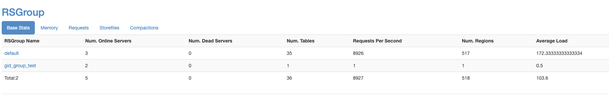
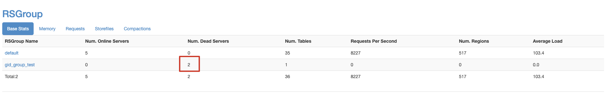
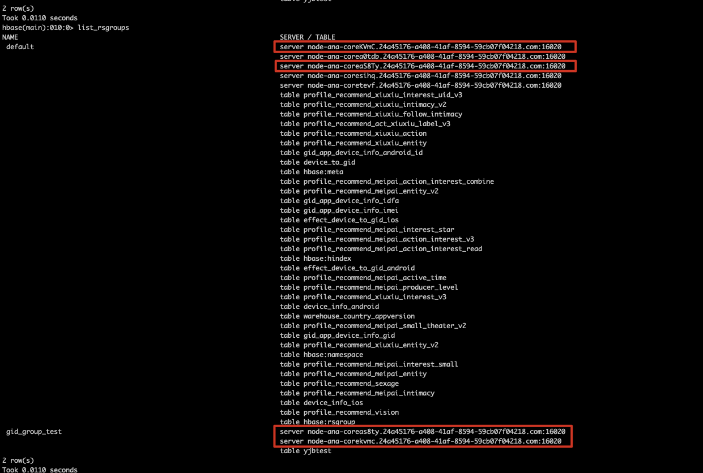
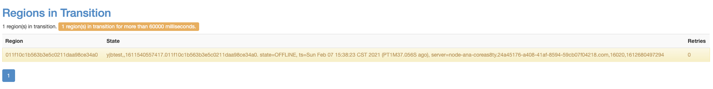
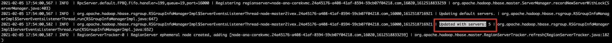
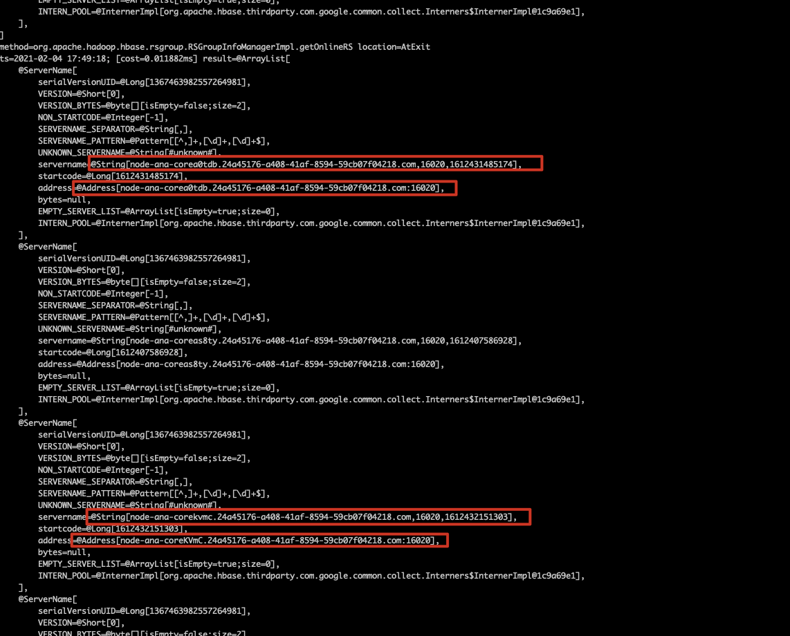

[TOC]

使用Hbase 版本：2.1.1

## 一、问题描述

RegionServer group是2.x后引入的隔离机制，可以用于业务的隔离。我们通过hbase shell的相关命令配置完group后，group信息如下：



后面滚动重启所有RegionServer，发现原先配置到gid_group_test的两台RS跑到default组了，同时gid_group_test组出现了两台Dead server：



通过hbase shell的list_rsgroups发现：



同时gid_group_test组的yjbtest表状态变为RIT，无法正常提供服务：



## 二、问题定位
查看HMaster日志，发现有相关日志输出，原先default组应该只有3台RegionServer，却变成发现了5台：

找到代码对应的行为是在org.apache.hadoop.hbase.rsgroup.RSGroupInfoManagerImpl$ServerEventsListenerThread.run类中，后面一路跟代码和不断复现，发现这是一段更新default组的RegionServer的代码，更新逻辑大概如下：
```java
// Called by ServerEventsListenerThread. Presume it has lock on this manager when it runs.
private SortedSet<Address> getDefaultServers() throws IOException {
  SortedSet<Address> defaultServers = Sets.newTreeSet();
  for (ServerName serverName : getOnlineRS()) {
    Address server =
        Address.fromParts(serverName.getHostname(), serverName.getPort());
    boolean found = false;
    for(RSGroupInfo rsgi: listRSGroups()) {
      if(!RSGroupInfo.DEFAULT_GROUP.equals(rsgi.getName()) &&
         //对比Address，RSGI里面存的Address都是小写的，如果这里取出来的server的address.host是大写，就会误判为不在这个组中
          rsgi.containsServer(server)) {
        found = true;
        break;
      }
    }
    if (!found) {
      defaultServers.add(server);
    }
  }
  return defaultServers;
}
```
1、获取现有的所有RegionServer（从ServerManager实例的onlineServers变量中）

2、遍历这些RegionServer，然后判断这些RegionServer是否在其他组的RS列表表，不在的则就是default组的RS了

问题就在于RegionServer在重启后，原先应该是gid_group_test的RS被判断不在gid_group_test组中，因此被分到了default组（根因是因为hostname大小写的原因，因此导致误判）

先看一下onlineServers，它是一个ConcurrentNavigableMap<ServerName, ServerMetrics>，其中ServerName有两个关键字段：
```java
//ServerName.java
private final String servername;
private transient Address address;
 
 
//Address.java
private HostAndPort hostAndPort;
 
 
//HostAndPort.java
private final String host;
private final int port;
```
后面我们使用arthas查看了onlineServers的相关数据,发现serverName字段有经过处理，全是小写字段，但是Address中的host却有时是小写有时是大写。当address的host是大写时，因为RS Group中存的host都是小写，因此会导致误判，认为此Regionserver不属于该Rs group，因此将其分到default组。


后面发现这种问题可以通过重启HMaster恢复，当重启HMaster后，RS的配置就会恢复成正常。结合代码应该是以下情况：

1、HMaster重启后，RegionServer的相关信息从zk加载，zk存储的hostname都是小写的，应该构造的ServerName的Address#host字段也是小写，此时RS group是正常的

2、RegionServer 重启后，RegionServer 上报的ServerName相关信息，是根据本机的hostname来决定的（有些机器是全小写，有些机器大小写混杂），因此这时上报到HMaster后构造的ServerName的Address#host字段就可能变成大写，导致RS group问题

## 三、解决方案
Hmaster的Regionserver的抽象是ServerName，因此可以在构造ServerName实例时，将所有的host都转成小写存储。因此修改ServerName的相关构造函数即可

## 四、网上相关patch
由于ServerName在大小写敏感的处理不一致还会引发许多问题，可以详见：

https://issues.apache.org/jira/browse/HBASE-24395

https://issues.apache.org/jira/browse/HBASE-13995