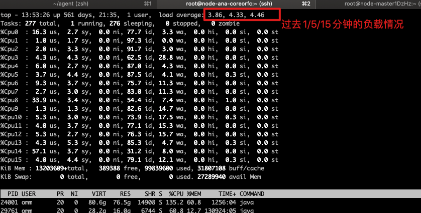
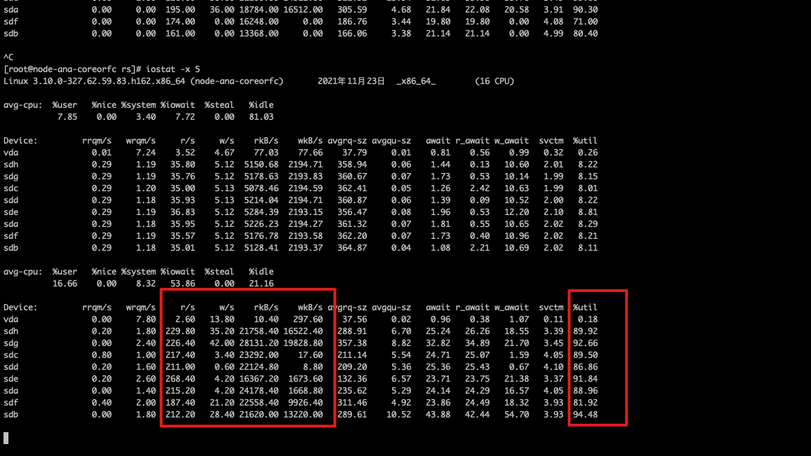
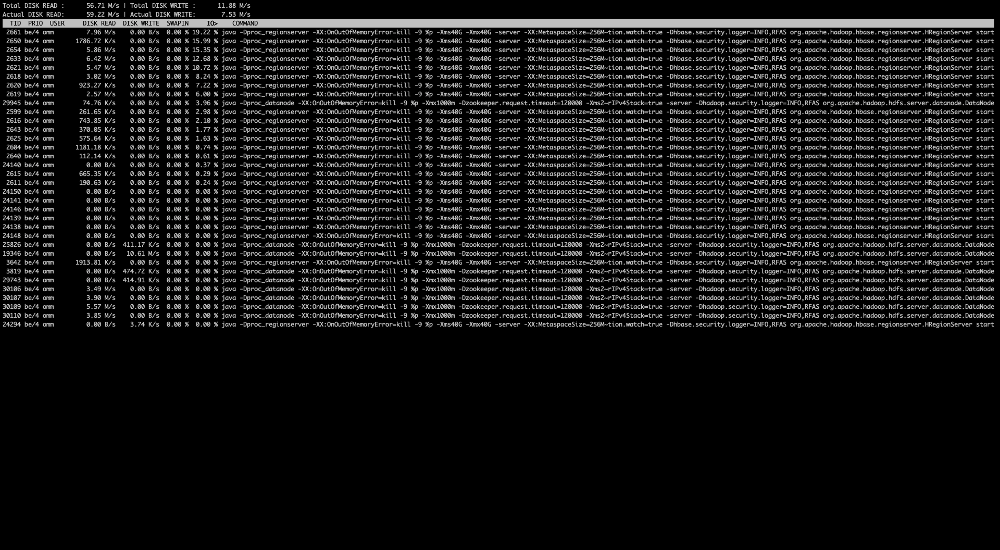
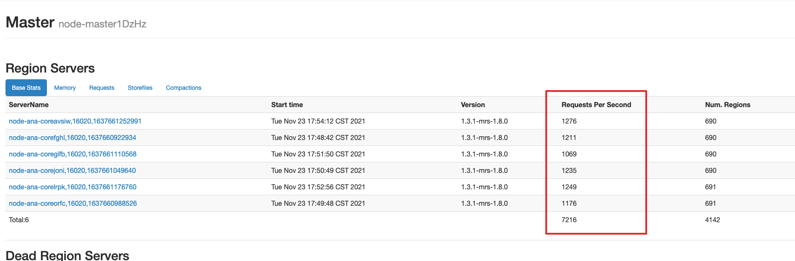
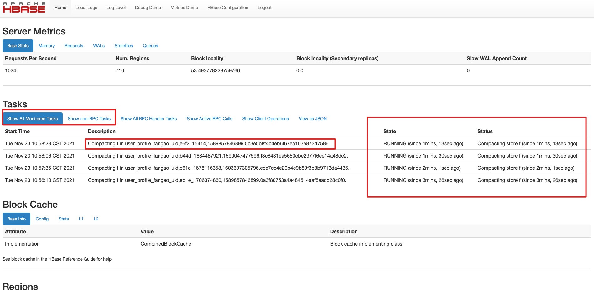
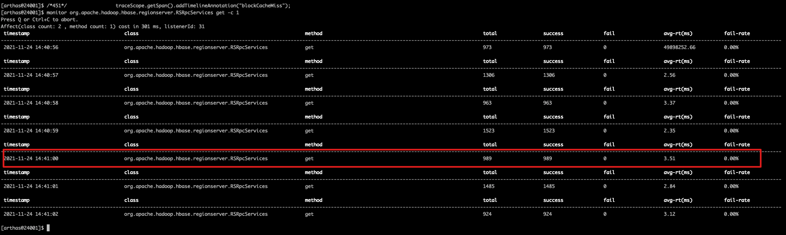
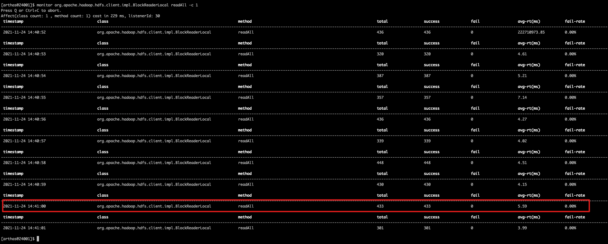
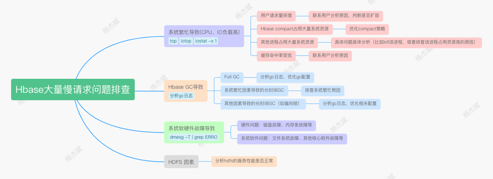

[toc]

# 一、确定慢请求是否突然暴增

查看RegionServer日志，搜索responseTooSlow，确认用户反馈的时间点是否出现慢请求。如果所有的RS在该时间点都没有明显的慢请求日志，可以让用户复查一下是否是其他因素导致的慢请求（大概率不是hbase的问题了）

慢请求参考日志：

```
2021-04-30 09:09:56,557 | WARN | RpcServer.FifoWFPBQ.default.handler=61,queue=21,port=16020 | (responseTooSlow): {``"call"``:``"Get(org.apache.hadoop.hbase.protobuf.generated.ClientProtos$GetRequest)"``,``"starttimems"``:1619744995231,``"responsesize"``:2254,``"method"``:``"Get"``,``"param"``:"regi``on= profile_recommend_pic_recognition,ccccccc8,1616800548557.997b5a47cc0d3c1d50f31d44788f4315., row=d07f_2038231756``","``processingtimems``":1326,"``client``":"``10.244.19.241:35072``","``queuetimems``":0,"``class``":"``HRegionServer"} | org.apache.hadoop.hbase.ipc.RpcServer.logResponse(RpcServ``er.java:2546)
```

上面这条表示查询 profile_recommend_pic_recognition 表的时候出现慢请求，processingtimems 表示实际的处理时间（1326ms），queuetimems 请求在队列的排队时间（0ms）。这里我们可以看到，这条请求处理了1326毫秒。

如果确实出现了大量慢请求，就需要从各方面介入排查了。

如果看到大量的慢请求，也先不要慌，因为GC的缘故，偶尔也会有一些慢请求的出现，这是正常现象，我们可以通过以下命令查询历史各个时间点的慢请求数量，来判断当前时间点的慢请求数量是否正常。

```
# 查询各个分钟出现的慢请求数量``cat` `hbase-omm-regionserver-node-ana-corefGhl.log | ``grep` `"responseTooSlow"` `| ``awk` `-F``'[ :]+'` `'{print $1,$2,$3}'` `| ``uniq` `-c | ``less
```

关于慢请求日志，和配置hbase.ipc.warn.response.time有关，没有设置的话默认是10s。也就是说，如果一个请求超过了10s，就会输出上hbase的日志上

# 二、慢请求暴增可能的因素

以下的标题顺序按照可能性排序（比如第一个系统繁忙是最有可能导致慢请求突增的因素）

## 1、系统繁忙导致的慢请求

系统繁忙最常见的就是IO和CPU，对于历史的负载数据，可以看机器的历史指标，看是否有明显的尖刺等（和平时对比）。如果有尖刺，就需要分析导致IO高和CPU高的原因是什么了。大多数原因如下：

- 用户请求短时间暴增
- Hbase compact
- 其他的一些潜在进程导致，这个通过top、iostat等命令排查，找出具体的进程然后关闭

**关于系统繁忙根因排查可以见第三章**

## 2、GC导致的慢请求

基本上大多数的慢请求都是GC导致的，具体的GC问题需要分析GC日志。

通过查看GC日志，我们可以很明显的看出在问题时间点是否有异常的STW停顿时间（如果gc日志看的比较吃力，可以将日志放到https://gceasy.io/上解析，会有比较可观的报表）。如果有长时间的停顿时间，就需要分析造成长时间的停顿的原因：

- Full GC：出现Full gc就得排查服务本身是否有请求暴增或者是否有内存泄露等问题 （临时解决方案：重启RS服务）
- 系统繁忙导致GC时间变长：这种一般要看一下当时的IO、CPU负载
- 其他原因导致的长时间停顿（偏向锁等）

## 3、系统故障导致的慢请求

如果没有长时间GC，系统各方面指标也比较正常。那可能是硬件故障导致的。一般硬盘出现故障的概率比较大:

- 通过 dmesg -T | grep ERROR 命令检测硬盘是否有问题，如果检测出来有问题就找相关的运维人员修复硬盘
- 有时可能硬件没问题，但是文件系统出现问题。比如有次我们集群的硬盘目录无法正常写入数据（可以读取），验证这种情况我们可以往对应的硬盘目录写一份文件看看：touch /hbase/data1/test.log

**这种情况一般只有个别机器会出现慢请求日志。如果所有机器都有大量慢请求日志，那大概率不是系统故障**

## 4、HDFS因素

因为hbase的数据是存储在hdfs上，因此hdfs的读写性能也会影响到请求（不过系统负载、硬件故障都会反映到hdfs的读写性能上）。需要额外关注的就是NameNode和各节点Datanode的GC情况，查看是否出现长时间停顿（可以通过MRS和GC日志）

# **三、系统负载高根因排查**

**上面有说到系统繁忙会导致大量的慢请求，下面介绍一下当因为系统繁忙出现大量慢请求时，我们该如何快速定位导致系统繁忙的根因（这里主要介绍CPU和IO负载）。**

## **1、CPU 持续飙高**

**通过top命令查看当前cpu负载**



重点可以关注load average这个指标，通过这个值，可以大概了解当前cpu的负载情况（假设16核的机器，load average 32表示每个cpu大概要同时服务两个进程，此时的负载系数为 32/16=2，已经算相对比较繁忙了，如果负载系数超过5，则表示系统此时非常繁忙）。关于top命令的详解可以见：https://blog.csdn.net/u013332124/article/details/95731226

在确定了cpu负载高之后，我们通过top命令也可以看到哪些进程长时间占用cpu，然后进行进一步的分析。

**对于java进行，我们可以进一步定位到具体哪个线程在占用cpu**：

- 通过top确定占用大量cpu时间的进程ID
- 通过top -H 确定占用大量cpu时间的线程ID
- 通过 printf %x xxxx 输出16进制地址 （xxxx是对应的线程ID）
- 通过 jstack -l yyyy 搜索上面的得到的16进制地址，就可以找到具体哪个线程在占用cpu

## 2、IO负载持续打满

通过 iostat -x 1 输出当前机器的IO负载情况：



重点可以看最后一列util，它代表了各个磁盘的当前利用率，当各个磁盘的util达到8-90%，甚至100%，说明当前IO磁盘的负载已经很高了。另外也可以看一下每秒的读请求数量和读的量，一般我们hbase-offline的磁盘读的tps到200+，读的量到2w+ kb/s，就会达到80%以上，以后也可以以这个为标准值来评估一下磁盘是否有问题（**可能一些磁盘出现问题，很低的IO请求里就会导致util打高**）

在确定了当前IO负载高时，我们可以通过 iotop -o 来查看当前是哪些进程在大量占用IO资源：



需要留意的是，如果是Java 进程，最左边的TID显示的线程ID。我们可以通过 `printf %x 线程ID`的方式输出16进制地址，然后jstack -l javaPid 的方式去堆栈中找到具体哪个线程在占用IO资源。

## 3、导致 IO 负载升高的情况汇总

对大部分的慢请求场景来说，基本都是IO负载高导致的。因此我们看一下常见的导致IO负载高都有哪些情况

### **用户请求突增**

这个比较好定位，可以去Hbase的HMaster页面查看一下各个region当前的请求数量，然后去MRS的曲线查看一下历史的请求数，对比一下是否存在请求突增的情况。



### Hbase在进行大量compact

Hbase 的compact又分成minor compact和major compact，通常会造成系统繁忙的大多都是major compact。在compact的过程中，hbase需要读取旧文件的KV然后写入到新的文件中，因此如果有大量的compact线程在做compact，就会导致IO负载持续升高。

对于某台RegionServer是否在做compact可以看这台RegionServer的UI页面（会标记状态和持续时间）：



PS：对于Major compact，因为它会占用大量的IO，因此通常线上环境建议关闭major compact（设置hbase.hregion.majorcompaction=0）。然后可以写个crontab在业务低峰期定时执行major compact

### 缓存命中率变低

在实际排查过程中，有发现请求数量没变（业务场景基本都是Get请求），也没compact，但是IO变高的情况。后面排查发现是因为Hbase的缓存命中率变低了导致的 ——> 原先2000个请求，缓存命中率50%，实际落到磁盘的请求也就1000。突然缓存命中率变成了10%，这时候会有2000 * 0.9 = 1800个请求落到磁盘，就会导致IO负载突增。关于缓存命中率，hbase页面和MRS都有展示，**但是那个是反应历史的一个整体缓存命中率，不可信。要查看当前RegionServer请求的整体命中率，我们可以通过arthas来确定：**

**在attach到RegionSever进程后，先查看当前rpc get的请求数：**

```
monitor org.apache.hadoop.hbase.regionserver.RSRpcServices get -c 1
```



**之后再查看实际查询磁盘的请求数：**

```
monitor org.apache.hadoop.hdfs.client.impl.BlockReaderLocal readAll -c 1
```



通过上面两张图我们可以看到，在 2021-11-24 14:41:00 这个点，get的请求实际是989，而去磁盘查询的方法调用次数是 433，因此这里可以算出来缓存利用率为 (989-433) * 100.0 / 989(989-433) * 100.0 / 989 = 56.22%。

因此，如果发现是缓存命中率变低，那么就要结合业务情况来详细分析下其中原因了

# 四、总结
