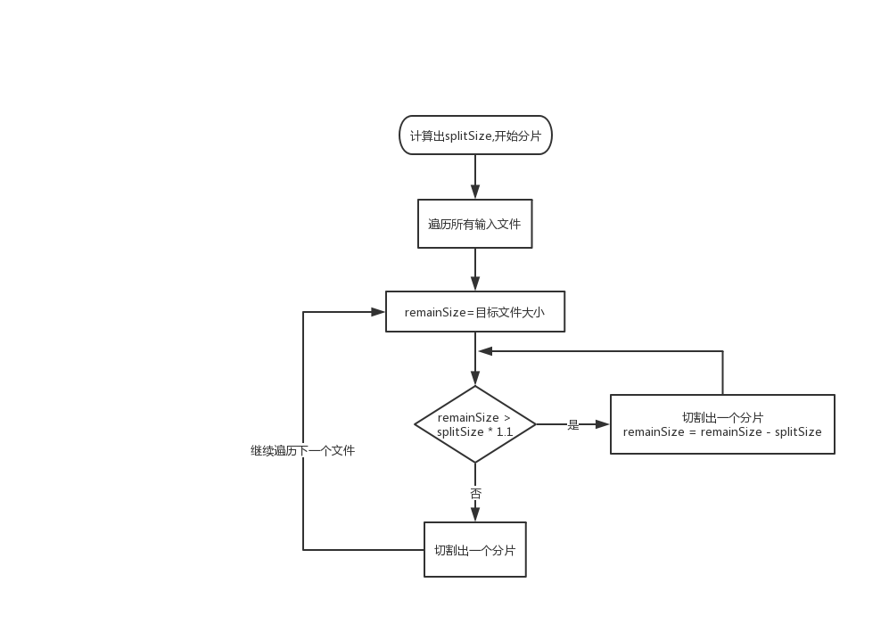
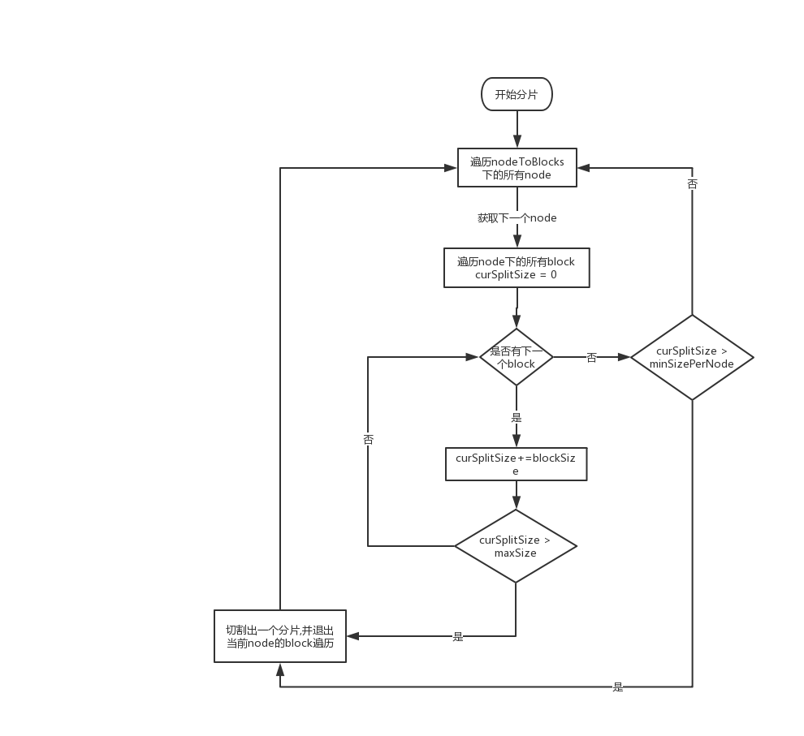
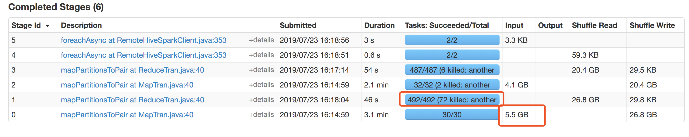

[TOC]

以下的内容都是基于hive on spark来讲解的，不过大部分概念都是互通的，也可以应用到hive on mr上。

## 一、如何调整任务map数量

在hadoop体系中，有一个类叫`InputFormat`。在hadoop1.x时期，这个类在`org.apache.hadoop.mapred`包底下，是一个接口。而到了hadoop2.x时期，这个类就到了`org.apache.hadoop.mapreduce`包底下，变成了一个抽象类（**1.x的那个InputFormat接口也还保留着**）。因此，我们去看hadoop源码时，搜InputFormat会搜到两个类。这是因为hadoop2.x做了很大的架构改进，同时为了兼容1.x的一些架构，所以同时保留了这两套代码。

InputFormat主要有两个方法（下面的代码是hadoop1.x版本的）：

```java
//1.x版本的getSplits方法
InputSplit[] getSplits(JobConf job, int numSplits) throws IOException;
//2.x版本的getSplits方法
public abstract List<InputSplit> getSplits(JobContext context ) throws IOException, InterruptedException;
RecordReader<K, V> getRecordReader(InputSplit split,
                                     JobConf job, 
                                     Reporter reporter) throws IOException;
```

- getSplits：获取数据分片信息，**这个分片数组的大小就决定了map数量**。一般一个分片由一个map task来处理
- getRecordReader：获取reader，用来实际读取分片数据

> 无论是mapreduce job还是spark job都是使用这个InputFormat的体系来计算map数量的。针对不同类型的输入数据，我们可以实现各种不同的InputFormat。比如我们常用的TextInputFormat就是实现了InputFormat类

### 1、FileInputFormat的实现逻辑介绍

hadoop实现了一个抽象类FileInputFormat来作为InputFormat的一个通用实现类，我们熟悉的TextInputFormat就继承了FileInputFormat。TextInputFormat并没有实现自己的getSplits方法，而是直接使用FileInputFormat的getSplits方法。

#### 1.1 getSplits方法实现

先通过公式`Math.max(minSize, Math.min(goalSize, blockSize))`计算出目标分片大小splitSize。

- minSize: 根据配置mapred.min.split.size获取的，2.x版本中这个配置改成mapreduce.input.fileinputformat.split.minsize。还hive中两个配置都可以用
- blockSize: 输入hdfs文件的单个block大小
- goalSize: 这个是1.x和2.x不同的地方。2.x中直接通过mapred.max.split.size或mapreduce.input.fileinputformat.split.maxsize获取。而1.x则是通过getSplits方法入参里的numSplits参数来计算的。计算规则：`goalSize=totalSize / (numSplits == 0 ? 1 : numSplits)`，其中totalSize是输入文件的总大小(如果输入是一个目录，就遍历底下的文件累加)。

确定了splitSize后，就通过以下流程进行分片：



1. 遍历所有输入文件
2. 设置`remainSize=目标文件大小`
3. 判断 remainSize 是否大于 splitSize * 1.1，是的话切割出一个分片，然后remainSize = remainSize - splitSize，接着继续执行以上逻辑，直到remainSize小于 splitSize * 1.1。之后将文件剩下的bytes切割出一个分片来

从上面的流程可以看出，在FileInputFormat的getSplits逻辑下，一个map task最多只能处理一个文件。**也就是说，如果输入文件有n个，无论怎么调整参数，分配的map数量都不会少于n**。

### 2、CombineFileInputFormat的实现逻辑介绍

上面介绍的FileInputFormat分片规则比较简单，有时候可能会有某一些分片都集中在几台节点的问题。而在CombineFileInputFormat的实现中，会尽量保证各个节点、机架都能分配到一定的数据。

#### 2.1 getSplits方法实现

首先遍历所有的输入文件，在遍历过程中构建以下数据结构：

```java
//具体节点上的所有block信息
Map<String, Set<OneBlockInfo>> nodeToBlocks    
//未分配出去的block信息
Map<OneBlockInfo, String[]> blockToNodes   
//具体机架上的所有block信息
Map<String, List<OneBlockInfo>> rackToBlocks   
```

还有几个和配置相关的变量：

- maxSize: 通过mapreduce.input.fileinputformat.split.maxsize参数设置
- minSizePerNode: 通过mapreduce.input.fileinputformat.split.minsize.per.node参数设置
- minSizePerRack:通过mapreduce.input.fileinputformat.split.minsize.per.rack参数设置

接下来开始计算分片（部分流程图）：



上面的流程图主要是遍历nodeToBlocks下的所有node，然后继续遍历node下的所有block，将block的大小相加(**这个block的大小计算也和maxSize有关**)，一直叠加到maxSize后生成一个分片，然后退出该node的block遍历。如果遍历完block都没达到maxSize，但是累加的数据量达到了minSizePerNode的值，也可以切割出一个分片来，否则就什么都不做。之后继续下一个node遍历。（在这个过程中，一个node最多只会生成一个分片）

之后按照基本一样的流程遍历rackToBlocks，处理完rack的分片后将所有剩下的block会放到一个`overflowBlocks（ArrayList\<OneBlockInfo\>）`的数据结构中。

最后一步是遍历overflowBlocks，不断累加block，遍历过程中达到maxSize就切割一个分片出来，直到全部遍历完。

### 3、HiveInputFormat 的实现逻辑介绍

因为hive的任务的数据类型有各种各样，用户在提交sql时并不需要关心要用哪种InputFormat来读取数据。因此，Hive内部实现了自己的InputFormat。我们可以通过hive的参数`hive.input.format`来设置具体要用哪种InputFormat实现。hive默认是使用`org.apache.hadoop.hive.ql.io.CombineHiveInputFormat`。目前也仅支持HiveInputFormat和CombineHiveInputFormat两种。

HiveInputFormat做的事主要就是解析输入目录对应的表，然后获取表设置的InputFormat是哪个。之后就把getSplits逻辑委托给这个类了。

如果我们要读取的表是textfile格式的，最后就也是走到TextInputFormat类进行数据分片。**所以，大多数情况下，HiveInputFormat的行为和FileInputFormat差不多**。

> 当我们在Hive创建一张表时，hive会根据用户的语句去给表的数据设置对应的InputFormat。默认是textfile的格式，使用的是`org.apache.hadoop.mapred.TextInputFormat`。如果我们建表的时候加上stored as orc，对应的InputFormat就变成了`org.apache.hadoop.hive.ql.io.orc.OrcInputFormat`。

另外，因为Hive的HiveInputFormat是基于hadoop1.x版本的。因此分片大小的计算公式中goalSize由getSplits的第二个参数numSplits来决定，这个参数是外界传进来的。在mapreduce job中，可以通过mapred.map.tasks参数来设置，默认是2。如果我们想调大并发度，可以把这个值设置的大一点。**但是在hive on spark中却没有地方可以设置这个参数（设置spark.defalut.parallelism也没用）**，在hive on spark中，numSplits的值都默认为2。这里不具体展开，感兴趣的可以自行查看相关源码。

### 4、CombineHiveInputFormat的实现逻辑介绍

和HiveInputFormat相对应的是CombineHiveInputFormat。**这个也是hive的默认配置**。

**CombineHiveInputFormat的底层实现也是使用了CombineFileInputFormat的getSplits方法**。但是CombineHiveInputFormat在调用CombineFileInputFormat#getSplits()前还会进行一些额外的处理。比如过滤出一些不需要合并的目录（例如ACID的目录就不可以去合并）。

### 5、map数量调整总结

**set hive.input.format=org.apache.hadoop.hive.ql.io.CombineHiveInputFormat 时**：

| 可影响map数量的参数                                          |
| ------------------------------------------------------------ |
| mapreduce.input.fileinputformat.split.maxsize ( mapred.max.split.size ) |
| mapreduce.input.fileinputformat.split.minsize.per.node       |
| mapreduce.input.fileinputformat.split.minsize.per.rack       |

**set hive.input.format=org.apache.hadoop.hive.ql.io.HiveInputFormat 时**：
| 可影响map数量的参数                                          |
| ------------------------------------------------------------ |
| mapreduce.input.fileinputformat.split.minsize ( mapred.min.split.size ) |
| mapred.map.tasks(**仅hive on mr有作用**)                     |
| 也可以通过改变文件hdfs block大小来影响（不推荐）             |

## 二、如何调整任务reduce数量

hive设置reduce数量的逻辑就比较简单，相关代码在SetSparkReducerParallelism类中，感兴趣的可以自己去细看代码。

reduce的数量主要和以下三个参数有关：

| 参数名                               | 默认值     |
| ------------------------------------ | ---------- |
| hive.exec.reducers.bytes.per.reducer | 1000000000 |
| hive.exec.reducers.max               | 999        |
| mapred.reduce.tasks                  | -1         |

mapred.reduce.tasks参数很简单，就是简单粗暴的直接指定reduce数量应该是多少。这个值是多少reduce task数量就是多少。

hive.exec.reducers.bytes.per.reducer和hive.exec.reducers.max是配合使用的。

具体计算公式如下：

`reduceNumber = min(maxReduceNumber,mapInputSize/(bytesPerReduce/2))`

其中mapInputSize表示的是预期输入的数据总大小。这里注意要把**预期输入的数据量和实际输入的数据量**区别对待。通常我们在spark historyServer看到的统计数据都是**实际输入的数据量**：



上图中实际输入的数据量是5.5GB，我们设置的bytesPerReduce是30m。如果使用公式去算，会发现的出来的值不是492。但其实预期输入的数据量是7.2GB（也就是目标目录的总大小），只是map task在读取数据时会过滤掉一些没用的数据不读取。

> 在spark job中，可能存在多个stage，有的reduce task数量的规则的mapInputSize是取自父stage的shuffle Read的值

## 三、关于map task是如何读取数据的

上面介绍了任务是如何切割分片，然后确定map task数量的，之后一个map task负责一个分片。但是如果仔细思考，就会发现一个问题：map task所分配的到的分片不一定是完整的。

举个例子，一个文件有200M，一行大概100M，也就是这个文件只有2条记录。

这时如果我们读取这个文件时splitSize是60M，也就是最终会切割成4个分片：0~59MB，60~119MB，120~179MB，180~200B。也就是会启动4个map task来处理数据。那这4个task是怎么处理两条数据的呢？

这个就和InputFormat的getRecordReader方法有关系了。map task拿到RecordReader后，就通过RecordReader来读取数据了。一般的RecordReader实现都会特别处理这种情况。如果LineRecordReader的读取逻辑中，是这样处理的：

- 第一个分片：发现起始是0，就直接往后读取一整行的数据。也就是这个map task实际处理的数据量是100M，即一条记录
- 第二个分片：起始不是0，**它就会在通过指定的行分割符去找下一行的起始位置开始读**，也就是定位100M的位置，然后开始读取一行的数据。这个map task实际处理的数据量也是100M，即一条记录
- 第三个分片：起始不是0，往后扫描也找不到下一个行分割符，所以这个map task处理的数据量是0M。
- 第四个分片：和分片三一样，处理的数据量是0M。

因此我们发现，虽然上面分出了4个分片，但实际有处理数据量的task其实就2个，**还有两个task实际基本没做什么事，等于浪费了一定的资源**。所以，我们如果想调大map阶段的并行度，并不是只要将splitSize调小就可以的，还要关注map task能处理的粒度是多大。**比如输入文件是orc时，如果orc文件的stripe大小平均是32m，那么splitSize=16m的实际并行度并不会比splitSize=32m来的好，反而会浪费一些资源**。

## 四、一些优化方向

### 1、map数量优化原则

关于map数量，一般来说，肯定是数量越多性能越高，但是同样的，数量越多意味着所消耗的资源也越多。因此，选择一个合理的map数量对资源和性能的影响还是挺大的。一般优化原则如下：

- 使map数量的并行度尽量逼近集群单个任务允许的最高并行度。比如hive on spark中，最多只能运行1000个executor，那么可以让map数量尽量逼近这个值。如果有多个stage同时都是map stage，就尽量保证这几个stage的map task总和不超过1000
- 虽然说尽量使用更多的map数量，但是要避免太多map task不工作的情况（处理的数据量是0）。比如Orc文件的一个stripe大小是30m，但是以2m一个map task去计算map task数量，就会导致大多数的map task不会真正的处理数据。具体可以看第三章【关于map task是如何读取数据的】

### 2、reduce数量优化原则

关于reduce数量，和map一样，也要选择了一个比较合理的值。一般优化原则如下：

- 使reduce数量的并行度尽量逼近集群单个任务允许的最高并行度（这个理由和map一样），这个其实可以通过hive.exec.reducers.max参数来限制
- 某些任务在reduce阶段可能会导致数据倾斜，所以如果可以获取到任务的历史运行情况，还可以适当的根据任务reduce阶段的倾斜程度来动态的调整reduce数量（具体多少和任务实际的运行情况有关）

## 参考资料 

<https://stackoverflow.com/questions/14291170/how-does-hadoop-process-records-split-across-block-boundaries>