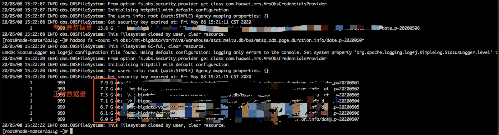
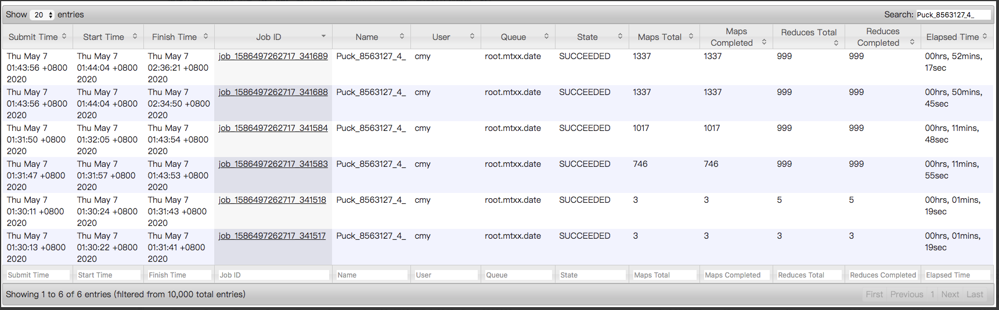
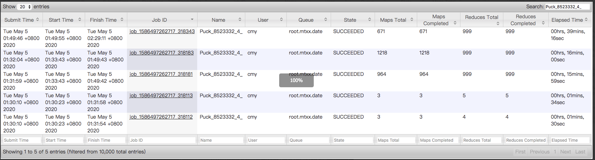
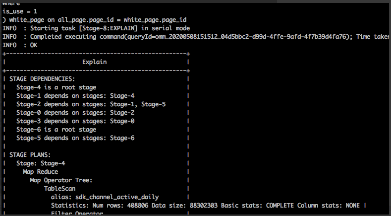
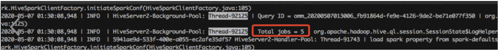
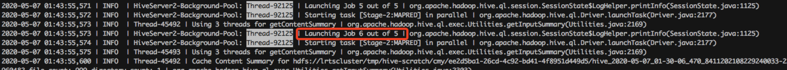
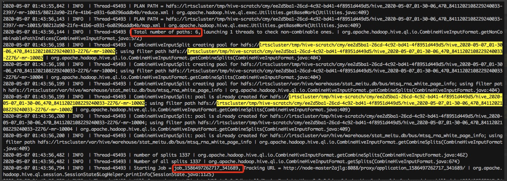
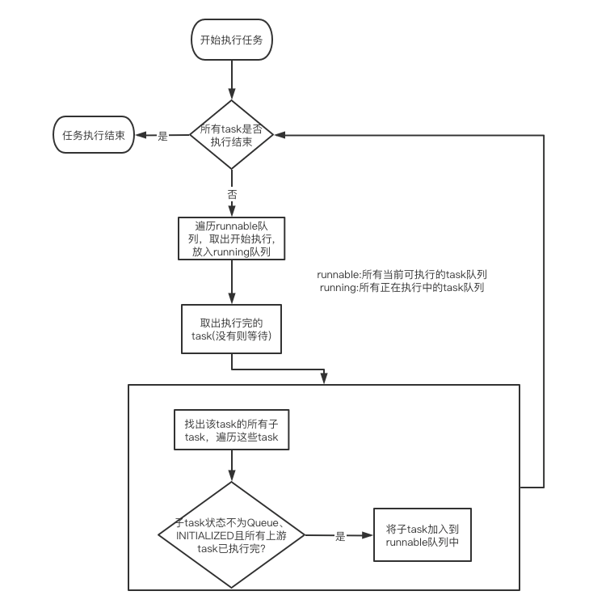
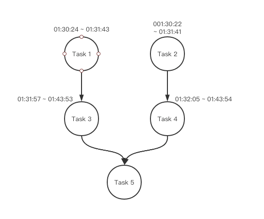

[TOC]

# 一、问题描述

业务反馈某张表的落地数据总大小比平时多了一倍。

平时正常落地6-7G，而这次落地的数据量有14G。**后该任务重跑后数据恢复正常：**



表落地数据使用的相关sql如下(为了不暴露公司相关业务信息，只展示sql的主体结构)：

```sql
set mapreduce.job.queuename=xxxxx;
insert
  overwrite table xxxxxxxxx partition(date_p)
select
  xxxxxxxx
from(
    select
      xxxxxxxx
    from
      (
        select
          xxxxxxxxxxx
        from
          xxxxxxx
        where
          xxxxxxx
      ) t1
      left join(
        select
          xxxxx
        from
          xxxxx
        where
          xxxxx
        group by
          xxxxx
      ) t2 on t1.xxxx = t2.xxxx
    union all
    select
      xxxxx
    from
      (
        select
          xxxxx
        from
          xxxx
        where
          xxxx
      ) t1
      left join(
        select
          xxx
        from
          xxx
        where
          xxxxx
        group by
          xxxx
      ) t2 on t1.gid = t2.server_id
  ) all_page
  join (
    select
      xxxx
    from
      xxxxx
    where
      xxxx
  ) white_page on xxxx = xxxxx
```

# 二、问题排查进度

1、对比错误目录下的文件和平时有什么区别 => **都是999个文件，错误目录各个文件的大小会比正常的目录大两倍左右**

2、排查sql所查询的相关表数据是否有异常 => **发现所有上游表正常，数据量也和平常几乎一致，因此不是上游数据的问题**

3、拿错误的任务执行计划和重跑后正常的任务执行计划进行对比 => 错误任务的执行计划有异常，最后多了两个一模一样的job，且task数量翻倍

**错误任务的job历史记录（6个job，其中最后两个job几乎同时启动，且执行计划基本一致）**



**正确任务的job历史记录（5个job，最后一个job的map task数量只有671，是错误任务最后job的一半）**



4、继续排查，通过explain命令,确认正常的job数量就是5个 => **错误任务的job数量出现问题**



5、深入查看Hive日志，发现错误任务一开始生成的执行计划中的job数量也是5个，后面在执行的过程中多执行了一个重复的job => **确认不是生成执行计划的问题**





(下图表示重复的那两个job都各自读取了6个目录，这6个目录两两重复，即 count(inputPaths)=6 , distinct count(inputPath=3) ,因此最后的数据出现了翻倍)



6、通过上面的排查，基本可以确定是在任务执行过程中出现了问题，导致生成了两个一模一样的job，并且这两个job互相干扰，导致数据翻倍。因此开始深入排查执行任务的逻辑

# 三、Hive执行任务的具体逻辑

## 3.1、Hive源码解析

在Hive中，对于MR的一个Job抽象的类叫Task，每个Task都有各自的子task和父task。Hive在解析完Sql生成执行计划后，会构造一个DriverContext，这个上下文中会存放整个任务的相关状态和各个task的状态，它存放task的主要属性有两个：

```java
//当前可以运行的所有task
private Queue<Task<? extends Serializable>> runnable;
//正在运行的所有task
private Queue<TaskRunner> running;
```

在一开始构造DriverContext后，会从执行计划中找出rootTask(没有父task的那些task)，然后放到DriverContext的runnable队列中：

```java
// Add root Tasks to runnable
for (Task<? extends Serializable> tsk : plan.getRootTasks()) {
  // This should never happen, if it does, it's a bug with the potential to produce
  // incorrect results.
  assert tsk.getParentTasks() == null || tsk.getParentTasks().isEmpty();
  driverCxt.addToRunnable(tsk);
 
  if (metrics != null) {
    tsk.updateTaskMetrics(metrics);
  }
}
```

之后，在各种上下文都准备完了后，才正式开始执行task：

```java
//Driver.execute()方法
//不断循环，直到所有task都执行完
while (driverCxt.isRunning()) {
  //从runnable队列中逐个取出可以执行task拿去执行（这里有个maxthreads的并发限制）
  Task<? extends Serializable> task;
  while ((task = driverCxt.getRunnable(maxthreads)) != null) {
    TaskRunner runner = launchTask(task, queryId, noName, jobname, jobs, driverCxt);
    if (!runner.isRunning()) {
      break;
    }
  }
 
  //从running队列中找出已经执行完的task，如果没有这里会一直等待，直到有task执行完
  TaskRunner tskRun = driverCxt.pollFinished();
  if (tskRun == null) {
    continue;
  }
  hookContext.addCompleteTask(tskRun);
  queryDisplay.setTaskResult(tskRun.getTask().getId(), tskRun.getTaskResult());
 
  Task<? extends Serializable> tsk = tskRun.getTask();
  TaskResult result = tskRun.getTaskResult();
 
  int exitVal = result.getExitVal();
  if (isInterrupted()) {
    return handleInterruption("when checking the execution result.");
  }
  if (exitVal != 0) {
    //此处代码省略
    //task执行失败时的一些错误处理
  }
 
  driverCxt.finished(tskRun);
 
  if (SessionState.get() != null) {
    SessionState.get().getHiveHistory().setTaskProperty(queryId, tsk.getId(),
        Keys.TASK_RET_CODE, String.valueOf(exitVal));
    SessionState.get().getHiveHistory().endTask(queryId, tsk);
  }
 
  //开始找这个已完成的task的所有子task，查看是否满足执行条件，满足的话就将子task放入runnable队列中，等下次while循环时拿出来执行
  if (tsk.getChildTasks() != null) {
    for (Task<? extends Serializable> child : tsk.getChildTasks()) {
      if (DriverContext.isLaunchable(child)) {
        driverCxt.addToRunnable(child);
      }
    }
  }
}
//DriverContext.isLaunchable()方法
//判断条件是保证task的状态不是queue且不是Initialized，且所有上游task都已执行完
public static boolean isLaunchable(Task<? extends Serializable> tsk) {
  //只有当tsk的所有上游task都执行完成了，tsk.isRunnable()才会返回true
  return !tsk.getQueued() && !tsk.getInitialized() && tsk.isRunnable();
}
```

大概流程图如下：



## 3.2、生成重复job问题分析

对于上文的源码分析，错误sql的task DAG图应该如下：



我们重点分析task 3、4、5。从执行时间可以看出，Task 3和Task 4是并行执行，**然后几乎同一时间结束**。大概的代码流程应该如下：

1、driverCxt.pollFinished() 获取到Task 3，继续获取Task 3的所有下游，也就是Task 5。开始判断Task 5是否能被加入到runnable队列中（**这时Task 4刚好也执行完了**）。此时task 5的状态为CREATED，满足条件 [**状态不为QUEUED和INITIALIZED，且所有上游task已执行完**] ，因此task 5被加入到runnable队列中

2、Task 5开始执行，状态被转成RUNNING

3、driverCxt.pollFinished() 获取到Task 4，继续获取Task 4的所有下游，也就是Task 5，继续判断Task 5是否能被加入到runnable队列中，此时 task 5的状态为RUNNING，满足条件 [状态不为QUEUED和INITIALIZED，且所有上游task已执行完] ，因此task 5又加入到runnable队列中

4、Task 5 再次被执行

至此，Hive执行了两次Task 5，也就对应生成了两个MR 的 Job，最终导致数据翻倍。

# 四、问题总结和代码修复

从上面的分析可以看出，问题的根因在于Hive判断子task能否被加入runnable队列中时未考虑到该task处于running状态的情况，导致一个task被加入了两次runnable，相应的执行两次。因此，我们只需保证在isLaunchable时将相关task的状态都考虑上即可。

具体修复代码：

```
From 8ed92150d4d8229fc4a46c9535b3634136e7a6ba Mon Sep 17 00:00:00 2001
From: wjl <wjl2@meitu.com>
Date: Fri, 8 May 2020 16:31:13 +0800
Subject: [PATCH] =?UTF-8?q?=E4=BF=AE=E5=A4=8D=E7=94=B1=E4=BA=8E=E4=B8=A4?=
 =?UTF-8?q?=E4=B8=AA=E7=88=B6Task=E5=90=8C=E6=97=B6=E7=BB=93=E6=9D=9F?=
 =?UTF-8?q?=E5=90=8E=EF=BC=8C=E6=B7=BB=E5=8A=A0=E4=B8=A4=E6=AC=A1=E7=9B=B8?=
 =?UTF-8?q?=E5=90=8C=E7=9A=84=E5=AD=90Task=E5=88=B0Runnable=E9=98=9F?=
 =?UTF-8?q?=E5=88=97=EF=BC=8C=E4=BD=BF=E5=BE=97=E5=A4=9A=E8=B5=B7=E4=BA=86?=
 =?UTF-8?q?=E4=B8=80=E4=B8=AAJob?=
MIME-Version: 1.0
Content-Type: text/plain; charset=UTF-8
Content-Transfer-Encoding: 8bit
 
---
 .../apache/hadoop/hive/ql/DriverContext.java  |  2 +-
 .../org/apache/hadoop/hive/ql/exec/Task.java  | 30 +++++++++++--------
 2 files changed, 18 insertions(+), 14 deletions(-)
 
diff --git a/ql/src/java/org/apache/hadoop/hive/ql/DriverContext.java b/ql/src/java/org/apache/hadoop/hive/ql/DriverContext.java
index f43992c8..583d3d38 100644
--- a/ql/src/java/org/apache/hadoop/hive/ql/DriverContext.java
+++ b/ql/src/java/org/apache/hadoop/hive/ql/DriverContext.java
@@ -160,7 +160,7 @@ public class DriverContext {
   public static boolean isLaunchable(Task<? extends Serializable> tsk) {
     // A launchable task is one that hasn't been queued, hasn't been
     // initialized, and is runnable.
-    return !tsk.getQueued() && !tsk.getInitialized() && tsk.isRunnable();
+    return tsk.isNotInitialized() && tsk.isRunnable();
   }
  
   public synchronized boolean addToRunnable(Task<? extends Serializable> tsk) throws HiveException {
diff --git a/ql/src/java/org/apache/hadoop/hive/ql/exec/Task.java b/ql/src/java/org/apache/hadoop/hive/ql/exec/Task.java
index e1bd2918..26d2cba1 100644
--- a/ql/src/java/org/apache/hadoop/hive/ql/exec/Task.java
+++ b/ql/src/java/org/apache/hadoop/hive/ql/exec/Task.java
@@ -114,6 +114,10 @@ public abstract class Task<T extends Serializable> implements Serializable, Node
     DYNAMIC_PARTITIONS, // list of dynamic partitions
   }
   public enum TaskState {
+    // Task state is unkown
+    UNKNOWN,
+    // Task is just created
+    CREATED,
     // Task data structures have been initialized
     INITIALIZED,
     // Task has been queued for execution by the driver
@@ -121,11 +125,7 @@ public abstract class Task<T extends Serializable> implements Serializable, Node
     // Task is currently running
     RUNNING,
     // Task has completed
-    FINISHED,
-    // Task is just created
-    CREATED,
-    // Task state is unkown
-    UNKNOWN
+    FINISHED
   }
  
   // Bean methods
@@ -366,38 +366,42 @@ public abstract class Task<T extends Serializable> implements Serializable, Node
       }
     }
   }
-  public void setStarted() {
+  public synchronized void setStarted() {
     setState(TaskState.RUNNING);
   }
  
-  public boolean started() {
+  public synchronized boolean started() {
     return taskState == TaskState.RUNNING;
   }
  
-  public boolean done() {
+  public synchronized boolean done() {
     return taskState == TaskState.FINISHED;
   }
  
-  public void setDone() {
+  public synchronized void setDone() {
     setState(TaskState.FINISHED);
   }
  
-  public void setQueued() {
+  public synchronized void setQueued() {
     setState(TaskState.QUEUED);
   }
  
-  public boolean getQueued() {
+  public synchronized boolean getQueued() {
     return taskState == TaskState.QUEUED;
   }
  
-  public void setInitialized() {
+  public synchronized void setInitialized() {
     setState(TaskState.INITIALIZED);
   }
  
-  public boolean getInitialized() {
+  public synchronized boolean getInitialized() {
     return taskState == TaskState.INITIALIZED;
   }
  
+  public synchronized boolean isNotInitialized() {
+    return taskState.ordinal() < TaskState.INITIALIZED.ordinal();
+  }
+
   public boolean isRunnable() {
     boolean isrunnable = true;
     if (parentTasks != null) {
--
2.18.1
```

