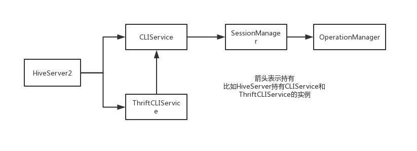

[TOC]

以下内容都基于hive-2.3.3版本。

## 一、HiveServer2的启动

通常我们是通过调用`${hive_home}/bin下的start-hiveserver2.sh`脚本来启动HiveServer2的。start-hiveserver2.sh脚本实际是调用`${hive_home}/bin/hive`脚本：

```shell
#! /bin/bash
export HIVE_HOME=/www/hive
${HIVE_HOME}/bin/hive --service hiveserver2 >> ${HIVE_HOME}/logs/hiveserver2.out 2>&1 &
```

之后hive脚本中会根据传入的`--service`的参数去调用`${hive_home}/bin/ext/hiveserver2.sh`脚本，最终在hiveserver2.sh脚本中才调用了HiveServer2类的main方法。

```java
//HiveServer2.java
public static void main(String[] args) {
    HiveConf.setLoadHiveServer2Config(true);
    try {
      ServerOptionsProcessor oproc = new ServerOptionsProcessor("hiveserver2");
        //解析传入的参数
      ServerOptionsProcessorResponse oprocResponse = oproc.parse(args);

      String initLog4jMessage = LogUtils.initHiveLog4j();
      LOG.debug(initLog4jMessage);
      HiveStringUtils.startupShutdownMessage(HiveServer2.class, args, LOG);

      LOG.debug(oproc.getDebugMessage().toString());
	//调用对应Executor的execute方法
      oprocResponse.getServerOptionsExecutor().execute();
    } catch (LogInitializationException e) {
      LOG.error("Error initializing log: " + e.getMessage(), e);
      System.exit(-1);
    }
  }
```

HiveServer2的main函数执行时会先解析传入的参数，然后返回一个response，里面封装了一个ServerOptionsExecutor。之后调用ServerOptionsExecutor#execute方法即可执行对应的逻辑。

ServerOptionsExecutor只是一个接口，它的实现主要有：


比如如果传入的ServiceName是hiveserver2，则会执行StartOptionExecutor的execute方法，这个方法中调用了HiveServer2的startHiveServer2方法。

这时，HiveServer才开始启动它的各个组件并提供服务。

## 二、HiveServer2的各个服务组件

Hive定义了一个接口Service，很多服务组件都实现了这个接口。这个接口定义了一个组件基本的生命周期，以及组件的各种状态：

```java
public interface Service {
  public enum STATE {
    NOTINITED,
    INITED,
    STARTED,
    STOPPED
  }
  void init(HiveConf conf);
  void start();
  void stop();
  void register(ServiceStateChangeListener listener);
  void unregister(ServiceStateChangeListener listener);
  String getName();
  HiveConf getHiveConf();
  STATE getServiceState();
  long getStartTime();
}
```

Service接口的具体实现有：


可以看到，包括HiveServer2其实也算Hive的一个服务组件。HiveServer2继承了CompositeService类，这里用到了设计模式中的组合模式。这样，HiveServer2可以同时持有多个服务组件。在HiveServer2启动时，会相应启动它的那些服务组件。

HiveServer2的服务组件主要有如下这些：



### 1、ThriftCLIService

一个Server的服务组件，它会监听指定的端口来对外提供服务，主要基于Thrift实现的rpc服务。HiveServer2在启动ThriftCLIService时，会将CLIService的实例也传给它。这样，ThriftCLIService收到请求后，就可以委托给CLIService处理了。

另外，ThriftCLIService启动时，根据`hive.server2.transport.mode`参数的值来决定是启动ThriftHttpCLIService还是ThriftBinaryCLIService。默认是ThriftBinaryCLIService：

```java
    if (isHTTPTransportMode(hiveConf)) {
      thriftCLIService = new ThriftHttpCLIService(cliService, oomHook);
    } else {
      thriftCLIService = new ThriftBinaryCLIService(cliService, oomHook);
    }
```

### 2、CLIService

CLIService主要封装了处理命令的逻辑，一条命令发到HiveServer2后，ThriftCLIService会委托给CLIService来处理。不同的命令会调用不同的CLIService方法。比如执行Sql就是调用CliService#executeStatementAsync()方法。

### 3、SessionManager

CLIService在启动时，会初始化一个SessionManager，用来管理会话。

当要建立一个会话时，会调用SessionManager#createSession()来获取到唯一的SessionHandle返回给客户端（session的唯一性是通过SessionHandle来标识的）。之后客户端发送命令时将对应的SessionHandle带上，SessionManager就可以根据这个SessionHandle获取到具体的HiveSession对象。

拿到对应的HiveSession对象后，CLIService把具体的操作继续委托给HiveSession的方法执行。

### 4、OperationManager

SessionManager在启动时，会初始化一个OperationManager，主要用来生成Operation（每一条命令都可以理解为是一个Operation）。

SessionManager在创建新的HiveSession时，会将OperationManager的实例也传给HiveSession。后面HiveSession根据命令执行对应的操作时会通过OperationManager获取到对应的Operation，之后调用Operation#run()执行具体的逻辑。

也就是说，客户端发来的命令最终生成一个Operation对象然后执行。不同的命令会对应不同的Operation的实现：


很明显，执行Sql最终会调用SQLOperation#run()方法。

## 三、一个命令的具体处理过程

### 1、一个命令的处理流程


1. ThriftCLIService服务启动后，会监听指定的端口，之后有请求进来，就会获取对应的Processor处理（可以参考thrift的架构设计）
2. 如果没有配置kerberos，最终的Processor会是TSetIpAddressProcessor。TSetIpAddressProcessor继承自TCLIService.Processor，TCLIService.Processor中定义了具体的命令要执行哪些ProcessFunction
3. 通过具体的命令找到对应的ProcessFunction后，就执行ProcessFunction的getResult()方法。之后，各个ProcessFunction实现类的getResult()方法最终又会调用ThriftCLIService的相关方法
4. ThriftCLIService从请求中获取到SessionHandle后，就委托给CLIService的相关方法来处理
5. CLIService拿着SessionHandle从SessionManager获取到对应的HiveSession，之后继续把命令委托给HiveSession处理
6. HiveSession根据具体的命令从OperationManager中获取到对应的Operation，这个Operation就是真正的操作对象。
7. 最终调用Operation#run()方法获取到一个OperationHandle，后面客户端还可以通过这个OperationHandle标识来获取到此次操作的一些状态信息。**如果是要执行Sql，就会走到SQLOperation#run()方法,之后就进入Driver.run()方法，然后开始编译执行sql了**。

### 2、关于SessionHandle和OperationHandle

在hive中，一个session表示一个会话。我们可以理解为一个beeline控制台就是一个session，在我们通过`!conn`命令连接到集群后，HiveServer2就会创建一个HiveSession，然后交给SessionManager管理，之后返回一个SessionHandle给客户端，这个SessionHandle就是此次session的唯一标识了。后面客户端发送命令的时候都需要带上这个SessionHandle，这样HiveServer2才可以辨认出是哪个session发来的请求。

在一个session中发起一个请求，HiveServer2收到请求进行处理后，会返回一个OperationHandle来作为此次操作的唯一标识。后面客户端可以通过这个OperationHandle标识来获取此次操作的具体信息（发请求时带上这个OperationHandle信息），比如获取操作的执行状态、日志等信息。

这也就是说，一个session其实可以发起多个操作，只要维护好返回的OperationHandle，我们可以并行查询这些操作的相关状态。**在beeline的控制台中，我们发送完一个命令后，会阻塞在那里，给我们的感觉好像一个session只能同时处理一个命令**。

另外，在阻塞的过程中，beeline客户端其实也不断的再想HiveServer2发送请求获取日志并输出。

#### beeline客户端是如何获取日志输出的

只有当`hive.server2.logging.operation.enabled`设置为true，才会在Beeline的控制台输出HiveServer2那边的相关操作日志。另外，通过`hive.server2.logging.operation.level`还可以调整输出级别。

如果开启了operation的log日志功能，Driver组件在输出日志时就会往另外一个临时的日志文件也输出一份。这个临时的日志文件是一个Operation一份。后面客户端根据OperationHandle发送fetchResult(**fetchType=1**)请求来获取对应的日志信息。这时HiveServer2只要直接去Operation对应的临时日志文件中拉取数据即可。

Operation临时日志文件的存放路径和`hive.server2.logging.operation.log.location`参数有关。

## 四、HiveServer2中的那些重要线程

### 1、rpc请求处理线程——HiveServer2-Handler-Pool

这个线程池主要是HiveServer2用来处理rpc请求的线程。线程池的coreSize和maxSize和参数`hive.server2.thrift.min.worker.threads`和`hive.server2.thrift.max.worker.threads`相关，默认值分别是5和500。

这个线程和netty的worker线程类似，有客户端发送请求给ThriftServer，最终都会由这个线程来处理。

### 2、sql异步执行线程 —— HiveServer2-Background-Pool

在SQLOperation#runInternal()方法中，如果请求要求异步操作，就会向BackGroundPool线程池提交一个异步任务，用来处理sql（也就是调用Driver#run()的逻辑），提交任务到线程池后会立马返回一个OperationHandle，后续客户端可以根据这个唯一标识实时的查询任务运行日志。

当然，如果请求没要求异步操作，Driver#run()的操作将在HiveServer2-Handler-Pool的线程中执行，这时会一直阻塞到任务执行完才返回，也就是说，客户端要等任务执行完才能看到全部运行日志。

BackGroundPool线程池的coreSize和maxSize都由参数`hive.server2.async.exec.threads`来决定，默认值是100。

> 是否要异步执行Driver#run()由thrift请求体TExecuteStatementReq中的参数runAsync来决定。目前看hive-jdbc的代码，这个参数默认都是true。
>
> 另外，目前只有SQLOperation才支持异步执行，其他的Operation都不支持

### 3、执行task的线程

Driver在编译完sql后，会生成物理执行计划，这个物理执行计划中包含了一系列的task。**Driver执行task的方式是将task放到一个线程中执行**。这个线程没有特别指定名称，通过日志我们看到的是`[Thread-id]`，其中id会不断自增。

因为task是在线程中执行的，因此一个Operation是允许多个task并行的。单个Operation的并行度由配置`hive.exec.parallel.thread.number`来决定，默认值是8。

### 4、task执行日志的线程

如果是spark on hive，在通过spark-submit提交了spark程序后。hive会新开两个线程stderr-redir-1和stderr-redir-1来负责输出spark-submit这个进程的相关执行日志。


上图中，我们可以看到在Thread-21373线程中执行spark-submit后，立马有一个线程stderr-redir-1出现，并负责输出相关的日志信息。

### 5、总结

在hive的日志中，各种任务的日志会交替出现，日志又杂又多，因此理解好上面三种线程可以方便我们排查问题，快速定位任务相关的线程和日志。


## 五、Beeline和HiveCli的区别

在hive中，有两种方式可以执行hiveQL。分别是beeline和hiveCli。

### 1、Beeline

beeline客户端执行的主类是Beeline.java。

**Beeline需要连接上HiveServer2后才可以执行命令**，之后通过jdbc协议往hiveServer2发送相关请求来执行用户的命令。

### 2、HiveCli

旧版的HiveCli执行的主类是CliDriver.java，目前新版的主类是HiveCli.java（底层还是调用Beeline.java类）。

CliDriver.java的执行流程详解可以看下面这篇文章：

<https://segmentfault.com/a/1190000002766035> —— 主要就是创建一个进程，在当前进程中执行hive的相关命令，比如执行Sql就初始化一个Driver，然后执行run方法。

在早期的版本中，第一代HiveServer对应的客户端实现就是CliDriver，后来出现了HiveServer2，完全取代了第一代。HiveServer2对应的客户端是Beeline，但是由于早期使用CliDriver的用户太多了，因此CliDriver版本一直没有被下掉。

后面社区又开发了新版的HiveCli，其底层其实也是调用了Beeline，这样社区只需要维护一份客户端的代码即可：

```java
  public static void main(String[] args) throws IOException {
    int status = new HiveCli().runWithArgs(args, null);
    System.exit(status);
  }

  public int runWithArgs(String[] cmd, InputStream inputStream) throws IOException {
    beeLine = new BeeLine(false);
    try {
      return beeLine.begin(cmd, inputStream);
    } finally {
      beeLine.close();
    }
  }
```

Beeline类有个属性isBeeline就表示这个Beeline实例是算真正的beeline客户端还是HiveCli客户端。

当isBeeline属性为false时，beeline客户端连接的是一个内嵌的HiveServer2服务，和HiveCli在同一个进程内。其他的逻辑都和Beeline相同。

### 3、总结

- beeline需要连接远程的HiveServer2来交互
- HiveCli直接在本进程执行命令，不用进行远程通信

在2.3.3版本中，HiveCli默认还是使用CliDriver的实现方式。可以通过在`hive-env.sh`中设置`USE_DEPRECATED_CLI=false`来将实现变成HiveCli.java的形式。因为HiveCli.java会启动内置的HiveServer2，执行的逻辑基本和HiveServer2一样，所以在做一些测试时会更容易发现HiveServer2的一些问题。

官网关于Beeline和HiveCli的介绍：

<https://cwiki.apache.org/confluence/display/Hive/Replacing+the+Implementation+of+Hive+CLI+Using+Beeline>


