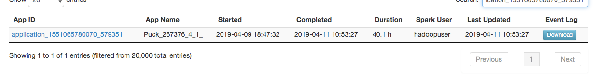
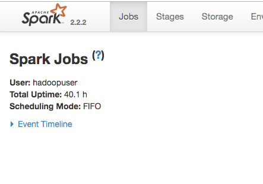
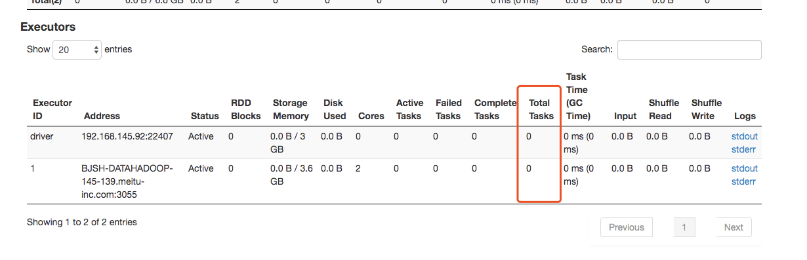
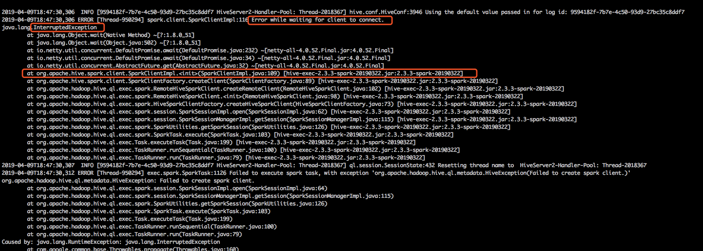
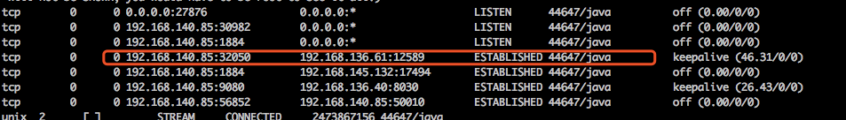

[TOC]

## 一、问题描述  

最近有数据平台的同学反馈yarn上面有一些任务跑了很久没有结束，状态一直处于running中。去Spark HistoryServer查看任务详情也没看到相关运行记录，需要人为手动kill任务才会停止并释放资源。





## 二、问题排查  

从Spark HistoryServer可以看出，任务的Driver虽然启动了，但是并未执行job，并且一直阻塞在那没有退出。从yarn的角度来看，这个任务就是在运行中。

**因此，我们需要排查是究竟什么原因导致Driver不退出，又不接收job运行呢**？

由于这是hive提交的任务，我们可以先看一下Hive是怎么提交spark任务的。

### Hive提交Spark任务流程


1. Hive要提交一个Spark任务时，会先通过spark-submit提交一个spark程序到yarn集群运行。而运行的MainClass就是RemoteDriver
2. RemoteDriver在yarn的container启动后，会主动去连接Hiveserver2开放的rpc端口（这个端口在spark-submit时会带上，因此RemoteDriver知道要连接的host和ip）
3. 连接建立后，SparkClientImpl这边会根据clientId从RpcServer中找到对应的channel，之后将要运行的job通过**kvro工具序列化**成字节流发送给RemoteDriver
4. RemoteDriver这边在连接成功后，就开始准备接收SparkClientImpl发送过来的消息并执行。
5. **最后，如果在SparkClientImpl关闭时也会相应的关闭远程的RemoteDriver，具体做法是发送一个关闭的消息给RemoteDriver，告诉它可以停掉了**。（SparkClientImpl一般是在整个客户端的session关闭时关闭的）

RpcServer在整个Hiveserver2进程中只会有一个，因此需要通过clientId来标识对应的RemoteDriver客户端。这个clientId也会在spark-submit时带上。

### 问题定位  

了解了提交的过程后，我们可以知道RemoteDriver的关闭依赖于**SparkClientImpl**发送的关闭请求。那么情况无非有两种：

1. SparkClientImpl发送了关闭消息，但是RemoteDriver没收到或者忽略了该消息
2. SparkClientImpl由于一些原因，没发送关闭消息

由于这种情况发生了好几例，且网络表现正常，因此基本可以排除掉因网络不佳丢包的可能性。之后仔细看了下RemoteDriver这边Rpc的相关代码，也基本可以排除RemoteDriver忽略消息的可能性。**因此大概率是SparkClientImpl没有发送关闭消息导致的。**

查了下HiveServer2这边那天的日志，果然发现一些异常，都是在任务启动时报的：



从异常信息我们可以很清晰的看出，SparkClientImpl在等待RemoteDriver的连接时抛出了InterruptedException。我们再看一下相关代码：

```java
String clientId = UUID.randomUUID().toString();
String secret = rpcServer.createSecret();
//通过spark-submit提交RemoteDriver到yarn集群运行
this.driverThread = startDriver(rpcServer, clientId, secret);
this.protocol = new ClientProtocol();
try {
  //109行，等待RemoteDriver的连接并获取连接
  this.driverRpc = rpcServer.registerClient(clientId, secret, protocol).get();
} catch (Throwable e) {
  if (e.getCause() instanceof TimeoutException) {
    LOG.error("Timed out waiting for client to connect.\nPossible reasons include network " +
        "issues, errors in remote driver or the cluster has no available resources, etc." +
        "\nPlease check YARN or Spark driver's logs for further information.", e);
  } else {
    //InterruptedException会走这里
    LOG.error("Error while waiting for client to connect.", e);
  }
    //driverThread是阻塞等待spark-submit子进程跑完的线程
  driverThread.interrupt();
  try {
    driverThread.join();
  } catch (InterruptedException ie) {
    // Give up.
    LOG.debug("Interrupted before driver thread was finished.");
  }
    //向外层继续抛出异常
  throw Throwables.propagate(e);
}
```

从上面的代码来看，SparkClientImpl在等待RemoteDriver的连接时抛出了InterruptedException，代码除了关闭driverThread外，并没有做其他的事了。

**这样就可能存在一个问题，虽然SparkClientImpl在这里退出了，但是RemoteDriver又连接上了RpcServer，它就会一直等待远程的消息并一直运行下去。**

后面刚好有一个任务也出现这种情况，登陆RemoteDriver所在的机器看了下tcp连接**，发现连接确实还存活着，但是SparkClientImpl这时已经退出了。**

RemoteDriver所在服务器的端口扫描:



### **问题总结**

出现这个问题的原因应该是用户提交一个sql到HiveServer后立马关闭了session，而此时SparkClientImpl又刚好在阻塞等待来自RemoteDriver的连接。因为session的关闭，关闭session的线程会主动interrupt掉SparkClientImpl所在的线程**。**

**SparkClientImpl等待连接抛出异常后又没通知rpcServer进行相关解除注册处理，因此RemoteDriver成功的建立了连接，并一直等待来自SparkClientImpl的请求。然而此时SparkClientImpl已经退出，因此除非外界干涉，否则RemoteDriver永远不会停止运行。**

## 三、解决方案 

**修改源码，在SparkClientImpl抛出InterruptedException时，移除SparkClientImpl对rpcServer的注册，这样客户端在连接过来时，rpcServer就会直接返回错误信息，客户端收到错误信息后就会判定连接失败从而退出进程。**

```java
try {
  //109行，等待RemoteDriver的连接并获取连接
  this.driverRpc = rpcServer.registerClient(clientId, secret, protocol).get();
} catch (Throwable e) {
  if (e.getCause() instanceof TimeoutException) {
    LOG.error("Timed out waiting for client to connect.\nPossible reasons include network " +
        "issues, errors in remote driver or the cluster has no available resources, etc." +
        "\nPlease check YARN or Spark driver's logs for further information.", e);
  } else {
    //InterruptedException会走这里
    LOG.error("Error while waiting for client to connect.", e);
 
 
    //其实就是将clientInfo从pendingClients中移除
    // 在客户端发送连接时，rpcserver发现客户端clientId不在pendingClients中，就会返回失败的信息给客户端
    rpcServer.cancelClient(clientId,"cancel client for " + e.getMessage());
  }
    //driverThread是阻塞等待spark-submit子进程跑完的线程
  driverThread.interrupt();
  try {
    driverThread.join();
  } catch (InterruptedException ie) {
    // Give up.
    LOG.debug("Interrupted before driver thread was finished.");
  }
    //向外层继续抛出异常
  throw Throwables.propagate(e);
}
```

