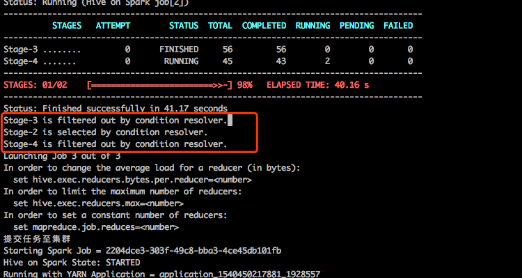

[TOC]

## 一、问题描述  

线上某条hive语句出现错误,hive语句如下

```shell
insert overwrite directory '/tmp/data_works_server/41109/904723/1547802020/' STORED AS ORC 
select 20190117, device_model, meios_version, server_id, ev.type, sum(ev.count) from rom lateral view explode(events) events as ev where date_p=20181031 and app_key_p='D1AF3AB43299858F' and ev.name='reboot' group by device_model, meios_version, server_id, ev.type;
```

经过简单测试，发现以下3点现象：

1. 去掉`STORED AS ORC`后语句正常执行   
2. 只查询某些字段的话可以正常执行,查询某些表也可以正常执行
3. 在查询的最后加上`limit xxx`后语句可以正常执行，xxx可以是任意数字

只看上面两点的话很可能会觉的是某些数据造成的问题，但再加上第三点的话，又应该不是数据问题。后面进行问题定位

## 二、问题定位  

为了方便描述问题，我们先建立一个新表

```mysql
create table test(id string);
```

然后看一下类似语句的执行计划

```mysql
explain insert overwrite directory '/tmp/test/' stored as orc select * from test;
```

最后可以看到执行计划

```shell
STAGE DEPENDENCIES:
  Stage-1 is a root stage
  Stage-6 depends on stages: Stage-1 , consists of Stage-3, Stage-2, Stage-4
  Stage-3
  Stage-0 depends on stages: Stage-3, Stage-2, Stage-5
  Stage-2
  Stage-4
  Stage-5 depends on stages: Stage-4

STAGE PLANS:
  Stage: Stage-1
    Spark
      DagName: hadoopuser_20190122170810_884746eb-f85f-49c4-b0d1-57bd5dfe1219:2
      Vertices:
        Map 1
            Map Operator Tree:
                TableScan
                  alias: test
                  Statistics: Num rows: 1 Data size: 0 Basic stats: PARTIAL Column stats: NONE
                  Select Operator
                    expressions: id (type: string)
                    outputColumnNames: _col0
                    Statistics: Num rows: 1 Data size: 0 Basic stats: PARTIAL Column stats: NONE
                    File Output Operator
                      compressed: false
                      Statistics: Num rows: 1 Data size: 0 Basic stats: PARTIAL Column stats: NONE
                      table:
                          input format: org.apache.hadoop.mapred.TextInputFormat
                          output format: org.apache.hadoop.hive.ql.io.orc.OrcOutputFormat
                          serde: org.apache.hadoop.hive.ql.io.orc.OrcSerde

  Stage: Stage-6
    Conditional Operator

  Stage: Stage-3
    Move Operator
      files:
          hdfs directory: true
          destination: hdfs://rangercluster/tmp/test/.hive-staging_hive_2019-01-22_17-08-10_712_8680878334963783411-1/-ext-10000

  Stage: Stage-0
    Move Operator
      files:
          hdfs directory: true
          destination: /tmp/test

  Stage: Stage-2
    Spark
      DagName: hadoopuser_20190122170810_884746eb-f85f-49c4-b0d1-57bd5dfe1219:3
      Vertices:
        Spark Merge File Work
            Map Operator Tree:
                TableScan
                  File Output Operator
                    compressed: false
                    table:
                        input format: org.apache.hadoop.mapred.TextInputFormat
                        output format: org.apache.hadoop.hive.ql.io.orc.OrcOutputFormat
                        serde: org.apache.hadoop.hive.ql.io.orc.OrcSerde

  Stage: Stage-4
    Spark
      DagName: hadoopuser_20190122170810_884746eb-f85f-49c4-b0d1-57bd5dfe1219:3
      Vertices:
        Spark Merge File Work
            Map Operator Tree:
                TableScan
                  File Output Operator
                    compressed: false
                    table:
                        input format: org.apache.hadoop.mapred.TextInputFormat
                        output format: org.apache.hadoop.hive.ql.io.orc.OrcOutputFormat
                        serde: org.apache.hadoop.hive.ql.io.orc.OrcSerde

  Stage: Stage-5
    Move Operator
      files:
          hdfs directory: true
          destination: hdfs://rangercluster/tmp/test/.hive-staging_hive_2019-01-22_17-08-10_712_8680878334963783411-1/-ext-10000
```

上面的计划生成DAG图大概是这样的：


整个语句执行的流程大概如下：

1. Stage-1 执行查询的语句，之后把结果写到某个临时目录A。
2. Stage-6根据生成的临时目录A的相关信息，判断是否要merge，或者还是直接move，再或者merge and move。**merge的过程需要读取临时目录A下的所有数据然后再写入到新的一个临时目录B**。
3. Stage-0直接将临时目录的数据到move到目标目录下，也就是最终路径 `/tmp/test`下

这个流程有个很关键的地方，就是是否需要merge，经过排查，**发现出错的语句在执行结束后全部都经过了merge，也就是执行了Stage-2**。

再回头看下那个执行计划，我们会发现一个问题：

```Shell
  Stage: Stage-1
		...
                    File Output Operator
                      compressed: false
                      Statistics: Num rows: 1 Data size: 0 Basic stats: PARTIAL Column stats: NONE
                      table:
                          input format: org.apache.hadoop.mapred.TextInputFormat
                   			# 这里是以OrcOutputFormat输出的
                          output format: org.apache.hadoop.hive.ql.io.orc.OrcOutputFormat
                          serde: org.apache.hadoop.hive.ql.io.orc.OrcSerde
	...
  Stage: Stage-2
    Spark
      DagName: hadoopuser_20190122170810_884746eb-f85f-49c4-b0d1-57bd5dfe1219:3
      Vertices:
        Spark Merge File Work
            Map Operator Tree:
                TableScan
                  File Output Operator
                    compressed: false
                    table:
              		# merge的这里是用 TextInputFormat 去读取
                        input format: org.apache.hadoop.mapred.TextInputFormat
                        output format: org.apache.hadoop.hive.ql.io.orc.OrcOutputFormat
                        serde: org.apache.hadoop.hive.ql.io.orc.OrcSerde
```

**hive的执行计划很清楚的指出，hive将查询结果输出到某个临时目录时，用的是OrcOutputFormat，但是Stage-2要去merge的时候却是用TextInputFormat，这明显是不对的**。

为了对比，我们创建一个orc的表来验证一下。

```mysql
create table orctest(id string) stored as orc;
```

然后往这个表查数据

```mysql
explain insert into orctest select * from test;
```

获得执行计划

```shell
STAGE DEPENDENCIES:
  Stage-1 is a root stage
  Stage-7 depends on stages: Stage-1 , consists of Stage-4, Stage-3, Stage-5
  Stage-4
  Stage-0 depends on stages: Stage-4, Stage-3, Stage-6
  Stage-2 depends on stages: Stage-0
  Stage-3
  Stage-5
  Stage-6 depends on stages: Stage-5

STAGE PLANS:
  Stage: Stage-1
    Spark
      DagName: hadoopuser_20190122171054_54c5e0e6-d662-4239-b527-9f8e3c2d5bcd:4
      Vertices:
        Map 1
            Map Operator Tree:
                TableScan
                  alias: test
                  Statistics: Num rows: 1 Data size: 0 Basic stats: PARTIAL Column stats: NONE
                  Select Operator
                    expressions: id (type: string)
                    outputColumnNames: _col0
                    Statistics: Num rows: 1 Data size: 0 Basic stats: PARTIAL Column stats: NONE
                    File Output Operator
                      compressed: false
                      Statistics: Num rows: 1 Data size: 0 Basic stats: PARTIAL Column stats: NONE
                      table:
                          input format: org.apache.hadoop.hive.ql.io.orc.OrcInputFormat
                          output format: org.apache.hadoop.hive.ql.io.orc.OrcOutputFormat
                          serde: org.apache.hadoop.hive.ql.io.orc.OrcSerde
                          name: default.orctest

  Stage: Stage-7
    Conditional Operator

  Stage: Stage-4
    Move Operator
      files:
          hdfs directory: true
          destination: hdfs://rangercluster/user/hive/warehouse/orctest/.hive-staging_hive_2019-01-22_17-10-54_801_6594738283174520641-1/-ext-10000

  Stage: Stage-0
    Move Operator
      tables:
          replace: false
          table:
              input format: org.apache.hadoop.hive.ql.io.orc.OrcInputFormat
              output format: org.apache.hadoop.hive.ql.io.orc.OrcOutputFormat
              serde: org.apache.hadoop.hive.ql.io.orc.OrcSerde
              name: default.orctest

  Stage: Stage-2
    Stats-Aggr Operator

  Stage: Stage-3
    Spark
      DagName: hadoopuser_20190122171054_54c5e0e6-d662-4239-b527-9f8e3c2d5bcd:5
      Vertices:
        Spark Merge File Work
          Merge File Operator
            Map Operator Tree:
                ORC File Merge Operator
            merge level: stripe
            input format: org.apache.hadoop.hive.ql.io.orc.OrcInputFormat

  Stage: Stage-5
    Spark
      DagName: hadoopuser_20190122171054_54c5e0e6-d662-4239-b527-9f8e3c2d5bcd:5
      Vertices:
        Spark Merge File Work
          Merge File Operator
            Map Operator Tree:
                ORC File Merge Operator
            merge level: stripe
            input format: org.apache.hadoop.hive.ql.io.orc.OrcInputFormat

  Stage: Stage-6
    Move Operator
      files:
          hdfs directory: true
          destination: hdfs://rangercluster/user/hive/warehouse/orctest/.hive-staging_hive_2019-01-22_17-10-54_801_6594738283174520641-1/-ext-10000
```

**我们可以看到这时对应的inputformat和outputformat是正常的**。

**也就是hive在执行`insert overwrite directory '' stored as xxx`时会有问题。经测试，确实无论是orc、parquet、avro都会导出失败**。

## 三、问题总结  

Hive在执行`insert overwrite directory '' stored as xxx selext ...`进行导出时，**如果导出的文件格式不是textfile，并且select查询生成的临时文件需要再次merge，就会导致merge的时候出现异常**，因为merge时使用的inputFormat是默认的`TextInputFormat`，这应该是hive的一个bug。

这里对第一节的3点现象为什么可以成功执行做一个解释：

1. 去掉stored as orc后，存储格式是textfile，采用TextInputFormat可以正常进行merge，因此不会有问题
2. 改成某些字段后，虽然sql可以正常执行，**这可能只是merge的过程中没有报错，但是最后得到的数据应该都是有问题的**，目前可以确认orc、parquet等输出后的数据都是有问题的。比如查询两个字段以orc格式输出到目录A，虽然整个语句执行过程中没有发生任何问题，但是再去用orc查询目录A下面的数据时，发现两个列的数据都是0。
3. 由于加了limit之后查询只会输出一个文件，因此没有涉及到merge的过程，走的是Stage-3，因此inputFormat导致的问题不会影响数据导出。

## 四、解决方案  

1. 建立一张临时外部表，location指向目标目录。之后再写入，比如要写一个这样的语句  

```mysql
insert overwrite directory '/tmp/test/' stored as orc select id from test;
```

可以建立一下新的临时外部表

```mysql
create external table tmptest(id string) stored as orc location '/tmp/test/';
```

再导出 

```mysql
insert into tmptest select id from test;
```

2. 修改hive源码

看了一圈源码，发现是hive在生成逻辑计划时，**没有为这种写入源是目录的场景设置对应的inputFormat**。我们可以在hive源码的SemanticAnalyzer#genFileSinkPlan()方法中修改FileSinkDesc的inputFormat。

**具体改动如下**：

修改`SemanticAnalyzer`类的getMetaData方法，找到`directoryDesc.setOutputFormat(storageFormat.getOutputFormat());`这行，然后再这行前面加上

```java
directoryDesc.setInputFormat(storageFormat.getInputFormat());
```

之后还在`SemanticAnalyzer`类的`genFileSinkPlan`方法中，找到`case QBMetaData.DEST_DFS_FILE`语句块，在case语句块的break之前加上以下代码:

```java
      CreateTableDesc qbTableDesc = qb.getDirectoryDesc();
      if(qbTableDesc!=null){
        try {
          String qbInputformat = qbTableDesc.getInputFormat();
          if (qbInputformat!=null){
            Class<? extends InputFormat> qbInputformatClass = (Class<? extends InputFormat>) Class.forName(qbInputformat);
            table_desc.setInputFileFormatClass(qbInputformatClass);
          }
        } catch (Exception e) {
          e.printStackTrace();
        }
      }
```

改完代码重新编译打包，然后替换一下hive-exec-xxx.jar重启hiveserver2就可以了。

## 五、一些题外话

关于Conditional Operator以及小文件合并的一些东西。

上文说的Conditional Operator其实就是一个抉择要不要进行merge的过程，我们在提交hive语句，hive日志会输出具体选择哪个Stage进行执行。



从上图可以看到hive在执行完查询语句后选择了Stage-2执行。

Stage-6如何抉择的相关代码在hive ql模块的ConditionalResolverMergeFiles中，主要是根据一些配置以及查询生成的文件信息判断要选择哪个Stage执行。

比如spark查询job跑完后，会根据`hive.merge.sparkfiles`配置是否为true判断是否要开启小文件合并，之后再根据`hive.merge.size.per.task`和`hive.merge.smallfiles.avgsize`以及当前生成的临时目录中的小文件信息，判断是否开启小文件合并。