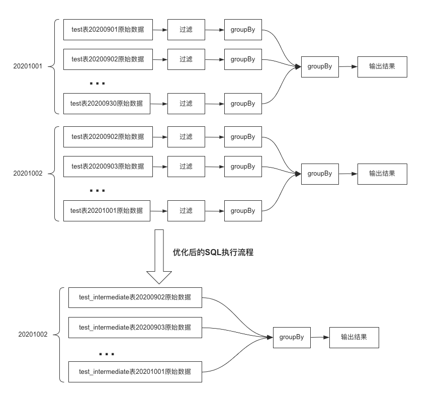

最近在优化集群的大任务，发现许多大任务的SQL都有一个特点：查询数据量大，导致扫描过滤以及shuffle的时间长。这种sql一般都是查询的时间范围比较大（我们集群的表基本都按天分区），从1个月到2年不等，然后又要每天运行，占用了集群相当大的资源。

对于这类任务，其实有很大的优化空间。举个例子：

```sql
select
  name,
  count(1) as occurCount
from
  test
where
  date_p > 20200901
  and date_p < 20200930
  and province = '福建'
group by
  name
```

这个sql每天都会查询近一个月的数据，10月01日查询20200901~20200930的数据，10月02日查询20200902~20201001的数据。我们会发现，10月2日计算的20200902~20200930这些数据其实在1号的时候都已经算过了，这时候又做了重复的计算。**为了避免这些重复的计算，我们可以提前每天的数据写入到一张中简表，之后再从这些中简表读取数据进行合并（此时每天的数据合并过一次了，读取数据量会少很多）:**



优化步骤：

1、建立表 test_intermediate (name,occurCount) 

2、创建每日任务 【清洗数据到中间表 test_intermediate】：

```sql
insert overwrite table test_intermediate partiton(date_p=${date_p})
select
  name,
  count(1) as occurCount
from
  test_intermediate
where
  date_p = ${date_p}
  and province = '福建'
group by
  name
```

3、优化之前的sql(从中间表读取数据)：

```sql
select
  name,
  sum(occurCount) as occurCount
from
  test_intermediate
where
  date_p > 20200901
  and date_p < 20200930
group by
  name
```

