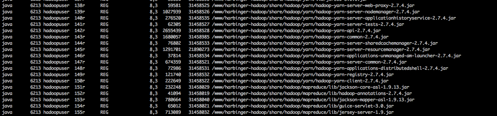

[TOC]

在java程序运行时，如果替换classpath下的某个jar包文件，可能会导致程序出现ClassNotFoundException**。

## 具体场景 

我们要升级线上服务时，可能经常只需要替换其中一两个jar包即可完成升级。有时我们为了方便，经常会先替换完jar包再进行重启。其实这样的做法会有一个隐患，如果在你重启之前程序需要从这个jar包加载某个类的话，**即使这个类在这个jar包中，也会导致程序出现ClassNotFoundException**。

我们可以写个demo来验证一下这个问题 :

`A.java`

```java
public class A {

    public static void main(String[] args) throws InterruptedException {
        System.out.println("begin");
        //在sleep期间jar包发生了改变
        Thread.sleep(10000L);

        B b = new B();
        b.print();
    }
}
```

`B.java`

```java
public class B {

    void print() {
        System.out.println("print B");
    }
}
```

我们先将A类和B类打成一个jar包，名称就叫test.jar，用来当做后面要替换的jar包，我们先将其放到`/tmp`目录下。然后我们稍微改一下B类的print()方法的输出字符串，接着再打个`test.jar`包出来。

**这时候前后的两个jar包，除了B类的print方法输出不一致，jar包名称和里面的类都完全一样**。

接着我们直接执行`java -jar test.jar`，之后在程序休眠时通过命令`cp /tmp/test.jar test.jar`快速替换jar包。大概休眠10秒后程序会抛出ClassNotFoundException。也就验证了我们之前的说法。

> 打jar包时记得在META-INF/MANIFEST.MF文件中加上Main-Class属性指定A类为启动类。可以用maven来打包

## 具体原因探索 

既然jar包名称和原来的一模一样，jar包里面的类也一致，为什么jvm就加载不到这个jar包里面的类呢？

要回答这个问题，我们可以先通过lsof来查看一下某个java进程打开的文件句柄:

`lsof | grep javapid`



我们可以看到，这个java进程维护了多个jar包文件的句柄。通过这个，**我们可以想到应该是jvm在运行中维护了这些jar包的inputstream，在需要某个类的时候，就从这些inputstream中获取某个类的字节码然后加载**。

那么问题来了，这个维护的inputstream是针对原先旧jar包打开的输入流，如果这时jar包被替换了，这个inputstream还能读取到新的jar包的内容吗？

带着这个问题，我们可以再写一个程序测试一下：

```java
    public static ZipInputStream zin;

    public static void main(String[] args) throws InterruptedException, ClassNotFoundException, IOException {
        InputStream in = new BufferedInputStream(new FileInputStream("/tmp/agent.jar"));

        zin = new ZipInputStream(in, Charset.forName("gbk"));
        read();
        //中间休眠10秒用于给我们操作去人为替换jar包
        Thread.sleep(10000L);
        read();
    }

    public static void read() throws IOException {
        ZipEntry ze;
        int available = zin.available();
        System.out.println("available=" + available);
        while ((ze = zin.getNextEntry()) != null) {
            System.out.println(ze.toString());
        }
    }
```

我们直接用jdk提供的ZipInputStream来读取jar包里的内容。第一次read()会输出`test.jar`下所有的类。然后在程序休眠10秒期间，我们替换掉这个test.jar。**之后程序第二次执行read()会发现已经读不到任何数据了（也不会报错）**。

到这里答案已经很明显了，**在替换了jar包后，jvm程序无法从维护的inputstream中读到任何数据，等于这个jar包被删除。之后再想从这个jar包加载什么类自然就加载不到了**。

## 总结  

**其实，如果jvm程序后面在运行时不需要再从这个jar包加载什么类的话，就算替换了jar包也不会造成什么影响**。但是应该没有哪个程序员敢说对要维护的java服务是了如指掌的，加上jvm是按需加载的。我们很难断定jvm在运行过程中就不会再从我们要替换的这个jar包中加载类了。

因此，再做线上的升级时，还是建议尽量关闭了进程后再进行jar包的替换。

