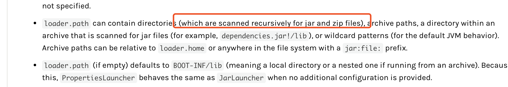

[TOC]

## 一、更新jar包时的一些现象

我们在更新jar包时，经常会对旧的jar包做备份。目前常见的备份方式有以下几种：

1、重命名旧的jar包，加上一些后缀。如  xxx.jar -> xxx.jar.bak

2、在程序指定的classpath下创建一个backup目录（通常是程序的lib目录下创建），然后把旧的jar包放入。如 lib/xxx.jar 移动到 lib/backup/xxx.jar

3、额外新建一个与classpath无关的备份目录，把jar包扔到那个目录下

以上三种方案中，第三种方案无疑是最安全的。但是前两种方案是否可行呢？我们可以做个测试。

## 二、jar包加载测试 

### 2.1、测试前的准备

我们准备三个jar包：test.jar，a.jar，b.jar，c.jar。

a.jar 下有类 com.test.A

```java
public class A {

    @Override
    public String toString() {
        return "load A";
    }
}
```

b.jar 下有类 com.test.B

```java
public class B {

    @Override
    public String toString() {
        return "load B";
    }
}
```

c.jar 下有类 com.test.C

```java
public class B {

    @Override
    public String toString() {
        return "load B";
    }
}
```

然后准备test.jar，有类 com.test.Test

```java
public class Test {

    public static void main(String[] args) throws Exception {
        String className = args[0];
        Class<?> aClass = Class.forName(className);
        Object object = aClass.newInstance();
        System.out.println(object);
    }
}
```

之后新建一个目录 `/tmp/test`，把jar包放进，最后有以下结构：

```shell
/tmp/test/test.jar
/tmp/test/a.jar
/tmp/test/b.jar.bak
/tmp/test/backup/c.jar
```

### 2.2、测试方案一

之后我们开始测试方案一：以`.bak`后缀的jar包是否会被加载到：

```java
java -Djava.ext.dirs=/tmp/test -cp /tmp/test/test.jar com.test.Test com.test.B
```

最后输出：

```shell
load B
```

### 2.3、测试方案二

接着测试方案二：把jar包放在classpath的子级目录中，会被加载吗？

```shell
java -Djava.ext.dirs=/tmp/test -cp /tmp/test/test.jar com.test.Test com.test.C
```

输出：

```shell
Exception in thread "main" java.lang.ClassNotFoundException: com.test.C
	at java.net.URLClassLoader.findClass(URLClassLoader.java:381)
	at java.lang.ClassLoader.loadClass(ClassLoader.java:424)
	at java.lang.ClassLoader.loadClass(ClassLoader.java:357)
	at java.lang.Class.forName0(Native Method)
	at java.lang.Class.forName(Class.java:264)
	at com.yangjb.Test.main(Test.java:16)
```

## 三、结论

很显然，**采用第一种方案以修改后缀备份jar包的话，这个备份的jar包依然会有被加载到的风险。**虽然大多数时候，xxx.jar 会比 xx.jar.bak 更先被加载到，但是并不意味着绝对安全。因此，在线上更新jar包时，还是不要采用这种方式备份jar包。

使用第二种方案备份的jar包，是不会被jvm加载的。但是笔者在更新一个springboot jar包时，却遇到过这种场景下备份jar包被加载的问题，后面查了下springboot的文档，发现springboot是会递归去加载`loader.path`(springboot通过该参数指定classpath)下的所有jar包:

<https://docs.spring.io/spring-boot/docs/current/reference/htmlsingle/#executable-jar-property-launcher-features>



**所以，第二种方式也并不意味着绝对的安全。**

其实关于备份jar包是否会被jvm加载，取决于jvm类加载器的行为，各种类加载器查找类的行为不一，所以最稳妥的备份方案还是创建一个与程序无关的目录进行备份。