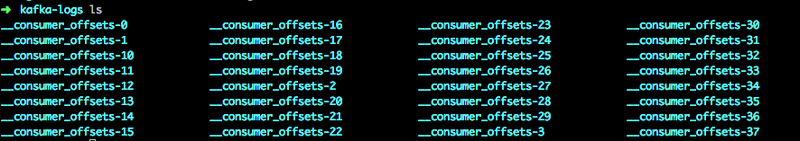

[TOC]

## 一、GroupCoordinator 概念


在每个kafka Broker上面，都会运行一个GroupCoordinator的组件。这个组件负责管理Consumer Group的成员信息以及Consumer Group已消费offset。

每个broker在启动的时候都会启动一个GroupCoordinator实例。但是一个kafka集群可能有多个broker，那么怎么确定一个新的Consumer要和哪个broker上的GroupCoordinator交互呢？

这就和kafka上的一个内部使用的topic `__consumer_offsets`有关系了。

### \_\_consumer_offsets

__consumer_offsets是kafka内部使用的一个topic，专门用来存储group具体消费的情况，默认情况下，这个topic有50个partition，每个partition有3个副本。我们进入某个broker的日志目录，一般都能看到该topic对应的partition目录，如下图：



### Consumer如何找到对应的GroupCoordinator

\_\_consumer_offsets的会分布在各个broker，当一个新的Consumer要寻找和它交互的GroupCoordinator时，需要先对它的GroupId进行hash，然后取模\_\_consumer_offsets的partition数量，最后得到的值就是对应partition，那么这个partition的leader所在的broker就是我们要交互的那个broker了。获取partition公式如下：

```java
abs(GroupId.hashCode()) % NumPartitions
```

NumPartitions为\_\_consumer_offsets的数量。GroupId为初始化Consumer时指定的groupId。

举个例子，假设一个GroupId计算出来的hashcode是5，之后取模50得到5。那么partition-5的leader所在的broker就是我们要找的那个节点。这个Consumer后面都会直接和该broker上的GroupCoordinator交互。

## 二、Consumer加入Group流程

Consumer在拉取数据之前，必须加入某个group，在consumer加入到group的整个流程中，主要涉及到了3种请求：

- GROUP_COORDINATOR请求
- JOIN_GROUP请求
- SYNC_GROUP请求

### GROUP_COORDINATOR请求

前面我们知道了通过\_\_consumer_offsets和对应的公式可以算出要和哪台broker上的GroupCoordinator做交互，但是我们并不知道\_\_consumer_offsets的各个partition位于哪些broker上。比如我们通过公式算出了要和\_\_consumer_offsets的partition-5所在的broker做交互，但是我们不知道它的partition-5的leader在哪个broker上。**因此我们需要先往集群的一个broker发送一个GROUP_COORDINATOR请求来获取对应的brokerId。**

要往哪个broker发送GROUP_COORDINATOR请求也不是随机选择的，kafka会默认选择一个当前连接数最少的broker来发送该请求。这个连接数是指**inFightRequest**，也就是当前客户端发往broker还未返回的那些连接数量。

**broker处理：**

kafka的broker接收到GROUP_COORDINATOR请求后，会通过公式`abs(GroupId.hashCode()) % NumPartitions`算出对应的partition，然后搜索__consumer_offsets的metadata，找到该partition leader所在的brokerId，最后返回给客户端。

这里要注意一点：

1. 如果__consumer_offsets被删除了或者还未创建，broker找不到对应的metadata时，会自动创建一个新的名为__consumer_offsets的topic然后再查找对应的brokerId。

### JOIN_GROUP请求

找到要交互的broker后，客户端就会往该broker发送 JOIN_GROUP请求了。

 JOIN_GROUP请求主要是让Consumer加入到指定的group中，broker上的GroupCoordinator服务会管理group的各个Consumer。

broker收到 JOIN_GROUP请求后，让目标group进入 **PreparingRebalance**状态，等待一段时间后，返回一些信息，这些信息包括Consumer在group中对应的memberId以及该group的leaderId、generationId(每次reblance都会+1)等等，如果对应consumer是leader，那么还会将当期组中所有的members信息返回给leader用于后面让leader来分配各个member要消费的partition（**第一个加入该group的consumer就是该group的leader**）。

Consumer收到broker返回的信息后，如果没有错误则表示已经加入到该Group中了。接着继续发送SYNC_GROUP请求。

### SYNC_GROUP请求

前面的JOIN_GROUP请求只是加入目标group，还没有真正的分配partiton。SYNC_GROUP请求就是用于获取consumer要消费哪些partition用的。

Consumer根据前面JOIN_GROUP请求的返回值，会判断自己是否是leader，如果是leader，就直接获取group中的所有members然后使用PartitionAssignor的实现类来为group中的各个Consumer分配要消费哪些partition，PartitionAssignor的默认实现是RangeAssignor，也可以通过配置`partition.assignment.strategy`来指定不同的分配策略。最后leader把分配好的信息封装成SYNC_GROUP请求发送给broker。

如果consumer是follower，就直接发送一个SYNC_GROUP请求给broker。

broker收到SYNC_GROUP请求后，根据group中的leader给的分配信息在内存中给每个member分配对应的partiton，然后将这些信息返回给对应的consumer。

最后，各个group中的consumer就得到了自己要消费的partition，就可以开始拉取数据了。

## 三、Group的状态变更

对于一个 Consumer Group，它会有五种状态：Dead、Empty、AwaitingSync、PreparingRebalance、Stable。状态间的变更关系如下图所示：


### Empty状态  

Empty状态表示该Consumer Group中没有任何member。新建的Group都是处于这个状态，它可能转化为以下两种状态

- PreparingRebalance：如果有新的member加入，状态就会变更成PreparingRebalance，等待partition-rebalance开始。
- Dead：如果该group被移除掉，状态就会变成Dead。

###PreparingRebalance状态

PreparingRebalance状态表示该Group正在等待partition-rebalance开始。这个状态存在的目的主要是为了等待所有的member都加入到该Group中了，然后开始进行partition rebalance(也就是进入AwaitingSync状态)。这样就可以**尽量**保证在进行partition reblance时，group中的member不会发送变动。它可能转化为以下三种状态：

- Dead：如果该group被移除掉，状态就会变成Dead
- AwaitingSync：第一个发送PreparingRebalance请求的Consumer返回后，group的状态就会变成AwaitingSync，等待重新分配partition
- Empty：group中最后一个member离开了，group重新变为Empty状态

### AwaitingSync状态  

AwaitingSync状态表示该Group正在等待重新分配partition的结果，partiton的分配是由member的leader来进行的，等leader发来SYNC_GROUP请求，GroupCoordinator知道partiton的分配情况了，Group状态就会变成Stable。它可能转化为以下三种状态：

- Dead：如果该group被移除掉，状态就会变成Dead
- PreparingRebalance：如果有新的member加入或者旧成员离开，状态会重新变回PreparingRebalance，等待新的一轮partition分配  
- Stable：partition分配完成，进入Stable状态   

### Stable状态  

Stable状态表示目前Group已经给各个Consumer分配好各自要消费的partition了。只要Group没有发生成员变动或者member要消费的元数据没发送变动(比如某topic的partition数量变更)，状态就会一直维持在Stable。它也可能转化为以下两种状态：

- Dead：如果该group被移除掉，状态就会变成Dead
- PreparingRebalance：如果有新的member加入或者旧成员离开，状态会重新变回PreparingRebalance，等待新的一轮partition分配  

### Dead状态  

Dead状态表示该Group已经被移除掉了。如果\_\_consumer_offsets的partition分布发生变动，就会导致Group可能不属于该broker上的GroupCoordinator管理，GroupCoordinator就会移除Group。

### 正常consumer加入group中的状态变动情况

`Empty —> PreparingRebalance —> AwaitingSync —> Stable`

当一个consumer发送 JOIN_GROUP请求要求加入一个新的group时，GroupCoordinator发现之前没有这个group，就会新建一个group，此时该group的状态为**Empty**。之后由于有新成员加入，状态迅速转变为**PreparingRebalance**。另外，GroupCoordinator收到JOIN_GROUP请求后会等待一段时间再返回，让该Group在PreparingRebalance状态等待一定时间，以确保该加入的member都加入了。

PreparingRebalance再返回JOIN_GROUP请求后，就会把Group的状态置为**AwaitingSync**。 Consumer收到响应后，会再发送SYNC_GROUP请求等待partition分配完成。如果该Consumer是leader，则该Consumer会在本地进行partition的分配，然后把partition的分配结果随着SYNC_GROUP请求一起上报给GroupCoordinator。之后GroupCoordinator收到leader发送过来的分配情况，就会将状态置为**Stable**，之后将这些信息作为SYNC_GROUP请求的响应发送给各个Consumer，各个Consumer就都得到了自己要消费的partition。

## 四、Consumer心跳机制

Consumer在加入Group后，会开启一个线程，不断的向GroupCoordinator发送心跳请求，报告自己还活着。GroupCoordinator会管理group中所有Consumer的心跳，如果发现有一个Consumer超过一定时间没有发送心跳过来，GroupCoordinator会认为这个Consumer已经离开group。这时GroupCoordinator会将该group的状态重新置为**PreparingRebalance**，开启新一轮的partition分配。

> 心跳的发送频率和consumer的配置 `heartbeat.interval.ms`有关，默认是3000，也就是每3s发送一次心跳。
>
> GroupCoordinator判断member是否过期和consumer的配置`session.timeout.ms`有关，默认为10000，也就是超过10s没收到心跳请求，就移除该member。

### Group处于Stable状态下，新加入一个Consumer

如果目前group已经处于stable状态了(各个consumer都在消费了)，又新加入了一个Consumer，那么状态会怎么变更呢？

首先，新的Consumer会发送一个 JOIN_GROUP请求给GroupCoordinator，GroupCoordinator收到请求后发现这是一个新的member，就会将group的状态置为**PreparingRebalance**,然后等待其他member也发送 JOIN_GROUP请求。

那么其他正在消费的consumer怎么知道要重新分配partition呢？这个就和心跳机制有关系了。Consumer发送心跳给GroupCoordinator的时候，如果GroupCoordinator发现此刻group的状态是PreparingRebalance，就会告诉Consumer需要重新分配partition了，各个Consumer收到消息后就开始重新发送JOIN_GROUP请求。

### Consumer离开可能引发的Group状态变更  

当Consumer超过一定时间没有发送心跳，GroupCoordinator会认为该Consumer已经离开group。此时GroupCoordinator会将该group的状态置为PreparingRebalance，等待新一轮的parition分配。

## 五、 __consumer_offsets topic中的消息    

在之前老的版本中，consumer消费的offset情况是存储在zookeeper中的，但是kafka对zk的依赖性很强，当consumer的数量不断增多，zk的负担也会越来越大，最终可能会影响到zk的正常运行。因此，在后面的版本中，kafka设计者将consumer的commitedoffset写到内部的一个topic中，也就是__consumer_offsets。

### __consumer_offsets存储的两种消息类型  

除了存储Consumer Group的commitedOffset外， __consumer_offsets中其他还存储了另外一种消息类型：**GroupCoordinator管理的元数据信息**，这些元数据包括GroupCoordinator管理的所有Group的信息，比如Group的状态，Group的leader信息，以及Group的各个member信息，但不包括Group中各个topic-partition的commitedOffset。kafka通过消息key的不同来区分两种消息类型

1. commitedOffset 消息类型  

它的key是 GroupId+topic+partition，value是对应的offset。

2. GroupCoordinator 消息类型 

它的key是 GroupId，value是对应的元数据信息

###  __consumer_offsets 消息的加载和写入

#### 数据加载


为了读取更快，无论是commitedOffset，还是GroupCoordinator的元数据，都会从 __consumer_offsets中加载出来缓存起来。这些数据在broker启动的时候加载的。

一个broker在启动的时候，并不会知道自己机器上的那些partition是leader还是replica，所以无法立即从   __consumer_offsets中加载数据。如果这时有Consumer来拉取offset，kafka就会抛出一个异常给Consumer，Consumer等待会等待若干时间后再次请求。

在broker启动后，Controller会感应到有新的broker启动，然后知道这个broker上的partition哪些是leader，哪些是replica，之后发送一个LEADER_AND_ISR请求给该broker。该Broker收到这个请求，解析附带的请求数据，就可以知道自己机器上的parition哪些是leader，哪些是replica了。接着，如果发现这些partition有__consumer_offsets的话，就开始读取\_\_consumer_offsets的数据并加载的内存中。

加载的流程也很简单，kafka会预先申请5M的内存空间，然后从目标partition的第一条offset开始读取，直到读取到最后一个offset为止。由于kafka会定时对 __consumer_offsets进行compact，因此\_\_consumer_offsets的partition大小一般也不会太大。

#### commitedOffset消息写入  

当有Consumer提交OFFSET_COMMIT请求时，就会往\_\_consumer_offsets的对应partition写入消息了。由于kafka对这个topic开始了消息压缩（Compact），因此随着时间的流逝，相同的key，旧的记录会被清除掉，只剩下最新的那个key

#### GroupCoordinator元数据写入  

在Group状态变为Stable后，GroupCoordinator会将当前Group的相关元数据写入对应partiiton。当有成员离开Group，Group状态变成Empty的时候，也会写一条消息到partition。

