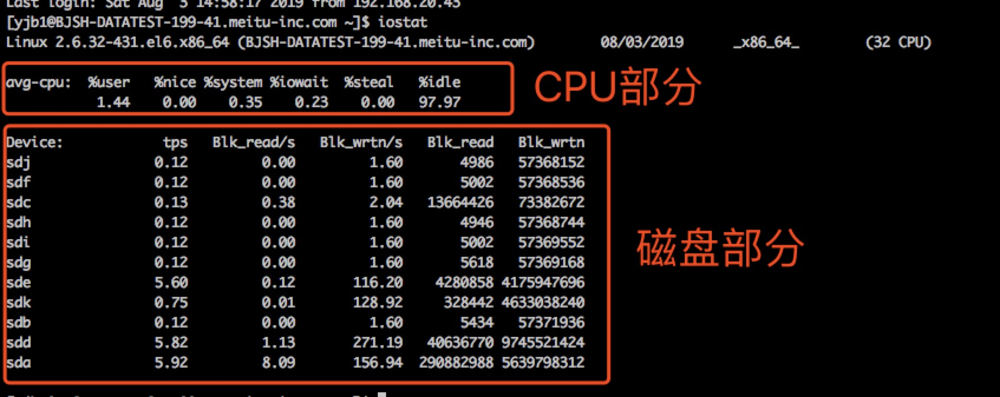
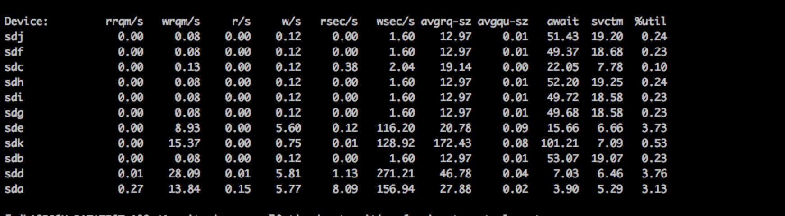

[TOC]
当我们要看系统IO情况时，一般最先想到的应该就是iostat命令的。iostat提供了丰富的参数给我们查询各种维度的io数据。学习iostat有助于我们排查IO相关问题时可以更快的定位到问题根源。

> 以下内容大多来自iostat的man文档，会加上部分自己的理解，英文水平好的同学也可以直接看man文档

## 一、命令相关参数

命令使用：

`iostat [ -c ] [ -d ] [ -N ] [ -n ] [ -h ] [ -k | -m ] [ -t ] [ -V ] [ -x ] [ -y ] [ -z ] [ -j { ID | LABEL | PATH | UUID | ... } [ device [...] | ALL ] ] [ device [...] | ALL ] [ -p [ device [,...] | ALL ] ] [ interval [ count ] ]`

看着有点乱，我们可以归纳为:

`iostat [-参数] [指定磁盘] [采集周期频率] [采集次数]`

比如`iostat -k sda 5 2`表示采集sda磁盘上的相关信息，每5秒采集一次，一共采集2次。-k参数表示以kb来显示。

相关参数介绍：

| 参数                                      | 详解                                                         |
| ----------------------------------------- | ------------------------------------------------------------ |
| -c                                        | 只显示cpu相关统计信息（默认是同时显示cpu和磁盘信息）         |
| -d                                        | 只显示磁盘统计信息（默认是同时显示cpu和磁盘信息）            |
| -h                                        | 使用NFS的输出报告更加友好可读。NFS通过-n来开启               |
| -j { ID \| LABEL \| PATH \| UUID \| ... } | 磁盘列表的Device列要用什么维度来描述磁盘                     |
| -k                                        | 默认情况下，iostat的输出是以block作为计量单位，加上这个参数可以以kb作为计量单位显示。（**该参数仅在linux内核版本2.4以后数据才是准确的**） |
| -m                                        | 默认情况下，iostat的输出是以block作为计量单位，加上这个参数可以以mb作为计量单位显示。（**该参数仅在linux内核版本2.4以后数据才是准确的**） |
| -N                                        | 显示磁盘阵列(LVM) 信息                                       |
| -n                                        | 显示NFS相关统计数据（network fileSystem）。但是这个参数只在linux内核版本2.6.17之后有用 |
| -p [ { device [,...] \| ALL } ]           | 显示磁盘分区的相关统计信息（默认粒度只到磁盘，没有显示具体的逻辑分区） |
| -t                                        | 每次输出报告时显示系统时间，                                 |
| -V                                        | 显示当前iostat的版本信息                                     |
| -x                                        | 显示更详细的磁盘报告信息，默认只显示六列，加上该参数后会显示更详细的信息。这个参数需要在内核版本2.5之后才能使用 |
| -y                                        | 跳过不显示第一次报告的数据，因为iostat使用的是采样统计，所以iostat的第一次输出的数据是自系统启动以来累计的数据 |
| -z                                        | 只显示在采样周期内有活动的磁盘                               |

> 通过uname -a可以查看当前linux系统的内核版本。2.4版本后一个block的大小通常是512byte

> 默认情况下，第一次的输出信息的数据是从操作系统启动以来的累计数据，第二次开始才是真正的采样周期内的真实数据，这点和top命令很像。我们可以加上-y来过滤掉第一次的输出信息。

## 二、输出信息

iostat的输出信息主要可以分为3大部分：

1. cpu部分的统计信息
2. 磁盘相关的统计信息
3. NFS（Network FileSystem）相关的统计信息

默认情况下，iostat只会显示cpu和磁盘部分的统计信息。如下图：

加上-n可以显示NFS的统计信息。由于本人在多个系统上测试均没有具体的数值输出，因此下面只介绍cpu和磁盘部分的统计信息。

### 1、cpu部分的统计

这里的cpu统计信息只是取平均值，如果是多核cpu，想看每核cpu的具体统计信息，可以使用top命令。

下面的百分比计算一般采用公式: **消耗时间*100.0/采样时间**

- %user: cpu消耗在用户空间的时间占比
- %nice: 被用户修改过优先级的进程运行时间占比
- %system: cpu消耗在内核空间的时间占比
- %iowait: cpu在等待IO的时间占比（需要满足**CPU资源空闲而磁盘IO在工作**的条件）
- %steal: 当hypervisor正服务于另外一个虚拟处理器时无意识地等待虚拟CPU所占有的时间百分比
- %idle: cpu空闲时间百分比

> iowait可以作为磁盘是否是系统瓶颈的参考值，但并不能全信。iowait表示的含义是cpu没在工作而在等待io的时间占比，在cpu高速运转的情况下也会出现iowait高的情况，这并不能表明磁盘性能就有问题。唯一能说明磁盘性能差的应该是根据磁盘的read/write时间，一般来说，一次读写就是一次寻道+一次旋转延迟+数据传输的时间。现代硬盘数据传输就是几微秒或者几十微秒的事情，远远小于寻道时间2~20ms和旋转延迟4~8ms，所以只计算这两个时间就差不多了，也就是15~20ms。如果磁盘读写时间大于20ms，就要考虑是否是磁盘读写太多，导致磁盘性能降低了。

### 2、磁盘部分的统计

在没加`-x`参数时，默认输出以下六列：

- Device： 磁盘名称，可以通过-p参数改成ID、PATH、UUID的形式
- tps：取样周期内，磁盘的读写次数。**但是由于有时操作系统会合并多个IO请求成一个，因此这个参数并不是十分准确**。
- Blk_read/s：取样周期内，每秒读取的block数量（通过参数-k -m可以将单位改成kb、mb）
- Blk_wrtn/s：取样周期内，每秒写入的block数量（通过参数-k -m可以将单位改成kb、mb）
- Blk_read：取样周期内，读取的总block数量（通过参数-k -m可以将单位改成kb、mb）
- Blk_wrtn：取样周期内，写入的总block数量（通过参数-k -m可以将单位改成kb、mb）

如果加了`-x`参数，会详细更加详细的数据，如下图：

- rrqm/s：采样周期内，每秒merge的读请求数量
- wrqm/s：采样周期内，，每秒merge的写请求数量
- r/s：采样周期内，每秒的读请求数量
- w/s：采样周期内，每秒的写请求数量
- rsec/s：采样周期内，每秒读取的扇区数量（通过参数-k -m可以将单位改成kb、mb）
- wsec/s：采样周期内，每秒写入的扇区数量（通过参数-k -m可以将单位改成kb、mb）
- avgrq-sz：采样周期内，平均IO请求的大小（以扇区为单位）
- avgqu-sz：采样周期内，平均IO队列长度（在等待被执行的IO请求）
- await：采样周期内，IO请求的平均时间（排队时长+IO服务时长），单位是毫秒
- svctm：采样周期内，IO请求的平均服务时间，排除排队的时长，单位是毫秒（**该统计维度的数值不可信，后面的iostat版本会移除这项统计值**）
- %util：采样周期内，IO忙碌的时间百分比，如果这个值接近100，说明此时IO已经满负荷了

> 网上许多博客都说用svctm可以衡量磁盘的性能，但是在iostat的man文档中有提到，让我们不要相信这个列的输出值，并且在后面的版本中会去除这个统计项。
>
> 所以要统计磁盘性能，综合来说还是用await列的信息来判断。一般的磁盘读写性能在20ms左右，如果await比这个数值大很多，就说明当前系统存在很大的IO问题。

## 三、一些扩展

和大多的系统指标统计一样，iostat的数据也基本来自/proc虚拟文件系统。不了解/proc虚拟文件系统的同学自行百度，这里就不多做介绍了。

比如 iostat -x 的数据则来自于 /proc/diskstats文件下的数据。另外，各种linux发行版的proc虚拟文件系统实现可能会有偏差，因此iostat输出的内容也可能不太一致。

## 参考资料

<https://blog.51cto.com/291268154/1981358>

