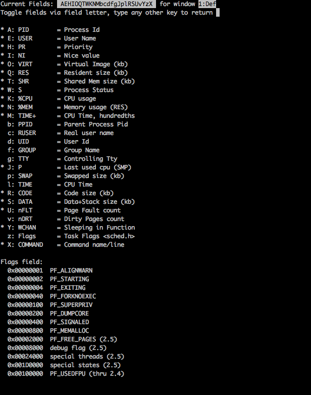
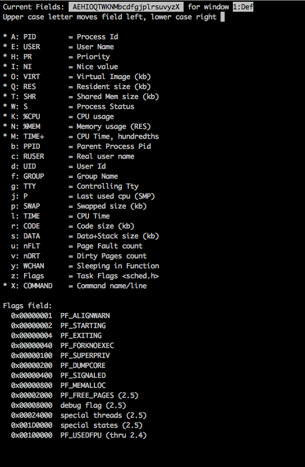

[TOC]

当需要排查一些问题或者要看系统的一些指标时，我们经常会用到top命令。但是我们大多数人都只会简单的使用top，比如看下哪个进程cpu、内存使用的比较多等。其实，top命令有着丰富的功能供我们使用。

## 一、基本使用及参数介绍

通过`top -h`我们可以获取到top当前的版本以及支持的所有参数：

```shell
	top: procps version 3.2.8
usage:	top -hv | -abcHimMsS -d delay -n iterations [-u user | -U user] -p pid [,pid ...]
```

下面逐个介绍各个参数的含义  

| 参数    | 表示含义                                    |
| ---- | ------------------------------------------------------------ |
| h    | 列出top版本和使用帮助信息                                    |
| v    | 列出top版本和使用帮助信息                                    |
| a    | top界面的进程列表以内存使用情况来排序                        |
| b    | 批处理模式。该模式下不会接收任何交互命令，**纯输出**。这个模式适合想把top结果输出到其他程序或者文件的场景。 |
| c    | top界面的进程列表的Command列中展示具体的命令行（默认只有一个简单的进程名字，如java。带上-c后会显示具体的执行命令，如java -jar xxx.jar） |
| H    | 显示线程的列表（默认是进程列表），我们经常使用这个参数来查看java哪个线程占满了cpu资源 |
| i    | 带上这个参数的话，进程列表将不显示空闲的进程。即只会显示在running状态中的进程 |
| m    | 进程列表显示具体使用的内存(USED)而不是虚拟内存(VIRT)         |
| M    | 进程列表的内存使用列会显示单位。比如1g,1000m                 |
| s    | 安全模式。不是很清楚作用，感兴趣的可以通过man top具体查看下文档 |
| S    | 累积模式。开启这个模式后进程的cpu时间会加上它的子进程的时间  |
| d    | top界面的数据更新频率。默认是3s，单位秒                      |
| n    | 更新几次后退出top界面                                        |
| u/U  | 进程列表只看指定用户的进程                                   |
| p    | 进程列表只看指定的进程,可以通过逗号分割多个id                |

## 二、top界面各个维度的含义

默认top界面的信息大概如下:

```
top - 08:26:59 up 586 days, 14:17, 12 users,  load average: 0.17, 0.11, 0.18
Tasks: 420 total,   1 running, 419 sleeping,   0 stopped,   0 zombie
Cpu(s):  4.5%us,  2.1%sy,  0.0%ni, 93.1%id,  0.0%wa,  0.0%hi,  0.3%si,  0.0%st
Mem:  65921144k total, 63430372k used,  2490772k free,  1256820k buffers
Swap: 16777208k total, 12220012k used,  4557196k free, 25095800k cached

  PID USER      PR  NI  VIRT  RES  SHR S %CPU %MEM    TIME+  COMMAND
36714 hadoopus  20   0 15308 1516  936 R  0.7  0.0   0:00.16 top
12032 hadoopus  20   0  106m  524  520 S  0.0  0.0   0:00.11 bash
33401 hadoopus  20   0  105m 1972 1528 S  0.0  0.0   0:00.01 bash
43932 hadoopus  20   0 7953m 300m 2876 S  0.0  0.5 570:46.72 java
```

### 1、第一行（系统相关统计信息）

`08:26:59` ：表示系统当前的时间

`up 586 days, 14:17` ： 表示系统已经启动了586天14小时17分（**中间没有重启过**）

`12 users`：当前有几个用户登录系统

`load average: 0.17, 0.11, 0.18`：当前cpu的负载情况。3个数值分别表示1分钟内、5分钟内、15分钟内cpu的负载情况

#### load average 解释 

load指标一般用来衡量系统cpu在一定时间内的负载情况。

top的load指标主要来自于文件/proc/loadavg。`/proc`是一个虚拟的文件系统(不占磁盘空间)，通过/proc文件系统，我们可以访问linux内核的一些实时运行数据。

比如`/proc/cpuinfo`文件可以获取到当前系统cpu的相关信息,`/proc/meminfo`可以获取到内存的相关信息。同理，通过 `/proc/loadavg`我们可以获取到当前系统的load指标。`/proc/loadavg`中的信息如下:

`0.15 0.11 0.10 1/4406 27140` ： 其中前三个表示1/5/15分钟内的cpu负载。1/4406表示当前系统共有4406个进程（包括线程），其中只有1个进程在运行。27140表示最近一次运行过的进程号

那么，**load的指标是怎么计算的呢**？linux内核会定时的去采集信息(具体的频率不是很清楚)，然后统计**在运行中或者在等待运行**的进程数量，之后取平均数，就是这个时间范围内的cpu负载了。

> 注意，这里计算的时候会算上等待要运行的进程。比如说一个进程满足运行条件了，但是当前cpu资源不够(cpu在运行其他进程)，这时这个进程就需要等待，同时这个进程也会算到cpu负载里面。

举个例子，比如某个时刻有3个进程在运行，2个进程在等待运行。那么这个时刻的cpu负载就是5。那么假设1分钟内取样了6次，分别是5、3、6、1、0、1，那么1分钟内的cpu负载就是(5+3+6+1+0+1)/6=2.6。我们通过top看到的1分钟内的cpu负载就是这么来的。

> 注意，**这个cpu负载指标的计算和cpu核数无关**，它只会统计当前运行中的进程+等待运行的进程。比如32核的服务器上，每个cpu都刚好运行一个进程且没有等待运行的进程，那么此时cpu负载就是32。
>
> 但是，一般我们要看系统整体负载的时候，就会结合cpu核数来算负载系数。比如当前系统是2个cpu，一分钟内的负载指标到达了4，那么此时一分钟内的负载系数就是2，意味着系统已经比较繁忙了（每个cpu长期运行一个进程+还有一个进程在等待）。根据网上提供的经验，当 cpu负载值/cpu核数 >= 5时，就说明系统已经负载的非常厉害了

### 2、第二行（进程统计信息）

`Tasks: 420 total,   1 running, 419 sleeping,   0 stopped,   0 zombie`：一共420个进程，1个进程在running状态，0个进程处于stopped状态，0个僵尸进程。（如果带上-H参数会显示系统总的线程数量）

> 在一个进程调用了exit之后，该进程 并非马上就消失掉，而是留下一个称为僵尸进程（Zombie）的数据结构。在Linux进程的5种状态中，僵尸进程是非常特殊的一种，它已经放弃了几乎所 有内存空间，没有任何可执行代码，也不能被调度，仅仅在进程列表中保留一个位置，记载该进程的退出状态等信息供其他进程收集，除此之外，僵尸进程不再占有 任何内存空间。

### 3、第三行（cpu相关信息）

`4.5%us`：进程运行在用户空间的时间百分比

`2.1%sy`：进程运行在内核空间的时间百分比（如果这个值比较大，就说明当前系统在进行大量的系统调用）

`0.0%ni`：修改过进程优先级比的进程运行时间百分比

`93.1%id`：空闲cpu时间百分比

`0.0%wa`：进程等待IO的CPU时间百分比（如果IO繁忙，这个值会比较高）

`0.0%hi`：进程硬件中断占的时间百分比

`0.3%si`：进程软中断占的时间百分比

`0.0%st`：虚拟机占的时间百分比

### 4、第四行（内存信息）

`65921144k total, 63430372k used,  2490772k free,  1256820k buffers`：总内存有65921144k，已经使用63430372k，剩余2490772k。其中buffer的空间还有1256820k。

### 5、第五行（虚拟内存信息）

`16777208k total, 12220012k used,  4557196k free, 25095800k cached`：虚拟内存有16777208k，已经使用12220012k，剩余4557196k。其中cache的空间还有25095800k。

> 不了解内存和swap内存区别可以先去了解一下linux关于虚拟内存模块的设计。简单来说，swap内存是将磁盘的一部分空间作为内存来使用的手段。
>
> **关于buffer和cache**：
>
> buffer一般是用于控制流量，比如我们要将内存数据写到磁盘时，为了避免频繁的进行IO，就需要用到buffer先缓存一些数据后再统一写到磁盘，减少IO次数
>
> cache主要用于加速读取速度。最典型的就是cpu cache。我们都知道，内存读写的速度虽然很快，但是还是赶不上cpu计算的速度。因此cpu cache就是用来做一些高速缓存，让cpu在计算的时候能最快的取到数据。虚拟内存中的cache也是为了弥补内存和磁盘速度不一致而引入的缓存机制

### 6、第六行+（进程列表）

后面就是进程列表了，进程列表会列出各个进程各个维度的信息，top支持的维度有:

```shell
序号  列名    含义	是否默认显示
a    PID     进程id	默认显示
b    PPID    父进程id	默认不显示
c    RUSER   Real user name	默认不显示
d    UID     进程所有者的用户id	默认不显示
e    USER    进程所有者的用户名	默认显示
f    GROUP   进程所有者的组名	默认不显示
g    TTY     启动进程的终端名。不是从终端启动的进程则显示为 ?	默认不显示
h    PR      内核实际的优先级,一般等于NI+20。值越低优先级越高	默认显示
i    NI      nice值(用户可以设置的)。负值表示高优先级，正值表示低优先级。也就是值越小优先级越高	默认显示
j    P       最后使用的CPU，仅在多CPU环境下有意义	默认不显示
k    %CPU    上次更新到现在的CPU时间占用百分比	默认显示
l    TIME    进程使用的CPU时间总计，单位秒	默认不显示
m    TIME+   进程使用的CPU时间总计，单位1/100秒	默认显示
n    %MEM    进程使用的物理内存百分比	默认显示
o    VIRT    进程使用的虚拟内存总量，单位kb。VIRT=SWAP+RES	默认显示
p    SWAP    进程使用的虚拟内存中，被换出的大小，单位kb。	默认不显示
q    RES     进程使用的、未被换出的物理内存大小，单位kb。RES=CODE+DATA	默认显示
r    CODE    可执行代码占用的物理内存大小，单位kb	默认不显示
s    DATA    可执行代码以外的部分(数据段+栈)占用的物理内存大小，单位kb	默认不显示
t    SHR     共享内存大小，单位kb	默认显示
u    nFLT    页面错误次数	默认不显示
v    nDRT    最后一次写入到现在，被修改过的页面数。	默认不显示
w    S       进程状态(D=不可中断的睡眠状态,R=运行,S=睡眠,T=跟踪/停止,Z=僵尸进程)	默认不显示
x    COMMAND 命令名/命令行	默认显示
y    WCHAN   若该进程在睡眠，则显示睡眠中的系统函数名	默认不显示
z    Flags   任务标志，参考 sched.h	默认不显示
```

#### 选择指定列展示/不展示

在top展示界面，我们可以按下`f`键，就会进程列选择界面:



**前面带*号表示当前有展示该列，或者用序号的大小写也可以判断该列是否展示（大写表示展示，小写字母表示不展示）**。

`:`号前面的字母表示列对应的序号，比如我们要看SWAP列，就按下p，这时我们小写p变成了大写P，并且前面带上了*。这时再按下回车，回到top界面就可以看到全新的列展示了。

#### 进程列表排序顺序调整

在top展示界面，我们可以按下`o`键，就可以对进程列表的排序顺序做调整了：



`*`号和大写字母表示当前列在展示的状态。之后通过序号来进行列上移或者下移，比如我们想要CPU列的排序往前调整一点，就按下大写字母K，如果想往后调整，就按下小写字母k（**大写表示往上调整，小写表示往下调整**）。之后按回车就可以了

## 三、top的一些小问题 

在top的man文档中，有报告了一个问题。因为top的一些信息是通过采样取平均值来算的，因此top第一次输出时一般是没有样本的，所以只能获取系统的平均值来输出。

比如我们如果多次输入

`top -b -n 1`

会发现获取到的CPU统计信息基本都是一样的。就是因为第一次输出获取的是系统启动后的平均值。

## 四、其他

top还可以通过文件进行一些特定的配置，这样就不用每次进入top展示界面时还要去调整了，不过感觉用的机会不会太多。因此就不做太多了解了。

另外，这里只是列出top的一些基本的使用和信息，想更深入了解的可以去看下top的man文档（写的很详细）。