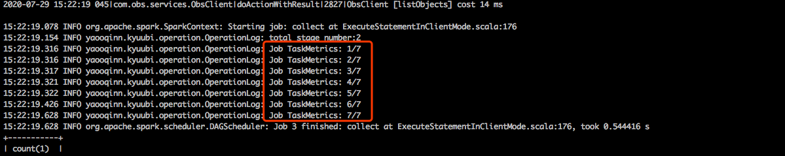

[TOC]

# 一、Hive QueryLog的实现

由于Kyuubi、Spark ThriftServer的实现框架都是用的Hive Server。因此这里只介绍Hive Server是如何实现QueryLog的。

## 客户端方面

在HiveServer实现的jdbc客户端中，获取QueryLog实现是在HiveStatement类的getQueryLog()方法中。这个方法的底层是调用了Thrift实现的FetchResults方法，从方法字面含义来看，这是个获取查询结果的方法。其实不然，Hive通过一个fetchType参数来区分是获取查询结果还是获取QueryLog。fetchType=1时，HiveServer会返回QueryLog，fetchType=0时返回查询结果。

## 服务端实现

我们可以看HiveServer关于FetchResults()的实现：

```java
//HiveSessionImpl.java
@Override
  public RowSet fetchResults(OperationHandle opHandle, FetchOrientation orientation,
      long maxRows, FetchType fetchType) throws HiveSQLException {
    acquire(true, false);
    try {
        //fetchType==0，则返回查询结果
      if (fetchType == FetchType.QUERY_OUTPUT) {
        return operationManager.getOperationNextRowSet(opHandle, orientation, maxRows);
      }
      //否则查询日志
      return operationManager.getOperationLogRowSet(opHandle, orientation, maxRows, sessionConf);
    } finally {
      release(true, false);
    }
  }
```

当客户端传过来的fetchType=1时，HiveServer会拉取对应Operation的日志返回。

### 日志的读取

HiveServer关于Operation的日志读写逻辑都封装在OperationLog类中。OperationLog维护着一个logFile的变量，logFile表示本地磁盘上的一个文件，具体地址为：\${hive.server2.logging.operation.log.location}/\${sessionId}/\${operationId}，也就是一个Operation对应一个日志文件。

HiveServer要读取对应Operation的日志只要读取这个日志文件的内容即可。

### 日志的写入

OperationLog日志的写入是由LogDivertAppender类来负责的。LogDivertAppender继承了log4j的AbstractOutputStreamAppender类，是Hive自己实现的一个日志追加器。

在OprationManager初始化时，Hive就会构造一个LogDivertAppender实例并将其加入到log4j的上下文中，因此后续通过log4j输出日志都会经过LogDivertAppender（**LogDivertAppender可以选择要不要输出，往哪输出**）

```java
//OperationManager.java  
private void initOperationLogCapture(String loggingMode) {
    // Register another Appender (with the same layout) that talks to us.
    Appender ap = LogDivertAppender.createInstance(this, OperationLog.getLoggingLevel(loggingMode));
    LoggerContext context = (LoggerContext) LogManager.getContext(false);
    Configuration configuration = context.getConfiguration();
    LoggerConfig loggerConfig = configuration.getLoggerConfig(LoggerFactory.getLogger(getClass()).getName());
    loggerConfig.addAppender(ap, null, null);
    context.updateLoggers();
    ap.start();
  }
```

我们再来看LogDivertAppender是怎么处理日志的。

Appender输出日志的核心在于append()方法，LogDivertAppender重写的这个方法：

```java
//LogDivertAppender.java 
@Override
  public void append(LogEvent event) {
    super.append(event);

    String logOutput = getOutput();
    manager.reset();
	//从ThreadLocal变量中获取到OperationLog
    OperationLog log = operationManager.getOperationLogByThread();
    if (log == null) {
      LOG.debug(" ---+++=== Dropped log event from thread " + event.getThreadName());
      return;
    }
    //使用OperationLog输出日志
    log.writeOperationLog(logOutput);
  }
```

从这个方法可以看出，LogDivertAppender在接收一个LogEvent后，尝试从当前线程中获取OperationLog，如果获取到了，就用这个实例输出日志。

我们接着看这个OperationLog实例时如何绑定到线程中去的:

```java
//SQLOperation$BackgroundWork.java
@Override
    public void run() {
      PrivilegedExceptionAction<Object> doAsAction = new PrivilegedExceptionAction<Object>() {
        @Override
        public Object run() throws HiveSQLException {
          Hive.set(parentHive);
          // TODO: can this result in cross-thread reuse of session state?
          SessionState.setCurrentSessionState(parentSessionState);
          PerfLogger.setPerfLogger(parentPerfLogger);
          // 注册OperationLog的实例到当前线程中
          registerCurrentOperationLog();
          registerLoggingContext();
          try {
            if (asyncPrepare) {
              prepare(queryState);
            }
            runQuery();
          } catch (HiveSQLException e) {
            setOperationException(e);
            LOG.error("Error running hive query: ", e);
          } finally {
            unregisterLoggingContext();
            unregisterOperationLog();
          }
          return null;
        }
      };

      try {
        currentUGI.doAs(doAsAction);
      } catch (Exception e) {
        setOperationException(new HiveSQLException(e));
        LOG.error("Error running hive query as user : " + currentUGI.getShortUserName(), e);
      } finally {
        xxxxxx
      }
    }
```

上面是SQLOperation的一部分代码，即Hive执行SQL的一部分代码，可以看出，Hive在执行SQL前，会先将OperationLog的实例绑定到当前线程。之后，只要本线程内用log4j组件输出的日志(log.info等操作)，都会输出到OperationLog对应的文件中去。

# 二、Kyuubi 增加进度日志输出

在HiveServer中，它启动的RemoteDriver会不断和HiveServer进行沟通，并且RemoteDriver内部又实现了一个新的SparkListener，因此RemoteDriver可以传递任务运行的进度信息给HiveServer，**之后由Operation所在的线程接收并输出日志**。因此，在HiveServer中我们可以正常的看到任务执行时的进度信息。

在Kyuubi Server中，则提交SQL是通过构造一个SparkContext实例来执行Sql，它虽然也实现了一个KyuubiServerListener，但是这个Listener并没有实现输出进度信息日志的功能。因此我们需要自己改在kyuubi使其支持进度日志输出。

首先，我们要想知道任务的进度信息，最快的办法就是注册一个SparkListener，因此我们可以直接对kyuubi的KyuubiServerListener做改造。

从上一节我们知道了，要想往客户端输出queryLog，必须往执行代码的线程中绑定好对应的OperationLog实例才行。但是SparkListener各个生命周期方法的执行线程都是在[event-loop]线程中执行的，因此不可能绑定过OperationLog。

所以，我们需要解决一个问题：

**如果在SparkListener的生命周期方法线程中绑定对应的OperationLog实例？**

首先，每个在Kyuubi执行的Sql都会分配一个StatementId，对应着一个Operation实例，首先，我们要先建立statementId到OperationLog的映射关系：

```java
//定义个存放statementId和OperationLog映射关系的类
object OperationLogManager {
  val handleToOperationLog = new ConcurrentHashMap[String, OperationLog]
}
//ExecuteStatementOperation.scala
  private def registerCurrentOperationLog(): Unit = {
    if (isOperationLogEnabled) {
      if (operationLog == null) {
        warn("Failed to get current OperationLog object of Operation: " +
          getHandle.getHandleIdentifier)
        isOperationLogEnabled = false
      } else {
        session.getSessionMgr.getOperationMgr.setOperationLog(operationLog)
            //增加statementId到operationLog的映射，后续可以通过statementId找到OperationLog
        OperationLogManager.handleToOperationLog.put(statementId, operationLog)
      }
    }
  }
```

之后，在指定SQL之前，先往KyuubiServerListener中注册statementId：

```java
//ExecuteStatementInClientMode.scala
override protected def execute(): Unit = {
    try {
      val userName = session.getUserName
      info(s"Running $userName's query '$statement' with $statementId")
      setState(RUNNING)
      MetricsSystem.get.foreach(_.RUNNING_QUERIES.inc)
      val classLoader = SparkSQLUtils.getUserJarClassLoader(sparkSession)
      Thread.currentThread().setContextClassLoader(classLoader)
	 //执行sql前kyuubi会主动调用onStatementStart方法，因此我们改造onStatementStart即可
      KyuubiServerMonitor.getListener(userName).foreach {
        _.onStatementStart(
          statementId,
          session.getSessionHandle.getSessionId.toString,
          statement,
          statementId,
          userName)
      }
      ...
    } catch {
      case e: KyuubiSQLException if !isClosedOrCanceled =>
        val err = KyuubiSparkUtil.exceptionString(e)
        onStatementError(statementId, e.getMessage, err)
        throw e
      case e: Throwable if !isClosedOrCanceled =>
        val err = KyuubiSparkUtil.exceptionString(e)
        onStatementError(statementId, e.getMessage, err)
        throw new KyuubiSQLException(err, e.getClass.getSimpleName, e)
    } finally {
      MetricsSystem.get.foreach {m =>
        m.RUNNING_QUERIES.dec()
        m.TOTAL_QUERIES.inc()
      }
    }
  }
//KyuubiServerListener.scala
  def onStatementStart(
      id: String,
      sessionId: String,
      statement: String,
      groupId: String,
      userName: String = "UNKNOWN"): Unit = synchronized {
    val info = new ExecutionInfo(statement, sessionId, System.currentTimeMillis, userName)
    info.state = ExecutionState.STARTED
    executionList.put(id, info)
    trimExecutionIfNecessary()
    sessionList(sessionId).totalExecution += 1
    executionList(id).groupId = groupId
	//新增一个JobId2StatementIdMap变量，映射jobId和statementId
    JobId2StatementIdMap.put(nowJobId, id)
    totalRunning += 1
    //nowJobId为我们新增的变量
    nowJobId += 1
  }
```

首先，Kyuubi在执行sql前kyuubi会主动调用onStatementStart方法，因此我们改造onStatementStart即可。在onStatementStart方法中，**我们就可以将jobId和statementId绑定起来了（目前认为一个sql对应一个jobId）**。之后，在各个生命周期方法中，我们通过JobId获取到StatementId，再通过StatementId获取到对应的OperationLog实例，然后将该实例绑定到当前线程中即可往客户端输出QueryLog日志。

改造后的KyuubiServerListener如下：

```java
/*
 * Licensed to the Apache Software Foundation (ASF) under one or more
 * contributor license agreements.  See the NOTICE file distributed with
 * this work for additional information regarding copyright ownership.
 * The ASF licenses this file to You under the Apache License, Version 2.0
 * (the "License"); you may not use this file except in compliance with
 * the License.  You may obtain a copy of the License at
 *
 *    http://www.apache.org/licenses/LICENSE-2.0
 *
 * Unless required by applicable law or agreed to in writing, software
 * distributed under the License is distributed on an "AS IS" BASIS,
 * WITHOUT WARRANTIES OR CONDITIONS OF ANY KIND, either express or implied.
 * See the License for the specific language governing permissions and
 * limitations under the License.
 */

package yaooqinn.kyuubi.ui

import scala.collection.JavaConverters._
import scala.collection.mutable
import org.apache.spark.{KyuubiSparkUtil, SparkConf}
import org.apache.spark.scheduler.{SparkListener, SparkListenerJobEnd, SparkListenerJobStart, SparkListenerStageCompleted, SparkListenerTaskEnd}
import org.apache.spark.sql.internal.SQLConf
import yaooqinn.kyuubi.operation.{OperationLog, OperationLogManager}

class KyuubiServerListener(conf: SparkConf) extends SparkListener {

  private[this] var onlineSessionNum: Int = 0
  private[this] val sessionList = new mutable.LinkedHashMap[String, SessionInfo]
  private[this] val executionList = new mutable.LinkedHashMap[String, ExecutionInfo]
  private[this] val JobId2StatementIdMap = new mutable.LinkedHashMap[Long, String]
  private[this] val stageIdJobIdMap = new mutable.LinkedHashMap[Int, Long]
  private[this] val job2TaskNumberMap = new mutable.LinkedHashMap[Long, Int]
  private[this] val job2TaskCompleteCountMap = new mutable.LinkedHashMap[Long, Int]
  private[this] val retainedStatements =
    conf.getInt(SQLConf.THRIFTSERVER_UI_STATEMENT_LIMIT.key, 200)
  private[this] val retainedSessions = conf.getInt(SQLConf.THRIFTSERVER_UI_SESSION_LIMIT.key, 200)
  private[this] var totalRunning = 0
  private[this] var nowJobId = 0

  def getOnlineSessionNum: Int = synchronized { onlineSessionNum }

  def getTotalRunning: Int = synchronized { totalRunning }

  def getSessionList: Seq[SessionInfo] = synchronized { sessionList.values.toSeq }

  def getSession(sessionId: String): Option[SessionInfo] = synchronized {
    sessionList.get(sessionId)
  }

  def getExecutionList: Seq[ExecutionInfo] = synchronized {
    executionList.values.toSeq
  }

  override def onStageCompleted(stageCompleted: SparkListenerStageCompleted): Unit = {
    stageIdJobIdMap.remove(stageCompleted.stageInfo.stageId)
  }

  override def onTaskEnd(taskEnd: SparkListenerTaskEnd): Unit = {
    val jobId = stageIdJobIdMap(taskEnd.stageId)
    val statementId = JobId2StatementIdMap(jobId)
    val log = OperationLogManager.handleToOperationLog.get(statementId)

    OperationLog.setCurrentOperationLog(log)
    var completeCount = job2TaskCompleteCountMap.getOrElse(jobId, 0)
    completeCount = completeCount + 1
    job2TaskCompleteCountMap.put(jobId, completeCount)

    val totalCount = job2TaskNumberMap(jobId)
    log.info(s"Job TaskMetrics: $completeCount/$totalCount")
    OperationLog.removeCurrentOperationLog()
  }

  override def onJobStart(jobStart: SparkListenerJobStart): Unit = synchronized {
    try {
      jobStart.stageIds.foreach(stageIdJobIdMap.put(_, jobStart.jobId))
      val totalTaskCount = jobStart.stageInfos.map(_.numTasks).sum
      job2TaskNumberMap.put(jobStart.jobId, totalTaskCount)

      val statementId = JobId2StatementIdMap(jobStart.jobId)
      val log = OperationLogManager.handleToOperationLog.get(statementId)
      OperationLog.setCurrentOperationLog(log)
      log.info("total stage number:" + jobStart.stageIds.size)
      OperationLog.removeCurrentOperationLog()
    } catch {
      case e: Throwable => e.printStackTrace()
    }

    for {
      props <- Option(jobStart.properties)
      groupIdKey <- props.stringPropertyNames().asScala
        .filter(_.startsWith(KyuubiSparkUtil.getJobGroupIDKey))
      groupId <- Option(props.getProperty(groupIdKey))
      (_, info) <- executionList if info.groupId == groupId
    } {
      info.jobId += jobStart.jobId.toString
      info.groupId = groupId
    }
  }

  override def onJobEnd(jobEnd: SparkListenerJobEnd): Unit = {
    job2TaskNumberMap.remove(jobEnd.jobId)
    job2TaskCompleteCountMap.remove(jobEnd.jobId)
    JobId2StatementIdMap.remove(jobEnd.jobId)
  }

  def onSessionCreated(ip: String, sessionId: String, userName: String = "UNKNOWN"): Unit = {
    synchronized {
      val info = new SessionInfo(sessionId, System.currentTimeMillis, ip, userName)
      sessionList.put(sessionId, info)
      onlineSessionNum += 1
      trimSessionIfNecessary()
    }
  }

  def onSessionClosed(sessionId: String): Unit = synchronized {
    sessionList(sessionId).finishTimestamp = System.currentTimeMillis
    onlineSessionNum -= 1
    trimSessionIfNecessary()
  }

  def onStatementStart(
      id: String,
      sessionId: String,
      statement: String,
      groupId: String,
      userName: String = "UNKNOWN"): Unit = synchronized {
    val info = new ExecutionInfo(statement, sessionId, System.currentTimeMillis, userName)
    info.state = ExecutionState.STARTED
    executionList.put(id, info)
    trimExecutionIfNecessary()
    sessionList(sessionId).totalExecution += 1
    executionList(id).groupId = groupId

    JobId2StatementIdMap.put(nowJobId, id)
    totalRunning += 1
    nowJobId += 1
  }

  def onStatementParsed(id: String, executionPlan: String): Unit = synchronized {
    executionList(id).executePlan = executionPlan
    executionList(id).state = ExecutionState.COMPILED
  }

  def onStatementError(id: String, errorMessage: String, errorTrace: String): Unit = {
    synchronized {
      executionList(id).finishTimestamp = System.currentTimeMillis
      executionList(id).detail = errorMessage
      executionList(id).state = ExecutionState.FAILED
      totalRunning -= 1
      trimExecutionIfNecessary()
    }
  }

  def onStatementFinish(id: String): Unit = synchronized {
    executionList(id).finishTimestamp = System.currentTimeMillis
    executionList(id).state = ExecutionState.FINISHED
    totalRunning -= 1
    trimExecutionIfNecessary()
  }

  private def trimExecutionIfNecessary(): Unit = {
    if (executionList.size > retainedStatements) {
      val toRemove = math.max(retainedStatements / 10, 1)
      executionList.filter(_._2.finishTimestamp != 0).take(toRemove).foreach { s =>
        executionList.remove(s._1)
      }
    }
  }

  private def trimSessionIfNecessary(): Unit = {
    if (sessionList.size > retainedSessions) {
      val toRemove = math.max(retainedSessions / 10, 1)
      sessionList.filter(_._2.finishTimestamp != 0).take(toRemove).foreach { s =>
        sessionList.remove(s._1)
      }
    }
  }
}

```

完成改造后，即可在客户端看到进度日志：



# 附录

Spark ThriftServer的改造原理也是类似的思路:

<https://www.jianshu.com/p/5ef9178a7b2e>