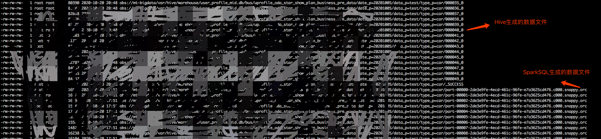
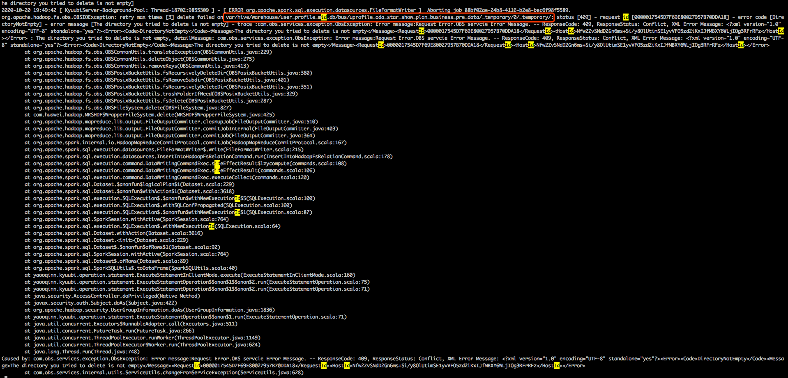
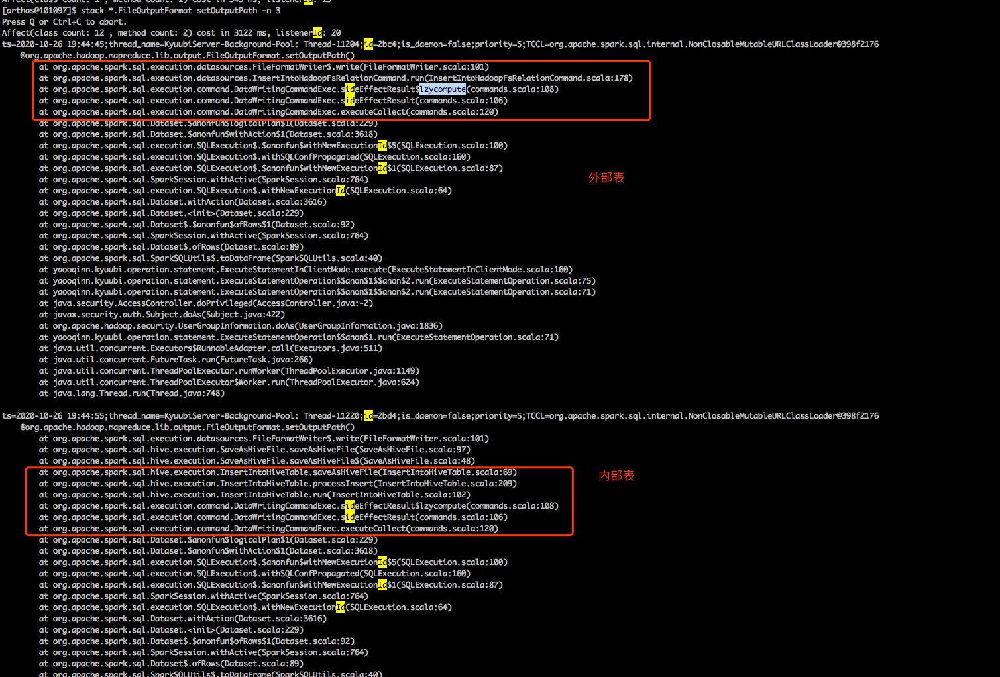

[TOC]

## 一、问题描述

有业务反馈某张表的分区下有重复数据，该分区数据的写入任务之前曾用sparkSQL执行过，跑失败了后切换成Hive执行成功了。看了下该分区对应的目录，发现目录下同时存在sparkSQL和Hive SQL生成的文件（**也就是Hive任务执行时未删除旧的sparkSQL的数据文件**）。因此查询的时候会发现数据重复的现象



执行的写入sql都是insert overwrite，因此正常写入数据之前要删除旧的数据才合理。但显然后面执行的Hive SQL执行时并未删除旧的SparkSQL生成的数据文件。

## 二、Hive 执行overwrite语句时没有删除旧数据的原因

当Hive执行insert overwrite写入数据到分区时，根据分区的元数据是否存在来决定是否要清空分区目录下的所有文件：

1、如果分区元数据存在（HiveMetaStore中有分区记录），则清空分区下的所有元数据

**2、如果分区元数据不存在（仅针对外部表），Hive不会去自动推测分区对应的路径，也就不会去删除该分区下的所有文件**

https://cloudera.ericlin.me/2015/05/hive-insert-overwrite-does-not-remove-existing-data/

后面排查了下HiveMetaStore的元数据，发现该分区的创建时间是在22:57分（Hive SQL执行完后），因此可以推测出之前失败的SparkSQL任务虽然生成了数据文件，但是未生成对应的Hive元数据，因此出现这种情况。

## 三、SparkSQL 失败的原因

在spark执行任务时，会创建一个临时目录，这个临时目录路径为 ${outputPath}/_temporary (outputPath为任务设置的OutputFormat的outputPath)。spark会将执行过程中生成的文件先落地到临时目录中，最终任务执行成功了才全部移动到最终的输出目录。

**最后，这个临时目录会在任务执行结束后被删除。**

具体的流程可见：https://blog.csdn.net/u013332124/article/details/92001346

经过多次测试发现，SparkSQL执行某张表的分区写入时，它生成的临时目录位于表路径下。如果这张表不是ORC或者Parquet表，它的临时目录就和Hive比较像，如/a/test/.hive-staging_hive_2020-10-23_16-41-55_549_7302943708666306032-5  (/a/test为表路径)，如果这张表是ORC或者Parquet表，sparkSQL生成的临时目录就变成/a/test/_temporary。

上面业务写入的那张表是ORC表，因此如果有多个任务在同时写入，就会有问题：任务结束时spark要删除掉这个临时目录，而其他的任务也在使用这个临时目录。

**上面的业务SparkSQL任务的错误原因就可以理通了：**

比如任务A执行结束，要删除/a/test/_temporary这个临时目录，但是任务B还在执行，下面还有任务B的一些临时文件存在，这时候任务A执行的删除操作就会报错，具体信息如下图：



上图提示临时目录下还有其他的文件，因此无法删除临时目录。**同时，SparkSQL在删除完临时目录后才会添加Hive元数据，因此这里删除临时目录失败就导致了后面的数据重复的问题**。

> Hive在写入数据的时候也会创建临时目录，但是在非动态分区的写入模式下，Hive创建的临时目录是在具体的分区路径下，比如/a/test/datep=20201022，因此各个分区的写入任务是可以同时并行的。

## 四、解决方案

### 1、排查过程

在网上查了一圈，均为发现有合适的解决方案，所以打算自己跟一下sparkSQL生成执行计划的代码，看一下为何内部表可以根据Hive的规范生成临时目录，而外部表却不行。

首先我们通过arthas跟踪FileOutputFormat.setOutputPath()方法的堆栈，发现了内部表和外部表的区别：



我们发现设置输出目录时外部表使用的执行计划类是InsertIntoHadoopFsRelationCommand，而内部表的则是InsertIntoHiveTable。所以，我们得需要从执行计划生成代码入手，看为什么生成的执行计划不同。

后面就是结合arthas一路跟代码，最终定位到了RelationConversions类。

```scala
/**
 * Relation conversion from metastore relations to data source relations for better performance
 *
 * - When writing to non-partitioned Hive-serde Parquet/Orc tables
 * - When scanning Hive-serde Parquet/ORC tables
 *
 * This rule must be run before all other DDL post-hoc resolution rules, i.e.
 * `PreprocessTableCreation`, `PreprocessTableInsertion`, `DataSourceAnalysis` and `HiveAnalysis`.
 */
case class RelationConversions(
    conf: SQLConf,
    sessionCatalog: HiveSessionCatalog) extends Rule[LogicalPlan] {
  private def isConvertible(relation: HiveTableRelation): Boolean = {
    isConvertible(relation.tableMeta)
  }

  private def isConvertible(tableMeta: CatalogTable): Boolean = {
    val serde = tableMeta.storage.serde.getOrElse("").toLowerCase(Locale.ROOT)
    serde.contains("parquet") && SQLConf.get.getConf(HiveUtils.CONVERT_METASTORE_PARQUET) ||
      serde.contains("orc") && SQLConf.get.getConf(HiveUtils.CONVERT_METASTORE_ORC)
  }

  private val metastoreCatalog = sessionCatalog.metastoreCatalog

  override def apply(plan: LogicalPlan): LogicalPlan = {
    plan resolveOperators {
      // Write path
      case InsertIntoStatement(
           r: HiveTableRelation, partition, query, overwrite, ifPartitionNotExists)
          if query.resolved && DDLUtils.isHiveTable(r.tableMeta) &&
            (!r.isPartitioned || SQLConf.get.getConf(HiveUtils.CONVERT_INSERTING_PARTITIONED_TABLE))
            && isConvertible(r) =>
        InsertIntoStatement(metastoreCatalog.convert(r), partition,
          query, overwrite, ifPartitionNotExists)

      // Read path
      case relation: HiveTableRelation
          if DDLUtils.isHiveTable(relation.tableMeta) && isConvertible(relation) =>
        metastoreCatalog.convert(relation)

      // CTAS
      case CreateTable(tableDesc, mode, Some(query))
          if DDLUtils.isHiveTable(tableDesc) && tableDesc.partitionColumnNames.isEmpty &&
            isConvertible(tableDesc) && SQLConf.get.getConf(HiveUtils.CONVERT_METASTORE_CTAS) =>
        // validation is required to be done here before relation conversion.
        DDLUtils.checkDataColNames(tableDesc.copy(schema = query.schema))
        OptimizedCreateHiveTableAsSelectCommand(
          tableDesc, query, query.output.map(_.name), mode)
    }
  }
}
```

SparkSQL的执行计划会经过RelationConversions类进行一些转换，比如将HiveTableRelation转换为HadoopFsRelation。

这里的代码逻辑是碰到Hive表存储格式如果是ORC或者Parquet，并且spark.sql.hive.convertInsertingPartitionedTable、spark.sql.hive.convertMetastoreParquet / spark.sql.hive.convertMetastoreOrc都为true，则SparkSQL会进行执行计划的转换。

### 2、解决方案

**因此只要我们将spark.sql.hive.convertInsertingPartitionedTable和spark.sql.hive.convertMetastoreParquet / spark.sql.hive.convertMetastoreOrc都设置为false，即可解决我们遇到的问题**

### 3、spark.sql.hive.convertInsertingPartitionedTable参数的作用

Hive写入Parquet/Orc表时，实现了自己的一个SerDe，Spark觉的Hive的SerDe性能比较低，于是实现了自己的SerDe。**因此碰到Parquet、Orc的表数据写入时，SparkSQL默认使用自己内部的SerDe**（这里感觉Spark没考虑到并发写入不同分区的问题）。