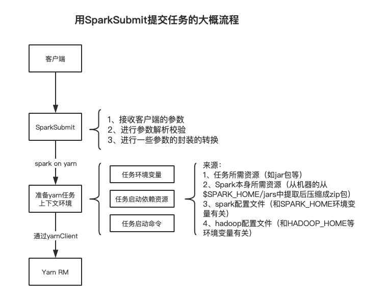
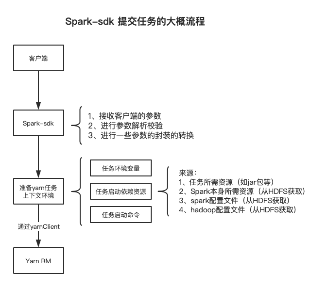

最近接到一个需求，需要提供给平台一个java sdk，用于spark任务的提交。这个sdk不能依赖用户机器的任何环境。网上找了一些资料，基本都是基于原生的SparkSubmit来提交任务的，都不符合我们的需求。因此决定自己手动撸。

首先做了一些调研，先梳理了下原生spark-submit的提交流程（Spark on Yarn）

# 一、常规Spark on Yarn的提交流程（基于SparkSubmit）

我们平时使用spark-submit脚本或者直接使用SparkSubmit类进行Spark任务的提交时，流程通常是以下这样的：



上面主要是Spark on Yarn的任务提交流程介绍，重点在于构建yarn任务的上下文环境，之后将这些信息提交到Yarn RM，进行任务的调度和执行。从yarn的接口文档和Spark源码中可以看出，这些上下文环境主要有3类：

- 任务所需的相关环境变量 （比如CLASSPATH）
- 任务启动时所需要的相关资源（如Spark依赖的相关jar包，任务本身的jar包，相关配置文件等等）
- 任务启动命令，也就是yarn启动ApplicationMaster的命令

其中环境变量和启动命令比较简单，无非就是一些字符串的拼接。但是依赖的资源准备就比较复杂，这个工作是由SparkSubmit来做的，主要是将客户端机器上的资源上传到hdfs的某个临时目录，然后告诉yarn这些资源的hdfs路径，这样yarn就可以拉取到这些资源文件。

这些资源文件主要有：

- Spark任务必须的运行环境，也就是spark安装目录下的那些jar包。这些jar包SparkSubmit通常会从客户端所在机器的 $SPARK_HOME/jars 下查找，然后压缩成 spark_lib.zip 包上传到临时目录
- 相关默认配置，包括但不限于 $SPARK_HOME/conf/spark-defaults.conf 和 $HADOOP_CONF_DIR(或$HADOOP_HOME/etc/hadoop) 下的配置文件
- 用户任务本身的jar包/python脚本，这些文件是由用户指定了路径，然后SparkSubmit会将这些文件上传到hdfs临时目录上
- 用户任务本身依赖的一些资源，比如spark-submit中--ffiles或–pyfiles指定的一些文件，也是由SparkSubmit上传到hdfs临时目录

可以看出，原生的SparkSubmit提交方式强依赖于客户端所在机器环境，需要确保机器上有安装Spark，同时配置SPARK_HOME、HADOOP_HOME等信息。

# 二、自研SDK提交流程

我们的目标是开发一个开箱即用的用于spark任务提交的Java sdk，如果底层还是使用SparkSubmit来提交任务，那么不可避免的就需要业务方的机器上安装了spark安装包，同时相关环境变量都配置好了（SPARK_HOME、HADOOP_HOME等）。因此，我们只能抛弃SparkSubmit这套流程，自己进行客户端参数的提取、校验、封装，然后自行构建yarn任务需要的上下文信息。大概流程如下：



和SparkSubmit不同的是，对于任务所需的启动依赖资源，我们直接从HDFS获取（因此需要提前将相关资源放置到HDFS上），而非客户端所在的机器。这样就可以避免sdk和机器环境的强绑定，只要保证客户端的机器可以访问obs即可。

# 三、使用Demo

该demo需要引入一些yarn的依赖：

```xml
 						<dependency>
                <groupId>org.apache.hadoop</groupId>
                <artifactId>hadoop-common</artifactId>
                <version>2.8.3</version>
                <exclusions>
                    <exclusion>
                        <groupId>org.slf4j</groupId>
                        <artifactId>slf4j-log4j12</artifactId>
                    </exclusion>
                </exclusions>
            </dependency>
            <dependency>
                <groupId>org.apache.hadoop</groupId>
                <artifactId>hadoop-yarn-client</artifactId>
                <version>2.8.3</version>
            </dependency>
            <dependency>
                <groupId>org.apache.hadoop</groupId>
                <artifactId>hadoop-yarn-api</artifactId>
                <version>2.8.3</version>
            </dependency>
```

demo如下：

```java
public static void main(String[] args) throws IOException, YarnException {
        Configuration configuration = new Configuration();
        configuration.set("yarn.resourcemanager.ha.enabled", "true");
        configuration.set("yarn.resourcemanager.ha.rm-ids", "rm1,rm2");
        configuration.set("yarn.resourcemanager.hostname.rm1", "10.16.19.237");
        configuration.set("yarn.resourcemanager.hostname.rm2", "10.16.19.13");

        //初始化yarnClient
        YarnClient yarnClient = YarnClient.createYarnClient();
        yarnClient.init(configuration);
        yarnClient.start();

        YarnClientApplication application = yarnClient.createApplication();
        System.out.println(application.getNewApplicationResponse().getApplicationId());

        //构建Spark作业的上下文，也就是ApplicationMaster的上下文信息
        ContainerLaunchContext amContainer = Records.newRecord(ContainerLaunchContext.class);
        //设置AppMaster的环境变量
        Map<String, String> env = Maps.newHashMap();
        //设置CLASSPATH，这里的{{PWD}}是任务工作目录的占位符，后面yarn会自动替换成工作目录。<CPS>是多个条目之间的间隔符
        env.put("CLASSPATH", "{{PWD}}<CPS>{{PWD}}/__spark_conf__<CPS>{{PWD}}/__spark_libs__/*<CPS>$HADOOP_CONF_DIR<CPS>" +
                "$HADOOP_COMMON_HOME/share/hadoop/common/*<CPS>$HADOOP_COMMON_HOME/share/hadoop/common/lib/*<CPS>" +
                "$HADOOP_HDFS_HOME/share/hadoop/hdfs/*<CPS>$HADOOP_HDFS_HOME/share/hadoop/hdfs/lib/*<CPS>" +
                "$HADOOP_YARN_HOME/share/hadoop/yarn/*<CPS>$HADOOP_YARN_HOME/share/hadoop/yarn/lib/*<CPS>" +
                "$HADOOP_MAPRED_HOME/share/hadoop/mapreduce/*<CPS>$HADOOP_MAPRED_HOME/share/hadoop/mapreduce/lib/*");
        env.put("SPARK_YARN_STAGING_DIR", "hdfs://test45cluster/tmp/yjbtest/sparkJobTest");
        env.put("SPARK_USER", "root");
        amContainer.setEnvironment(env);

        //准备相关资源，这里我们可以把这些资源提前放到hdfs上，然后把对应的路径告诉yarn即可
        //其中如果资源类型是ARCHIVE，yarn会帮我们解压到工作目录。
        //比如我们指定了一个Key是__spark_libs__的资源，对应hdfs上的/tmp/yjbtest/spark_lib.zip，那么yarn在启动任务时会将这个zip文件拉下来解压成__spark_libs__目录
        //所以我们在上面的CLASSPATH可以看到 {{PWD}}/__spark_libs__/* 这个条目，就是这么来的
        Map<String, LocalResource> localResourceMap = Maps.newHashMap();
        {
            LocalResource resource = Records.newRecord(LocalResource.class);
            URL uri = URL.newInstance("hdfs", "myCluster", -1, "/tmp/yjbtest/spark_lib.zip");
            resource.setType(LocalResourceType.ARCHIVE);
            resource.setVisibility(LocalResourceVisibility.PRIVATE);
            resource.setResource(uri);
            //文件的时间戳和大小一定要和实际的文件信息对上，不然会报错
            resource.setTimestamp(1617261217328L);
            resource.setSize(194878966);
            localResourceMap.put("__spark_libs__", resource);
        }
        {
            LocalResource resource = Records.newRecord(LocalResource.class);
            URL uri = URL.newInstance("hdfs", "myCluster", -1, "/tmp/yjbtest/spark-test-1.0-SNAPSHOT.jar");
            resource.setType(LocalResourceType.FILE);
            resource.setVisibility(LocalResourceVisibility.PRIVATE);
            resource.setResource(uri);
            resource.setTimestamp(1617347524409L);
            resource.setSize(39168);
            localResourceMap.put("__app__.jar", resource);
        }
        {
            //在spark-submit中，spark.* 开头的配置会被写入到 __spark_conf__/__spark_conf__.properties 配置下
            //spark.hadoop.* 开头的配置会被写入到 __spark_hadoop_conf__.xml 配置下
            //
            LocalResource resource = Records.newRecord(LocalResource.class);
            URL uri = URL.newInstance("hdfs", "myCluster", -1, "/tmp/yjbtest/__spark_conf4__.zip");
            resource.setType(LocalResourceType.ARCHIVE);
            resource.setVisibility(LocalResourceVisibility.PRIVATE);
            resource.setResource(uri);
            resource.setTimestamp(1617692664596L);
            resource.setSize(1186);
            localResourceMap.put("__spark_conf__", resource);
        }
        {
            //在spark-submit中，spark.* 开头的配置会被写入到 __spark_conf__/__spark_conf__.properties 配置下
            //spark.hadoop.* 开头的配置会被写入到 __spark_hadoop_conf__.xml 配置下
            LocalResource resource = Records.newRecord(LocalResource.class);
            URL uri = URL.newInstance("hdfs", "myCluster", -1, "/tmp/yjbtest/log4j.properties");
            resource.setType(LocalResourceType.FILE);
            resource.setVisibility(LocalResourceVisibility.PRIVATE);
            resource.setResource(uri);
            resource.setTimestamp(1617676015956L);
            resource.setSize(3265);
            localResourceMap.put("log4j.properties", resource);
        }
        {
            //在spark-submit中，spark.* 开头的配置会被写入到 __spark_conf__/__spark_conf__.properties 配置下
            //spark.hadoop.* 开头的配置会被写入到 __spark_hadoop_conf__.xml 配置下
            LocalResource resource = Records.newRecord(LocalResource.class);
            URL uri = URL.newInstance("hdfs", "myCluster", -1, "/tmp/yjbtest/__spark_dist_cache__.properties");
            resource.setType(LocalResourceType.FILE);
            resource.setVisibility(LocalResourceVisibility.PRIVATE);
            resource.setResource(uri);
            resource.setTimestamp(1617678784802L);
            resource.setSize(586);
            localResourceMap.put("__spark_dist_cache__.properties", resource);
        }
        amContainer.setLocalResources(localResourceMap);

        //ApplicaiontMaster的启动命令
        List<String> commandList = Lists.newArrayList();
        commandList.add("{{JAVA_HOME}}/bin/java -server -Xmx1024m -Djava.io.tmpdir={{PWD}}/tmp " +
                "-Dspark.yarn.app.container.log.dir=<LOG_DIR> org.apache.spark.deploy.yarn.ApplicationMaster " +
                "--class 'com.yangjb.SqlTest' --jar file:/tmp/abc.jar " +
                "--properties-file {{PWD}}/__spark_conf__/__spark_conf__.properties " +
                "--dist-cache-conf {{PWD}}/__spark_dist_cache__.properties 1> <LOG_DIR>/stdout 2> <LOG_DIR>/stderr");

        amContainer.setCommands(commandList);

        ApplicationSubmissionContext appContext = application.getApplicationSubmissionContext();
        appContext.setApplicationName("yjbtest-20210402");
        appContext.setQueue("default");
        appContext.setAMContainerSpec(amContainer);
        appContext.setApplicationType("SPARK");
        appContext.setMaxAppAttempts(1);

        //告诉yarn需要分配给我们多少内存和cpu
        Resource capability = Records.newRecord(Resource.class);
        capability.setMemorySize(2048);
        capability.setVirtualCores(2);

        appContext.setResource(capability);
        //提交spark作业
        yarnClient.submitApplication(appContext);

        while (true) {
            ApplicationReport applicationReport = yarnClient.getApplicationReport(application.getNewApplicationResponse().getApplicationId());

            YarnApplicationState yarnApplicationState = applicationReport.getYarnApplicationState();
            System.out.println("State:" + yarnApplicationState);
            if (yarnApplicationState == YarnApplicationState.FAILED) {
                String diagnostics = applicationReport.getDiagnostics();
                System.out.println("错误信息：" + diagnostics);
                break;
            } else if (yarnApplicationState == YarnApplicationState.KILLED
                    || yarnApplicationState == YarnApplicationState.FINISHED) {
                break;
            }

            try {
                Thread.sleep(5000);
            } catch (InterruptedException e) {
                e.printStackTrace();
            }
        }
    }
```

# 四、后记

因为我们sdk的代码量比较多，目前也还不够成熟，暂时不考虑开源全部代码。

上面的demo比较简单，上下文信息都是固定写死的。不过读者读懂demo大概也就能基于这个思路开发一个用于提交spark任务的java sdk了。

另外，需要注意的是，SparkSubmit本身做了大量的参数解析，转换，封装的工作。我们抛弃SparkSubmit自己实现这些参数的解析封装，就意味很容易漏掉很多细节，因此开发完sdk需要做好详尽的测试，避免一些场景没考虑到，导致用户的任务出现的问题。